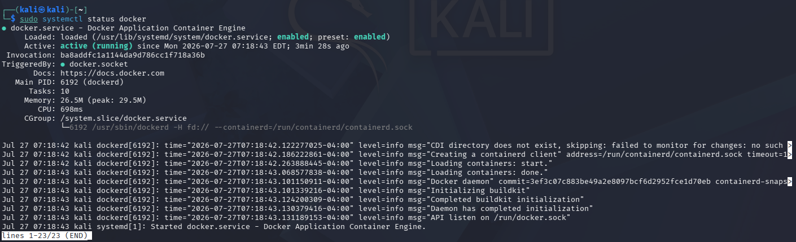
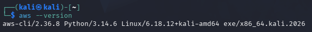
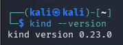
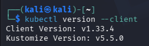
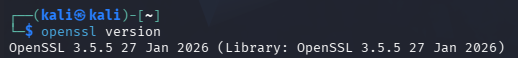
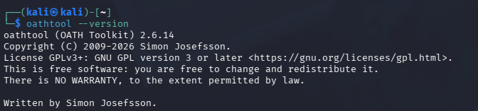
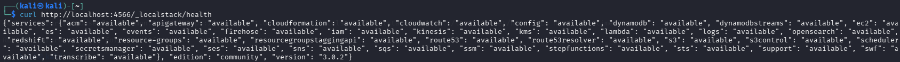
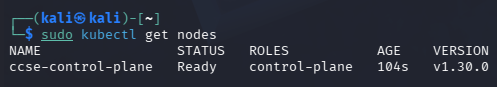
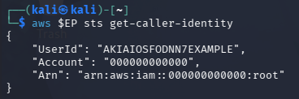

# IKB42603-CLOUD-COMPUTING-SECURITY-ESSENTIALS

# Lab 0: Environment Setup Report

## Course Information
- Course Name: IKB42603 Cloud Computing Security Essentials
- Lab: Lab 0 – Environment Setup
- Instructor: MADAM ADANI
- Student Name: SITI NUR SALIHAH BINTI AHMAD BALKIS
- Date: 29 July 2026

## Objective

The objective of this setup is to prepare the local lab environment required before Lab 1. Based on the setup cheatsheet, the environment must support Docker, AWS CLI v2, kind, kubectl, OpenSSL, oathtool, LocalStack, and a local Kubernetes cluster.

All services are intended to run locally. LocalStack is used as the local AWS simulator, and kind is used to run Kubernetes inside Docker.

## Environment Summary

| Component | Verified Version / Status | Purpose | Status |
| --- | --- | --- | --- |
| Operating System | Kali Linux | Host system for development tools | Configured |
| Docker | Docker service running | Container runtime and image management | Verified |
| AWS CLI | aws-cli/2.36.8 | Interaction with AWS services and LocalStack | Verified |
| kind | kind v0.23.0 | Local Kubernetes cluster creation | Verified |
| kubectl | Client Version v1.33.4 (Kustomize v5.5.0) | Kubernetes cluster management | Verified |
| OpenSSL | OpenSSL 3.5.5 | Certificate and cryptographic utilities | Verified |
| oathtool | OATH Toolkit 2.6.14 | Time-based one-time password generation | Verified |
| LocalStack | Community Edition v3.0.2 (Healthy) | Local AWS service emulation | Running |
| Kubernetes | Node `ccse-control-plane` (Ready) | Local Kubernetes cluster | Running |

## Step 1: Install and Verify Docker
Docker was installed to provide a container runtime for local development and testing. It also serves as the prerequisite for running LocalStack and other container-based services.

### Actions Performed
- Installed Docker Engine on the Kali Linux host system.
- Verified that the Docker service was running successfully using the system service status command.

### Verification Commands
```bash
sudo systemctl status docker
```

### Result
Docker was successfully installed and the daemon was accessible for subsequent lab steps.



## Step 2: Install and Verify AWS CLI v2
AWS CLI v2 was installed to enable command-line interaction with AWS services and to support configuration for LocalStack.

### Actions Performed
- Downloaded and installed AWS CLI v2.
- Verified the installation using the CLI version command.

### Verification Commands
```bash
aws --version
```

### Result
AWS CLI v2 was successfully installed and ready to use for local service configuration.



## Step 3: Install and Verify kind and kubectl
kind and kubectl were installed to support the creation and management of a local Kubernetes cluster.

### Actions Performed
- Installed kind to create lightweight local clusters.
- Installed kubectl to interact with the cluster.
- Verified both tools by checking their versions.

### Verification Commands
```bash
kind --version
kubectl version --client
```

### Result
Both tools were installed correctly and available for cluster creation.




## Step 4: Install and Verify Helper Tools (OpenSSL and oathtool)
Helper utilities were installed to support cryptographic operations and one-time password generation where needed during the lab workflow.

### Actions Performed
- Installed OpenSSL for certificate-related tasks.
- Installed oathtool for generating one-time passwords.
- Verified the installations using version checks.

### Verification Commands
```bash
openssl version
oathtool --version
```

### Result
The required helper tools were successfully installed and verified.




## Step 5: Start and Verify LocalStack
LocalStack was started locally to emulate AWS services such as S3, Lambda, and IAM for development and testing purposes.

### Actions Performed
- Started the LocalStack container or service.
- Verified that the service was running and reachable.

### Verification Commands
```bash
curl http://localhost:4566/_localstack/health
```

### Result
LocalStack was running successfully and ready to receive AWS-compatible requests.



## Step 6: Create and Verify Kubernetes Cluster
A local Kubernetes cluster was created with kind and then verified to ensure that the control plane was operational.

### Actions Performed
- Created a Kubernetes cluster using kind.
- Verified the cluster nodes and API server availability.

### Verification Commands
```bash
sudo kubectl get nodes
```

### Result
The local Kubernetes cluster was successfully created and accessible for later tasks.



## Step 7: Configure AWS CLI for LocalStack
The AWS CLI was configured to target the LocalStack endpoint so that commands could be tested against a local AWS-compatible environment.

### Actions Performed
- Configured the AWS CLI with dummy access key, secret access key, and default region for LocalStack.
- Defined the LocalStack endpoint URL.
- Verified the configuration by executing an AWS STS command against the LocalStack endpoint.

### Verification Commands
```bash
aws configure set aws_access_key_id test
aws configure set aws_secret_access_key test
aws configure set region us-east-1

EP='--endpoint-url=http://localhost:4566'

aws $EP sts get-caller-identity
```

### Result
The AWS CLI was successfully configured to communicate with the LocalStack endpoint. The verification command returned a valid response, confirming that the local AWS-compatible environment was working correctly.



## Conclusion

The Lab 0 environment setup was completed successfully. Docker, AWS CLI v2, kind, kubectl, OpenSSL, oathtool, LocalStack, and the local Kubernetes cluster were installed and verified successfully. The AWS CLI was configured to communicate with LocalStack using dummy credentials and a local endpoint. The environment is now ready for the subsequent Cloud Computing Security Essentials laboratory exercises.
