# Lab 1: Cloud Account Security, Identity and Access Management

**Course:** IKB42603 Cloud Computing Security Essentials  
**Topic:** Identity governance, least privilege, LocalStack IAM and Kubernetes RBAC  
**Environment:** Kali Linux, Docker, LocalStack, AWS CLI, Kubernetes (kind) and kubectl  
**Name:** SITI NUR SALIHAH BINTI AHMAD BALKIS

## Lab Summary and Objectives

This lab explored identity and access management across two local cloud-computing environments. LocalStack was used to practise AWS IAM operations involving users, groups, policies and access keys without connecting to a live AWS account. Kubernetes RBAC was then used to apply and test namespace-based authorization rules. The main objective was to understand how least privilege, credential hygiene and separation of duties reduce security risk.

## Evidence Folder

All screenshots used as evidence in this report are stored in the `Evidence` folder.

| Evidence File | Purpose |
|---|---|
| `1._LocalStack_Identity_Verification.png` | Verification of the LocalStack IAM connection using the AWS CLI |
| `2.1_create_admins_group.png` | Creation of the `Admins` IAM group |
| `2.1_attach_admin_policy.png` | Attachment of the `AdministratorAccess` policy to the `Admins` group |
| `2.2_create_cloudadmin_user.png` | Creation of the `CloudAdmin_Salihah` administrator account |
| `2.3_add_user_to_admins_group.png` | Adding the administrator account to the `Admins` group |
| `2.4_verify_admin_group_membership.png` | Verification of the `Admins` group membership |
| `3.1_create_analyst_user.png` | Creation of the `Analyst_Suraya` account |
| `3.2_attach_s3_readonly_policy.png` | Attachment of the `AmazonS3ReadOnlyAccess` policy |
| `3.3_verify_attached_user_policy.png` | Verification of the attached user policy |
| `4.1_create_access_key.png` | Creation of an access key for the analyst account |
| `4.2_list_access_keys.png` | Listing of the analyst account access keys |
| `4.3_deactivate_access_key.png` | Deactivation of the analyst account access key |
| `5.0_kubernetes_cluster_setup.png` | Creation and verification of the Kubernetes cluster |
| `5.1_create_namespaces.png` | Creation of the `dev` and `prod` namespaces |
| `6.1_create_service_account.png` | Creation of the Kubernetes service account |
| `6.2_create_role.png` | Creation of the Kubernetes Role |
| `6.3_create_rolebinding.png` | Creation of the Kubernetes RoleBinding |
| `7.1_verify_rbac_permissions.png` | Verification of Kubernetes RBAC permissions |
| `verify_rolebinding_configuration.png` | Verification of the RoleBinding configuration in YAML format |

## Task 1: Map the Cloud Identity Landscape

Before configuring access, it is important to distinguish the main identity concepts used by AWS. Each concept has a different purpose in controlling who can access resources and what actions they may perform.

| Concept | AWS Term | Purpose |
|---|---|---|
| Account owner with unrestricted power | Root user | The initial identity that owns the account and has complete access to resources and billing. It must be strongly protected and reserved for exceptional account-level activities. |
| Identity for a person or application | IAM User | A named identity that may receive credentials and permissions for long-term access to cloud services. |
| Set of permission rules | IAM Policy | A JSON document that specifies allowed or denied actions and the resources to which those rules apply. |
| Managed collection of identities | IAM Group | A collection of IAM users that can receive common policies, making access administration more consistent. |
| Assumable temporary identity | IAM Role | An identity that provides temporary permissions when assumed, reducing dependence on permanent credentials. |

## Session A: LocalStack IAM

### Environment Setup Verification

Before performing any IAM configuration, the AWS CLI was configured to communicate with the LocalStack endpoint. The `sts get-caller-identity` command was executed to verify that the AWS CLI was successfully connected to the local cloud environment. The output displays the default LocalStack account ID (`000000000000`), confirming that all subsequent IAM operations will be performed locally rather than on the real AWS cloud.

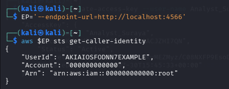

**Figure 1.0:** Verification of the AWS CLI connection to the LocalStack IAM environment using the `sts get-caller-identity` command.

## Task 2: Create a Least-Privilege Admin

Rather than using the root identity for routine administration, a named administrator was created. Administrative access was assigned through a group so that permissions could be centrally managed.

### Step 2.1: Create the Admins Group

To implement centralized permission management, an IAM group named `Admins` was created in the LocalStack environment. After the group was successfully created, the managed `AdministratorAccess` policy was attached to it. Assigning permissions through a group allows administrator privileges to be inherited by group members instead of attaching policies directly to individual users. This approach simplifies permission management and follows AWS IAM best practices.

**Create the Admins group**

```bash
aws $EP iam create-group --group-name Admins
```

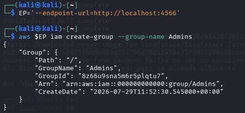

**Attach the AdministratorAccess policy**

```bash
aws $EP iam attach-group-policy --group-name Admins \
    --policy-arn arn:aws:iam::aws:policy/AdministratorAccess
```

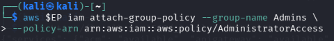

**Figure 2.1:** Creation of the `Admins` IAM group and attachment of the `AdministratorAccess` managed policy in the LocalStack environment.

### Step 2.2: Create a Personal Administrator Account

A dedicated IAM user named `CloudAdmin_Salihah` was created to perform administrative tasks instead of using the root account. Creating a separate administrator account improves accountability and follows the security best practice of avoiding the use of the root identity for routine administration. The command output confirms that the user was created successfully.

```bash
aws $EP iam create-user --user-name CloudAdmin_Salihah
```

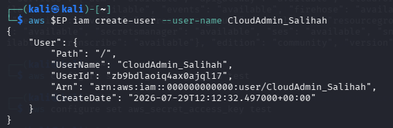

**Figure 2.2:** Successful creation of the `CloudAdmin_Salihah` IAM user in the LocalStack environment.

### Step 2.3: Add the Administrator User to the Admins Group

After creating the personal administrator account, the user `CloudAdmin_Salihah` was added to the `Admins` group. This allows the user to inherit the permissions assigned to the group instead of attaching administrator policies directly to the user account. Managing permissions through groups improves consistency and simplifies future access management.

```bash
aws $EP iam add-user-to-group --group-name Admins \
    --user-name CloudAdmin_Salihah
```

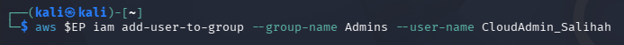

**Figure 2.3:** Command used to add the `CloudAdmin_Salihah` user to the `Admins` IAM group.

### Step 2.4: Verify Administrator Group Membership

The `get-group` command was executed to verify that the `CloudAdmin_Salihah` user had been successfully added to the `Admins` group. The output displays both the group information and the user details, confirming that the administrator account is now a member of the group and will inherit the permissions assigned to it.

```bash
aws $EP iam get-group --group-name Admins
```

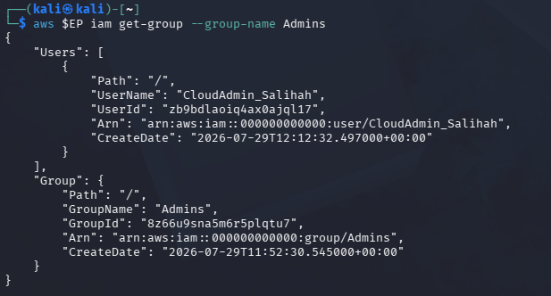

**Figure 2.4:** Verification that the `CloudAdmin_Salihah` user is a member of the `Admins` IAM group.

## Task 3: Enforce Least Privilege with a Scoped Policy

A separate analyst identity was created for work that does not require administrative control. Giving this user only read access illustrates how permissions can be matched to a job function.

### Step 3.1: Create the Analyst User

A dedicated IAM user named `Analyst_Suraya` was created to represent an analyst account with limited access. This user is intended to perform tasks that do not require administrative privileges, supporting the principle of least privilege by separating administrative and non-administrative responsibilities.

```bash
aws $EP iam create-user --user-name Analyst_Suraya
```

The command returned the user details, including the user name, ARN and creation timestamp, confirming that the `Analyst_Suraya` account was successfully created.

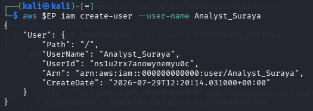

**Figure 3.1:** Successful creation of the `Analyst_Suraya` IAM user in the LocalStack environment.

### Step 3.2: Attach the AmazonS3ReadOnlyAccess Policy

To enforce the principle of least privilege, the `AmazonS3ReadOnlyAccess` managed policy was attached to the `Analyst_Suraya` user. This policy grants read-only access to Amazon S3 resources, allowing the user to view information without creating, modifying or deleting any objects. Assigning only the required permissions helps reduce potential security risks.

```bash
aws $EP iam attach-user-policy --user-name Analyst_Suraya \
    --policy-arn arn:aws:iam::aws:policy/AmazonS3ReadOnlyAccess
```

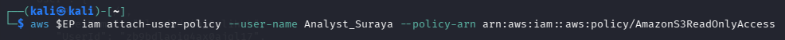

**Figure 3.2:** Command used to attach the `AmazonS3ReadOnlyAccess` managed policy to the `Analyst_Suraya` IAM user.

### Step 3.3: Verify the Attached Policy

The attached policies for the `Analyst_Suraya` user were verified using the AWS CLI. The output shows that only the `AmazonS3ReadOnlyAccess` managed policy is assigned to the user. This confirms that the analyst account has read-only permissions and does not possess unnecessary administrative privileges, demonstrating the implementation of the principle of least privilege.

```bash
aws $EP iam list-attached-user-policies --user-name Analyst_Suraya
```

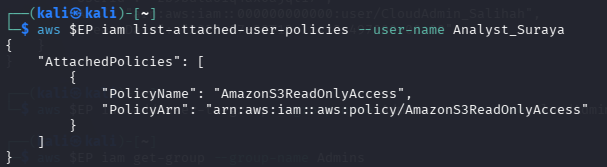

**Figure 3.3:** Verification that the `AmazonS3ReadOnlyAccess` managed policy is attached to the `Analyst_Suraya` IAM user.

### Least-Privilege Explanation

The `Analyst_Suraya` identity is limited to viewing S3 information and objects permitted by the managed policy. If its credentials were compromised, an attacker would not gain administrator privileges through this account. The identity could not use IAM administration capabilities to create privileged users or change policies, and its read-only scope would prevent write or delete operations in S3. Restricting the account in this way reduces the possible impact, or blast radius, of a credential compromise.

## Task 4: Credential Hygiene and Access Keys

Access keys are long-term credentials and therefore require careful handling. This task demonstrated their creation, inspection and deactivation as part of a basic credential-rotation process.

### Step 4.1: Create an Access Key

An access key was generated for the `Analyst_Suraya` IAM user to enable programmatic access to cloud services. The generated credentials consist of an Access Key ID and a Secret Access Key, which are used to authenticate API requests. In practice, these credentials should be protected and never exposed in public repositories or shared with unauthorized individuals.

```bash
aws $EP iam create-access-key --user-name Analyst_Suraya
```

The command successfully generated a new access key for the analyst account, confirming that the user is able to authenticate programmatically when the assigned permissions are required.

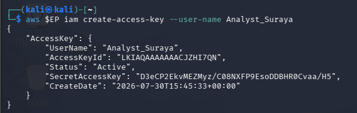

**Figure 4.1:** Successful creation of an access key for the `Analyst_Suraya` IAM user.

### Step 4.2: List Access Keys

The access keys associated with the `Analyst_Suraya` account were listed to verify that the newly created credentials were successfully registered. The output displays the Access Key ID, user name, creation date and current status. The status `Active` confirms that the access key is valid and can be used for programmatic authentication.

```bash
aws $EP iam list-access-keys --user-name Analyst_Suraya
```

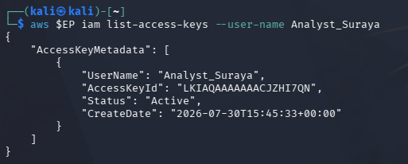

**Figure 4.2:** Verification of the active access key assigned to the `Analyst_Suraya` IAM user.

### Step 4.3: Deactivate the Access Key

To demonstrate credential hygiene, the access key associated with the `Analyst_Suraya` account was deactivated using the AWS CLI. After updating the key status, the access keys were listed again to verify the change. The output shows that the access key status is now `Inactive`, confirming that the credentials can no longer be used for authentication while still remaining in the account for management purposes.

```bash
aws $EP iam update-access-key --user-name Analyst_Suraya \
    --access-key-id LKIAQAAAAAAACJZHI7QN --status Inactive

aws $EP iam list-access-keys --user-name Analyst_Suraya
```

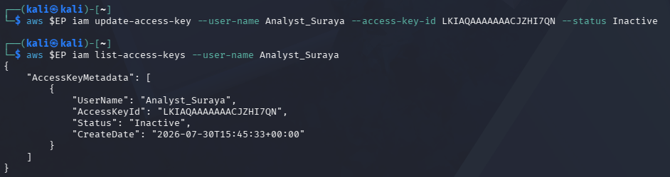

**Figure 4.3:** Verification that the access key for the `Analyst_Suraya` IAM user has been successfully changed to the `Inactive` state.

## Session B: Enforced Access Control with Kubernetes RBAC

### Setup: Create a Local Kubernetes Cluster

A new Kubernetes cluster named `ccse_lab1` was created using **kind (Kubernetes in Docker)** to provide an isolated environment for testing Kubernetes Role-Based Access Control (RBAC). After the cluster was successfully created, the cluster status was verified using `kubectl cluster-info` and `kubectl get nodes`. The output confirms that the Kubernetes control plane is running correctly and that the control-plane node is in the **Ready** state, indicating that the cluster is ready for the RBAC exercises.

```bash
kind create cluster --name ccse-lab1

kubectl cluster-info --context kind-ccse-lab1

kubectl get nodes
```

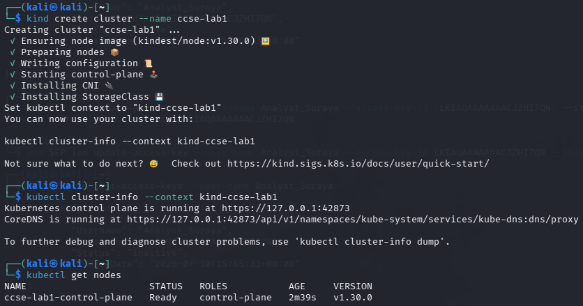

**Figure 5.0:** Creation and verification of the local Kubernetes cluster (`ccse-lab1`) using kind and kubectl.

## Task 5: Separate Environments with Namespaces

Namespaces were created to logically separate resources within the Kubernetes cluster. In this task, two namespaces named `dev` and `prod` were created to represent the development and production environments. After creating the namespaces, the cluster was verified to ensure that both environments were successfully added and ready for the RBAC configuration in the following tasks.

```bash
kubectl create namespace dev

kubectl create namespace prod

kubectl get namespaces
```

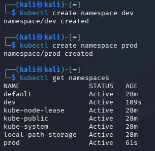

**Figure 5.1:** Creation and verification of the `dev` and `prod` namespaces in the Kubernetes cluster.

## Task 6: Define a Role and Bind It

Kubernetes RBAC separates the description of permissions from the assignment of those permissions. A service account was created first, followed by a namespaced Role and a RoleBinding.

### Step 6.1: Create a Service Account

A Kubernetes service account named `dev-user` was created in the `dev` namespace to represent a developer identity. This service account will be used in the following RBAC configuration to demonstrate how permissions can be assigned to non-human identities within a specific namespace.

```bash
kubectl create serviceaccount dev-user -n dev
```

The command completed successfully, confirming that the `dev-user` service account was created and is ready to be associated with a role and role binding.

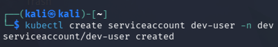

**Figure 6.1:** Successful creation of the `dev-user` service account in the `dev` namespace.

### Step 6.2: Create a Role

A Kubernetes role named `pod-reader` was created in the `dev` namespace to grant read-only access to pod resources. The role allows users or service accounts to perform the `get`, `list`, and `watch` operations without permitting any modifications. This configuration follows the principle of least privilege by granting only the permissions required to perform read-only tasks.

```bash
kubectl create role pod-reader -n dev \
    --verb=get,list,watch \
    --resource=pods
```

The successful execution of the command confirms that the `pod-reader` role has been created and is ready to be assigned to a service account through a RoleBinding.

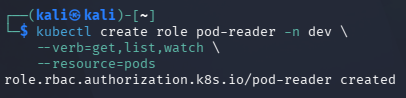

**Figure 6.2:** Successful creation of the `pod-reader` role in the `dev` namespace.

### Step 6.3: Create a RoleBinding

A RoleBinding named `dev-user-binding` was created in the `dev` namespace to associate the `pod-reader` role with the `dev-user` service account. This binding grants the service account the permissions defined in the role, allowing it to perform only the authorized read-only operations on pods within the `dev` namespace.

```bash
kubectl create rolebinding dev-user-binding -n dev \
    --role=pod-reader \
    --serviceaccount=dev:dev-user
```

The successful execution of the command confirms that the RoleBinding has been created, linking the `dev-user` service account to the `pod-reader` role and completing the RBAC configuration for the development environment.

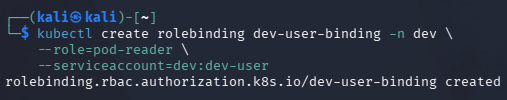

**Figure 6.3:** Successful creation of the `dev-user-binding` RoleBinding in the `dev` namespace.

## Task 7: Test the RBAC Policy

### Step 7.1: Verify Role Permissions

The permissions assigned to the `dev-user` service account were verified using the `kubectl auth can-i` command. Three authorization checks were performed to validate the RBAC configuration. The results show that the service account can list pods within the `dev` namespace (`yes`), but cannot delete pods in the same namespace (`no`) or access pods in the `prod` namespace (`no`). These results confirm that the RBAC policy correctly enforces the principle of least privilege by granting only the required permissions within the intended namespace.

```bash
SA=system:serviceaccount:dev:dev-user

kubectl auth can-i list pods -n dev --as=$SA

kubectl auth can-i delete pods -n dev --as=$SA

kubectl auth can-i list pods -n prod --as=$SA
```

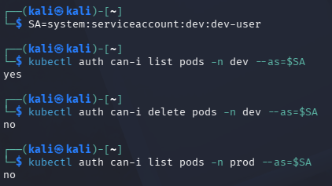

**Figure 7.1:** Verification of the RBAC permissions assigned to the `dev-user` service account using the `kubectl auth can-i` command.

### Authentication and Authorization

Authentication verifies the identity of the user or service account making a request, while authorization determines whether that identity is allowed to perform the requested action. In this lab, Kubernetes recognized `system:serviceaccount:dev:dev-user` as a valid service account. RBAC then allowed the service account to list pods in the `dev` namespace but denied permission to delete pods or access resources in the `prod` namespace.

## RBAC Verification Command

The RoleBinding configuration was reviewed in YAML format to verify that the RBAC policy had been applied successfully. This verification ensures that the correct role is linked to the intended service account within the appropriate namespace.

```bash
kubectl get rolebinding dev-user-binding -n dev -o yaml
```

**Output:**

```yaml
apiVersion: rbac.authorization.k8s.io/v1
kind: RoleBinding
metadata:
  ...
roleRef:
  apiGroup: rbac.authorization.k8s.io
  kind: Role
  name: pod-reader
subjects:
- kind: ServiceAccount
  name: dev-user
  namespace: dev
```

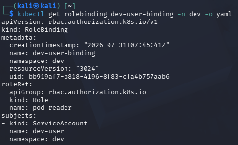

The YAML output confirms that the `dev-user-binding` resource references the `pod-reader` role and assigns it to the `dev-user` service account in the `dev` namespace. This verification demonstrates that the RBAC relationship has been configured correctly and that the intended permissions are associated with the appropriate identity.

## Short-Answer Questions

### Q1. Why is attaching policies to groups better than attaching them directly to users?

Attaching policies to groups makes permission management easier because the permissions only need to be configured once. When a new user joins the same team, they can simply be added to the group instead of assigning policies individually. This also helps maintain consistent access control and reduces configuration errors.

### Q2. What is the difference between an IAM User and an IAM Role?

An IAM User represents a specific person or account with long-term credentials. An IAM Role does not have permanent credentials and is assumed temporarily to perform specific tasks. Roles are commonly used to provide temporary access to users, applications, or services.

### Q3. Explain least privilege using the Analyst account, and how it reduces blast radius if compromised.

The `Analyst_Suraya` account was assigned only the `AmazonS3ReadOnlyAccess` policy. This means the user can view S3 resources but cannot modify or delete them. If the account is compromised, the attacker can only perform limited actions, reducing the overall impact and protecting other AWS resources.

### Q4. In Kubernetes, what is the difference between a Role and a RoleBinding?

A Role defines what actions are allowed on specific resources within a namespace. A RoleBinding links that Role to a user or service account, allowing them to use the permissions defined in the Role.

### Q5. Why did the developer service account fail to access prod, and which security principle does that demonstrate?

The `dev-user` service account failed to access the `prod` namespace because its Role and RoleBinding were created only in the `dev` namespace. It did not have any permissions in `prod`. This demonstrates the principle of least privilege, where access is limited to only the resources required for a specific task.

## Security Best-Practices Checklist

- ☑ **Root user is not used for daily tasks** – A dedicated administrator account (`CloudAdmin_Salihah`) was created to perform administrative tasks instead of using the root account.

- ☑ **Permissions are granted via groups/roles, not directly to individual users** – Administrative permissions were assigned through the `Admins` group in IAM, while Kubernetes permissions were managed using Roles and RoleBindings.

- ☑ **At least one least-privilege (read-only) identity was created and tested** – The `Analyst_Suraya` account was assigned the `AmazonS3ReadOnlyAccess` policy, providing only the minimum permissions required for its role.

- ☑ **Access keys were listed and a rotation (deactivate) was demonstrated** – The access key for `Analyst_Suraya` was created, verified, and later deactivated to demonstrate secure credential management.

- ☑ **Kubernetes RBAC blocks an unauthorised action (delete / cross-namespace)** – RBAC testing confirmed that the `dev-user` service account could list pods in the `dev` namespace but was denied permission to delete pods or access resources in the `prod` namespace.

## Conclusion

This lab showed that secure access is achieved by giving users only the permissions they need. In LocalStack IAM, the administrator received permissions through the `Admins` group, while `Analyst_Suraya` was only allowed to read Amazon S3 resources. Creating and deactivating an access key also showed the importance of managing user credentials securely.

In Kubernetes, RBAC applied the same security concept. The `dev-user` service account could only read pods in the `dev` namespace and was not allowed to delete pods or access the `prod` namespace. Overall, this lab demonstrated how IAM groups, least-privilege access, and Kubernetes RBAC help protect cloud resources by limiting unnecessary permissions.