# Lab 2: Secure Isolation & Multi-Tenancy

## Course Information
- Course Name: IKB42603 Cloud Computing Security Essentials
- Instructor: MADAM ADANI
- Student Name: SITI NUR SALIHAH BINTI AHMAD BALKIS
- Topic: Compute, network and storage isolation using Docker and Kubernetes
- Environment: kind Kubernetes cluster `ccse-lab2`, Calico CNI and Docker volume `ccse-vol`
- Date: 14 August 2026

## Lab Objectives
- To create and manage separate tenants using Kubernetes namespaces.
- To control tenant resource usage using ResourceQuota.
- To test and enforce network isolation using NetworkPolicy.
- To protect secrets between tenants using RBAC.
- To demonstrate data remanence and secure data deletion.

## Learning Outcomes

After completing this lab, I was able to:

- Create separate tenants using Kubernetes namespaces.
- Deploy applications and services in different namespaces.
- Test communication between tenants.
- Control resource usage using ResourceQuota.
- Enforce network isolation using NetworkPolicy.
- Restrict access to Secrets using RBAC.
- Explain data remanence and secure deletion in cloud storage.

## Environment

| Component | Details |
|---|---|
| Operating System | Kali Linux |
| Container Platform | Docker |
| Kubernetes Platform | kind |
| Cluster Name | `ccse-lab2` |
| Kubernetes Node | `kindest/node:v1.30.0` |
| Network Plugin | Calico v3.27.0 |
| Test Application | Nginx |
| Connectivity Tool | curl |
| Docker Volume | `ccse-vol` |
| Namespaces | `tenant-a` and `tenant-b` |

## Lab Summary
In this lab, two Kubernetes tenants were created using separate namespaces. Nginx was deployed in both tenants, and the initial test showed that they could communicate by default. A ResourceQuota was used to control resource usage, while a NetworkPolicy successfully blocked traffic between tenants. RBAC protected secrets across namespaces, and secure deletion was demonstrated by overwriting sensitive data before removing it. Overall, the lab demonstrated tenant isolation and data security in Kubernetes.

## Step-by-Step Implementation

### Setup — Cluster with Policy Enforcement

A kind cluster named `ccse-lab2` was created with the default Container Network Interface (CNI) disabled. Calico was then installed to manage cluster networking and enforce NetworkPolicy rules.

```bash
cat <<EOF > ccse-lab2-config.yaml
kind: Cluster
apiVersion: kind.x-k8s.io/v1alpha4
networking:
  disableDefaultCNI: true
  podSubnet: 192.168.0.0/16
EOF

cat ccse-lab2-config.yaml

kind create cluster --name ccse-lab2 --config ccse-lab2-config.yaml
```

Calico was installed using:

```bash
kubectl apply -f https://raw.githubusercontent.com/projectcalico/calico/v3.27.0/manifests/calico.yaml
kubectl -n kube-system rollout status daemonset/calico-node --timeout=180s
```

All important components, including Calico, CoreDNS and kube-proxy, successfully reached the `Running` state.

### Evidence


### Task 1 — Two Tenants on One Cluster

Two Kubernetes namespaces were created to represent separate tenants:

```bash
kubectl create namespace tenant-a
kubectl create namespace tenant-b
```

An Nginx deployment was created in each namespace:

```bash
kubectl -n tenant-a create deployment web --image=nginx
kubectl -n tenant-b create deployment web --image=nginx
```

Both deployments were exposed as ClusterIP services:

```bash
kubectl -n tenant-a expose deployment web --port=80
kubectl -n tenant-b expose deployment web --port=80
```

The pods and services were checked using:

```bash
kubectl get pods,svc -n tenant-a
kubectl get pods,svc -n tenant-b
```

Both Nginx pods reached the `1/1 Running` state. This confirmed that both tenants had their own workloads and services while sharing the same Kubernetes cluster.

### Evidence


### Task 2 — Observe the Default-Open Risk

The ClusterIP address of the Tenant B web service was obtained using:

```bash
kubectl get svc web -n tenant-b -o jsonpath='{.spec.clusterIP}'; echo
```

The IP address assigned to the Tenant B service was:

```text
10.96.58.244
```

A temporary curl pod was launched from `tenant-a` to access the web service in `tenant-b`:

```bash
kubectl -n tenant-a run probe --rm -it \
  --image=curlimages/curl \
  --restart=Never \
  -- curl -s -m 5 http://10.96.58.244 \
  -o /dev/null -w 'HTTP %{http_code}\n'
```

The test produced:

```text
HTTP 200
```

The `HTTP 200` response confirmed that Tenant A could communicate with Tenant B. This shows that Kubernetes namespaces only provide logical separation and do not automatically block network traffic between namespaces.

### Evidence


### Task 3 — Contain the Noisy Neighbour (Resource Quotas)

A ResourceQuota was created in `tenant-a` to limit the amount of cluster resources that the tenant could request.

```bash
cat <<EOF | kubectl apply -f -
apiVersion: v1
kind: ResourceQuota
metadata:
  name: tenant-a-quota
  namespace: tenant-a
spec:
  hard:
    requests.cpu: "1"
    requests.memory: 512Mi
    pods: "5"
EOF
```

The ResourceQuota was checked using:

```bash
kubectl describe resourcequota tenant-a-quota -n tenant-a
```

The result showed:

```text
Name:            tenant-a-quota
Namespace:       tenant-a
Resource         Used   Hard
pods             1      5
requests.cpu     0      1
requests.memory  0      512Mi
```

The quota limits Tenant A to a maximum of five pods, one CPU request and 512 MiB of memory requests. This prevents one tenant from consuming too many shared resources and affecting other tenants.

### Evidence


### Task 4 — Default-Deny Network Isolation

A default-deny ingress NetworkPolicy was applied to `tenant-b`.

```bash
cat <<EOF | kubectl apply -f -
apiVersion: networking.k8s.io/v1
kind: NetworkPolicy
metadata:
  name: default-deny-ingress
  namespace: tenant-b
spec:
  podSelector: {}
  policyTypes:
    - Ingress
EOF
```

The policy was verified using:

```bash
kubectl get networkpolicy -n tenant-b
```

The output showed:

```text
NAME                   POD-SELECTOR   AGE
default-deny-ingress   <none>         57s
```

The empty pod selector means that the policy applies to every pod in `tenant-b`. Since no ingress traffic is allowed by the policy, incoming connections to the pods are denied.

The first connection test could not create the probe pod because the ResourceQuota required CPU and memory requests:

```text
Error from server (Forbidden): pods "probe" is forbidden: failed quota:
tenant-a-quota: must specify requests.cpu for: probe;
requests.memory for: probe
```

Therefore, the probe was repeated with CPU and memory requests:

```bash
kubectl -n tenant-a run probe --rm -it \
  --image=curlimages/curl \
  --restart=Never \
  --overrides='{"spec":{"containers":[{"name":"probe","image":"curlimages/curl","resources":{"requests":{"cpu":"10m","memory":"16Mi"}}}]}}' \
  -- curl -s -m 5 http://10.96.58.244 \
  -o /dev/null -w 'HTTP %{http_code}\n'
```

The observed result was:

```text
pod "probe" deleted
error: timed out waiting for the condition
```

The timeout confirmed that Tenant A could no longer connect to the web service in Tenant B. Therefore, the default-deny NetworkPolicy successfully provided network isolation.

### Evidence


### Task 5 — Storage & Secret Isolation

A different Kubernetes Secret was created in each tenant:

```bash
kubectl -n tenant-a create secret generic data \
  --from-literal=value=SECRET_A

kubectl -n tenant-b create secret generic data \
  --from-literal=value=SECRET_B
```

A ServiceAccount named `app-a` was created in `tenant-a`:

```bash
kubectl -n tenant-a create serviceaccount app-a
```

A Role named `reader` was created to allow access to Secrets inside `tenant-a`:

```bash
kubectl -n tenant-a create role reader \
  --verb=get \
  --resource=secrets
```

The Role was assigned to the ServiceAccount using a RoleBinding:

```bash
kubectl -n tenant-a create rolebinding rb \
  --role=reader \
  --serviceaccount=tenant-a:app-a
```

The ServiceAccount identity was stored in a variable:

```bash
SA=system:serviceaccount:tenant-a:app-a
```

Its permission in Tenant A was checked using:

```bash
kubectl auth can-i get secrets -n tenant-a --as=$SA
```

Result:

```text
yes
```

Its permission in Tenant B was checked using:

```bash
kubectl auth can-i get secrets -n tenant-b --as=$SA
```

Result:

```text
no
```

The results showed that the ServiceAccount could access Secrets in its own namespace but could not access Secrets belonging to Tenant B. This demonstrates secret isolation using namespace-scoped RBAC.

### Evidence


### Task 6 — Data Remanence and Secure Deletion

This task demonstrated the difference between normal file deletion and overwriting a file before deletion inside a Docker volume.

### Normal Deletion

Sensitive information was written to a file and then deleted normally:

```bash
docker run --rm -v ccse-vol:/data alpine sh -c \
  'echo SENSITIVE-PATIENT-RECORD > /data/phi.txt; \
  sync; \
  rm /data/phi.txt; \
  grep -a SENSITIVE /data/* 2>/dev/null; \
  echo scan-done'
```

The observed result was:

```text
scan-done
```

The file was no longer visible after deletion. However, the `rm` command only removes the file reference and does not intentionally overwrite its underlying data. Therefore, some data may remain recoverable on the storage medium.

### Secure Wipe

A second file was created and overwritten with zero bytes before deletion:

```bash
docker run --rm -v ccse-vol:/data alpine sh -c \
  'echo SENSITIVE > /data/phi2.txt; \
  sync; \
  dd if=/dev/zero of=/data/phi2.txt bs=1k count=1 conv=notrunc; \
  rm /data/phi2.txt; \
  echo wiped'
```

The observed result was:

```text
1+0 records in
1+0 records out
1024 bytes (1.0KB) copied
wiped
```

The Docker volume was checked using:

```bash
docker run --rm -v ccse-vol:/data alpine ls -la /data
```

The final output only showed the `.` and `..` directory entries. This confirmed that `phi.txt` and `phi2.txt` were no longer visible.

Overwriting the file before deletion reduces the possibility of recovering its original contents. However, cryptographic erasure is more practical in cloud storage because customers normally cannot control the physical storage blocks directly.

### Evidence


## Lab 2 Addendum: Zero Trust Micro-Segmentation & Admission Control

This addendum extends Lab 2 by implementing additional Zero Trust security controls. Task Z1 applies default-deny egress to control outgoing traffic from `tenant-a`, while Task Z2 uses the Restricted Pod Security Standard to reject unsafe workloads before they can run.

The existing Lab 2 environment uses an Nginx service named `web`. Therefore, the commands were adjusted from `api` to `web`. CPU and memory requests were also added to the probe pods to meet the existing `tenant-a-quota` requirements.

### Task Z1 — Egress Default-Deny

#### Baseline Cross-Tenant Test

Before applying the egress NetworkPolicy, a probe pod was created in `tenant-a` to access the `web` service in `tenant-b`. A temporary ingress exception was used so that the test could measure egress traffic separately from the existing ingress restriction.

The probe pod was configured with CPU and memory requests because the ResourceQuota in `tenant-a` requires these values.

### Evidence

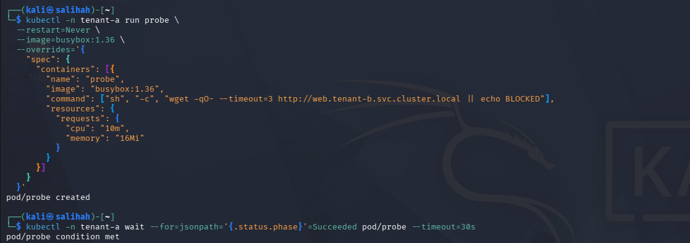

*Figure Z1.1: Cross-tenant probe execution before applying the egress policy.*

The probe completed successfully, and the output displayed the Nginx welcome page.

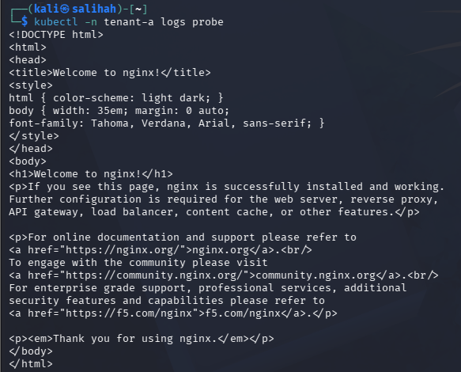

*Figure Z1.2: Successful cross-tenant access before applying the egress policy.*

The Nginx response confirmed that the probe pod in `tenant-a` could access the `web` service in `tenant-b`. This established the baseline condition before the egress restriction was applied.

#### Egress NetworkPolicy Configuration

Two NetworkPolicies were created in `tenant-a`. The first policy, `default-deny-egress`, blocks all outgoing traffic by default. The second policy, `allow-dns-and-web-only`, allows only the traffic required by the workload.

The allow-list policy permits DNS communication through UDP and TCP port 53. It also permits TCP port 80 only to pods labelled `app: web` within the same namespace.

The policy configuration was saved in `egress-policy.yaml`.

### Evidence

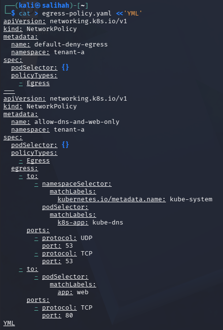

*Figure Z1.3: Configuration of the default-deny egress and explicit allow-list NetworkPolicies.*

The policies were validated using:

```bash
kubectl apply --dry-run=client -f egress-policy.yaml
```

After the validation completed without errors, the policies were applied using:

```bash
kubectl apply -f egress-policy.yaml
```

The applied NetworkPolicies were then checked using:

```bash
kubectl -n tenant-a get networkpolicy
```

The output listed both `default-deny-egress` and `allow-dns-and-web-only`. This confirmed that outgoing traffic was denied by default, while DNS and the required in-namespace web service were explicitly permitted.

### Evidence

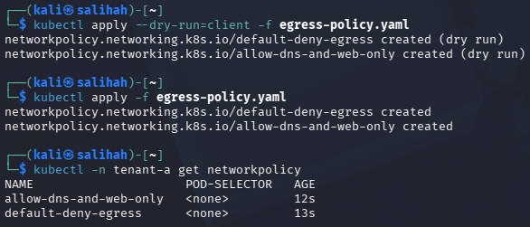

*Figure Z1.4: Egress NetworkPolicies applied and verified in `tenant-a`.*

#### Cross-Tenant Egress Test

After applying the egress policies, another probe pod was created in `tenant-a` to access the `web` service in `tenant-b`.

The request produced:

```text
wget: download timed out
BLOCKED
```

The timeout confirmed that the probe could no longer communicate with the service in `tenant-b`. Therefore, the default-deny egress policy successfully blocked unauthorised cross-tenant traffic.

### Evidence

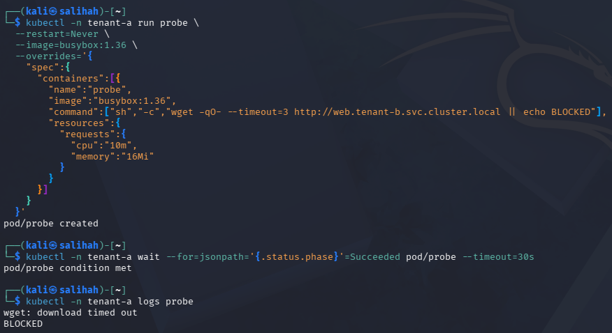

*Figure Z1.5: Cross-tenant egress blocked after applying the default-deny egress policy.*

#### Permitted In-Namespace Test

A second test was conducted from the probe pod to the `web` service within `tenant-a`. The Nginx welcome page was successfully returned.

This result confirmed that the policy did not block all outgoing traffic. Communication to the explicitly permitted `web` service within the same namespace remained available.

### Evidence

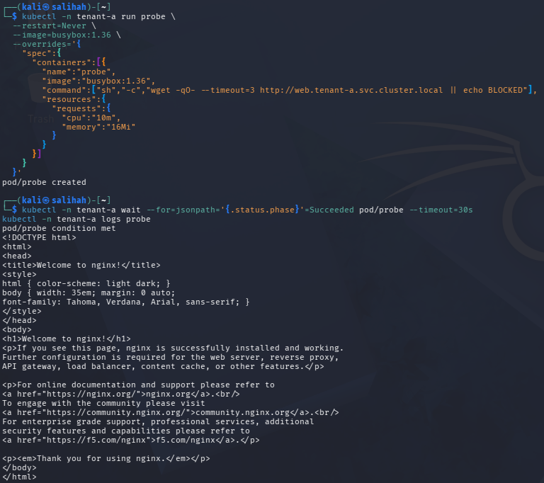

*Figure Z1.6: Successful access to the permitted web service within `tenant-a`.*

#### DNS Rule Test

The DNS rule was temporarily removed from the `allow-dns-and-web-only` NetworkPolicy. After the change, the policy only permitted TCP port 80 to pods labelled `app: web`.

### Evidence

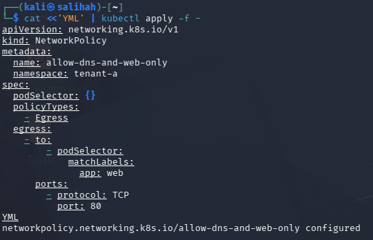

*Figure Z1.7: DNS egress rule temporarily removed from the allow-list NetworkPolicy.*

The probe then attempted to access `web.tenant-a.svc.cluster.local`. The test produced:

```text
wget: bad address 'web.tenant-a.svc.cluster.local'
DNS_BLOCKED
```

The `bad address` result showed that the pod could not resolve the service hostname because DNS traffic on port 53 was blocked. Although the policy still permitted TCP port 80 to the web pods, the connection could not begin without DNS name resolution.

### Evidence

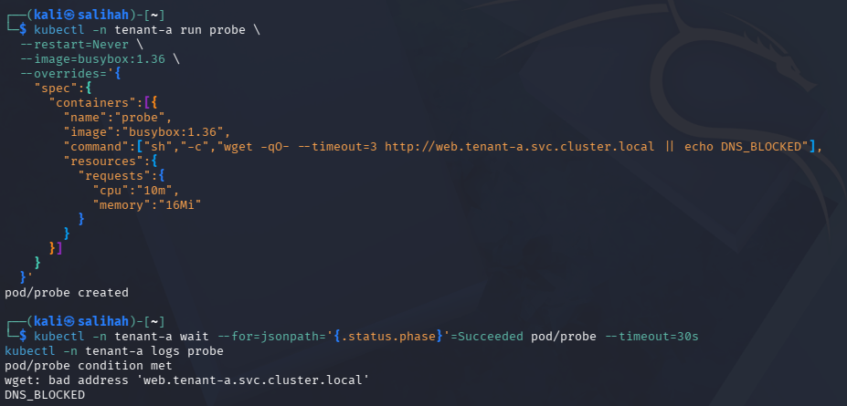

*Figure Z1.8: DNS name resolution failed after removing the DNS egress rule.*

The original `egress-policy.yaml` file was reapplied after the test. The restored policy permitted UDP port 53, TCP port 53 and TCP port 80.

This confirmed that DNS access was restored while the required web service remained permitted.

### Evidence

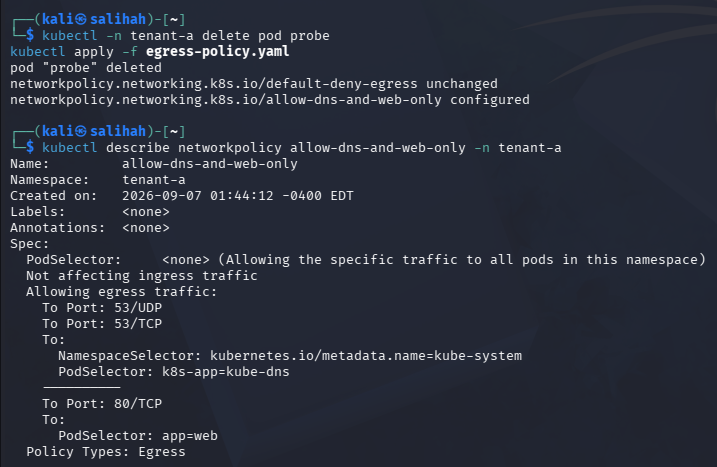

*Figure Z1.9: DNS and web egress rules restored in `tenant-a`.*

### Task Z2 — Admission Control Using Pod Security Standards

The Restricted Pod Security Standard was applied to the `tenant-a` namespace using the following command:

```bash
kubectl label namespace tenant-a \
  pod-security.kubernetes.io/enforce=restricted \
  pod-security.kubernetes.io/enforce-version=latest \
  pod-security.kubernetes.io/warn=restricted \
  --overwrite
```

The namespace labels confirmed that `tenant-a` was configured to enforce the latest Restricted Pod Security Standard.

A privileged pod was then created with `securityContext.privileged` set to `true`. When the manifest was applied, the Kubernetes admission controller rejected the pod before it could run.

The rejection message identified five security violations:

* Privileged access was enabled.
* Privilege escalation was not disabled.
* Linux capabilities were not dropped.
* Non-root execution was not enforced.
* A seccomp profile was not configured.

This demonstrated that Pod Security Standards provide preventative protection because the unsafe workload was blocked during admission.

### Evidence

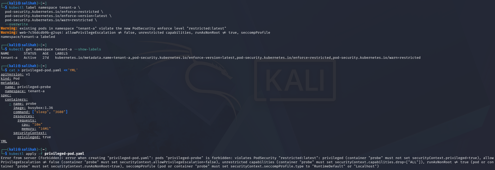

*Figure Z2.1: Restricted Pod Security enforcement and privileged pod rejection in `tenant-a`.*

#### Compliant Pod Deployment

A compliant pod was then configured with the required security controls. It was set to run as a non-root user, use the `RuntimeDefault` seccomp profile, prevent privilege escalation and drop all Linux capabilities.

The compliant pod was applied using:

```bash
kubectl apply -f compliant-pod.yaml
```

Its status was checked using:

```bash
kubectl -n tenant-a get pod compliant-probe
```

The pod reached the `1/1 Running` state. This confirmed that the Restricted Pod Security Standard did not block all workloads. It only rejected pods that did not meet the required security controls.

### Evidence

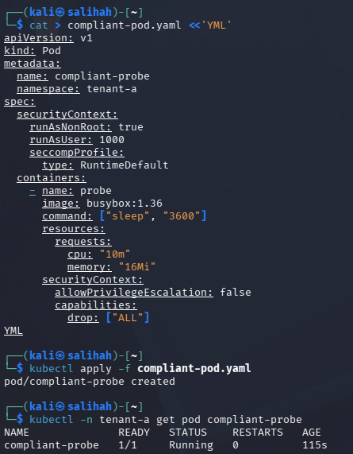

*Figure Z2.2: Compliant pod successfully admitted and running in `tenant-a`.*

#### Most Severe Restricted Violation

In my opinion, privileged container access is the most severe violation in a multi-tenant cluster. A privileged container receives extensive access to the host system and shared kernel. If an attacker compromises it, they may escape the normal container boundary, access node resources, interfere with other workloads and potentially obtain sensitive data belonging to another tenant. This would weaken the isolation provided by Kubernetes namespaces.

## Verification Commands

The original Lab 2 controls were verified using:

```bash
kubectl get networkpolicy -A
kubectl describe resourcequota tenant-a-quota -n tenant-a
```

The Lab 2 Addendum controls were verified using:

```bash
echo "=== Lab 2 Addendum verification ==="

kubectl -n tenant-a get networkpolicy \
  -o custom-columns='NAME:.metadata.name,TYPES:.spec.policyTypes'

kubectl get namespace tenant-a \
  -o jsonpath='{.metadata.labels}' | tr ',' '\n' | grep pod-security

kubectl -n tenant-a get pods
```

The outputs confirmed that the original NetworkPolicy and ResourceQuota remained active. They also confirmed that the egress policies, Restricted Pod Security labels and compliant pod were available.

### Evidence


*Figure 7: Verification of the original Lab 2 NetworkPolicy and ResourceQuota.*

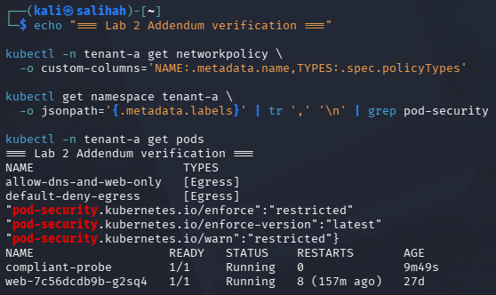

*Figure Z2.3: Final verification of the Lab 2 Addendum security controls.*

## Evidence

All screenshots used as evidence are stored in the `Evidence` folder.

| Screenshot | Description |
|---|---|
| `0-Create-Cluster.png` | Creation of the kind cluster |
| `0.1-Install-Calico.png` | Installation of Calico |
| `0.2-Calico-Rollout-Success.png` | Successful Calico rollout |
| `1-Tenant-Setup-and-Deployment.png` | Tenant namespaces, deployments and services |
| `2-Default-Network-Access.png` | Successful connection before NetworkPolicy |
| `3-ResourceQuota-and-Verification.png` | ResourceQuota configuration and verification |
| `4-Default-Deny-NetworkPolicy.png` | Default-deny NetworkPolicy configuration |
| `4.1-NetworkPolicy-Timeout.png` | Connection blocked by NetworkPolicy |
| `5-Secret-Isolation-and-RBAC.png` | Secret isolation and RBAC results |
| `6-Data-Remanence-and-Secure-Wipe.png` | Normal deletion and secure wipe |
| `7-Security-Control-Verification.png` | Final NetworkPolicy and ResourceQuota verification |
| `Z1.1-Cross-Tenant-Probe-Before-Egress-Policy.png` | Cross-tenant probe before egress policy |
| `Z1.2-Cross-Tenant-Access-Successful-Before-Egress-Policy.png` | Successful cross-tenant access before egress policy |
| `Z1.3-Egress-NetworkPolicy-Configuration.png` | Egress NetworkPolicy configuration |
| `Z1.4-Egress-NetworkPolicies-Applied-and-Verified.png` | Egress policies applied and verified |
| `Z1.5-Cross-Tenant-Egress-Blocked-After-Policy.png` | Cross-tenant egress blocked after policy |
| `Z1.6-In-Namespace-Web-Access-Successful.png` | Successful in-namespace web access |
| `Z1.7-DNS-Egress-Rule-Temporarily-Removed.png` | DNS egress rule temporarily removed |
| `Z1.8-DNS-Resolution-Blocked-Without-DNS-Rule.png` | DNS resolution blocked without DNS rule |
| `Z1.9-DNS-and-Web-Egress-Rules-Restored.png` | DNS and web egress rules restored |
| `Z2.1-Restricted-Pod-Security-and-Privileged-Pod-Rejection.png` | Restricted Pod Security and privileged pod rejection |
| `Z2.2-Compliant-Pod-Admitted-and-Running.png` | Compliant pod admitted and running |
| `Final-Security-Control-Verification.png` | Final Lab 2 Addendum verification |

## Commands Used

| Purpose | Command |
|---|---|
| Create a namespace | `kubectl create namespace tenant-a` |
| Create a deployment | `kubectl -n tenant-a create deployment web --image=nginx` |
| Expose a deployment | `kubectl -n tenant-a expose deployment web --port=80` |
| Check pods and services | `kubectl get pods,svc -n tenant-a` |
| Retrieve a service IP | `kubectl get svc web -n tenant-b -o jsonpath='{.spec.clusterIP}'` |
| Inspect ResourceQuota | `kubectl describe resourcequota tenant-a-quota -n tenant-a` |
| Verify NetworkPolicy | `kubectl get networkpolicy -A` |
| Test RBAC access | `kubectl auth can-i get secrets -n tenant-a --as=$SA` |
| Inspect the Docker volume | `docker run --rm -v ccse-vol:/data alpine ls -la /data` |
| Apply egress policies | `kubectl apply -f egress-policy.yaml` |
| List egress NetworkPolicies | `kubectl -n tenant-a get networkpolicy` |
| Enforce Restricted Pod Security | `kubectl label namespace tenant-a pod-security.kubernetes.io/enforce=restricted --overwrite` |
| Test privileged pod | `kubectl apply -f privileged-pod.yaml` |
| Deploy compliant pod | `kubectl apply -f compliant-pod.yaml` |
| Check compliant pod | `kubectl -n tenant-a get pod compliant-probe` |

## Challenges Encountered

The main challenge occurred during the Calico installation. Some Kubernetes components failed to start because the system reached its open-file and `inotify` limits. The issue was resolved by increasing the `inotify` limits and restarting the kind control-plane container.

Another challenge occurred when the probe pod was rejected after ResourceQuota was applied. The quota required the pod to specify CPU and memory requests. The command was corrected by adding resource requests through the `--overrides` option. After this correction, the connection timed out and confirmed that NetworkPolicy was working.

Another challenge occurred during the addendum because the existing default-deny ingress policy in `tenant-b` would also block the baseline cross-tenant test. A temporary ingress exception was added so that egress behaviour could be tested separately. The exception was removed after the baseline evidence was collected.

## Short-Answer Questions

### Q1. Why can containers in different namespaces communicate by default?

Kubernetes namespaces separate resources logically, but they are not network firewalls. Without a NetworkPolicy, pods in one namespace can communicate with services in another namespace. This is dangerous in a multi-tenant environment because a compromised tenant may attempt to scan or access another tenant's workloads.

### Q2. How does the default-deny principle improve security?

The default-deny principle blocks traffic unless it is specifically allowed. The NetworkPolicy used in this lab selected every pod in `tenant-b` and did not include any ingress allow rules. Therefore, incoming connections were automatically blocked.

### Q3. How are virtual machines and containers different in isolation?

Virtual machines provide stronger isolation because each VM has its own guest operating system and kernel boundary. Containers are more lightweight, but they share the host kernel. A VM boundary is more suitable when tenants are untrusted, workloads contain highly sensitive information or compliance requires stronger separation.

### Q4. What is data remanence?

Data remanence occurs when information remains on a storage device after a file is deleted. Cloud users usually cannot overwrite all physical copies, replicas or snapshots. Cryptographic erasure is preferred because destroying the encryption key makes the remaining encrypted data unreadable.

### Q5. Which isolation area was demonstrated by each task?

| Task | Isolation Area | Explanation |
|---|---|---|
| Task 1 | Compute isolation | Workloads were placed in separate Kubernetes namespaces. |
| Task 2 | Network isolation risk | The initial test showed that cross-namespace traffic was allowed. |
| Task 3 | Resource isolation | CPU, memory and pod usage were limited using ResourceQuota. |
| Task 4 | Network isolation | Incoming traffic to Tenant B was blocked using NetworkPolicy. |
| Task 5 | Secret isolation | RBAC prevented access to another tenant’s Secret. |
| Task 6 | Storage security | Normal deletion was compared with overwrite-before-delete. |

### Lab 2 Addendum Short-Answer Questions

#### Q1. Why is default-deny egress important?

An attacker who compromises a pod may try to send stolen data or connect to a command-and-control server. Default-deny egress blocks both activities unless the destination is explicitly allowed.

#### Q2. Why did hostname lookup fail without the DNS rule?

DNS uses UDP or TCP port 53. Without the DNS rule, the pod could not resolve the service hostname into an IP address. This shows that deny-by-default policies must be tested before production to avoid blocking required services.

#### Q3. What is the advantage of preventing a privileged pod?

Pod Security Standards reject the privileged pod before it starts, so it has no opportunity to cause damage. Detection only identifies the pod after it is running, when harmful activity may have already occurred.

#### Q4. Why can a privileged container defeat namespace isolation?

Containers on the same node share the host kernel. A privileged container may access host resources and affect other workloads, weakening the isolation provided by namespaces.

#### Q5. How do Z1 and Z2 demonstrate Zero Trust?

In Z1, the policy verifies the destination and port instead of trusting internal traffic. In Z2, the admission controller verifies the pod’s security settings instead of trusting every submitted workload.

## Security Best-Practices Checklist

* [x] Tenants are separated into distinct namespaces.
* [x] A default-deny NetworkPolicy blocks cross-tenant traffic.
* [x] ResourceQuota prevents a noisy neighbour from exhausting shared resources.
* [x] Per-tenant secrets are protected using RBAC.
* [x] Secure deletion and cryptographic erasure are understood.
* [x] Egress is denied by default, not only ingress.
* [x] Permitted egress uses an explicit allow-list, including DNS.
* [x] Cross-tenant traffic was tested and blocked by ingress and egress controls.
* [x] The namespace enforces the Restricted Pod Security Standard.
* [x] The privileged workload was rejected before it could run.
* [x] The compliant workload was successfully deployed.

## Lessons Learned

This lab showed that namespaces alone do not provide complete tenant isolation. NetworkPolicy is required to control ingress and egress traffic, while ResourceQuota prevents excessive resource usage. I also learned that RBAC protects Secrets and secure deletion reduces data remanence risks.

The addendum showed that DNS must be explicitly allowed when egress is denied by default. Pod Security Standards can also prevent privileged workloads from running while still allowing compliant pods.

## Cleanup

```bash
kubectl delete -f egress-policy.yaml --ignore-not-found
kubectl delete pod compliant-probe -n tenant-a --ignore-not-found

kubectl label namespace tenant-a \
  pod-security.kubernetes.io/enforce- \
  pod-security.kubernetes.io/enforce-version- \
  pod-security.kubernetes.io/warn- 2>/dev/null

rm -f egress-policy.yaml privileged-pod.yaml compliant-pod.yaml

kind delete cluster --name ccse-lab2
docker volume rm ccse-vol
```

## Conclusion

This lab demonstrated secure multi-tenancy using namespaces, ResourceQuota, NetworkPolicy and RBAC. The addendum strengthened the setup by blocking unauthorised egress traffic and enforcing the Restricted Pod Security Standard. The results showed that Zero Trust requires both network restrictions and workload verification.

## References

1. UniKL MIIT. *IKB42603 Cloud Computing Security Essentials: Lab 2 Manual*.

2. UniKL MIIT. *Lab 2 Addendum: Zero Trust Micro-Segmentation and Admission Control*.

3. Kubernetes Documentation. [Namespaces](https://kubernetes.io/docs/concepts/overview/working-with-objects/namespaces/).

4. Kubernetes Documentation. [Resource Quotas](https://kubernetes.io/docs/concepts/policy/resource-quotas/).

5. Kubernetes Documentation. [Network Policies](https://kubernetes.io/docs/concepts/services-networking/network-policies/).

6. Kubernetes Documentation. [Pod Security Standards](https://kubernetes.io/docs/concepts/security/pod-security-standards/).

7. Kubernetes Documentation. [Using RBAC Authorization](https://kubernetes.io/docs/reference/access-authn-authz/rbac/).

8. National Institute of Standards and Technology. (2020). [Zero Trust Architecture (NIST SP 800-207)](https://doi.org/10.6028/NIST.SP.800-207).

9. Cloud Security Alliance. (2024). [Security Guidance v5](https://cloudsecurityalliance.org/artifacts/security-guidance-v5).

10. Calico Documentation. [Getting Started with Calico](https://docs.tigera.io/calico/latest/getting-started/).
