# Lab 2: Secure Isolation & Multi-Tenancy

## Course Information
- Course Name: IKB42603 Cloud Computing Security Essentials
- Instructor: MADAM ADANI
- Student Name: SITI NUR SALIHAH BINTI AHMAD BALKIS
- Topic: Compute, network and storage isolation using Docker and Kubernetes
- Environment: kind Kubernetes cluster `ccse-lab2`, Calico CNI and Docker volume `ccse-vol`
- Date: 14 August 2026

## Lab Objectives
- To create and manage separate tenants using Kubernetes namespaces.
- To control tenant resource usage using ResourceQuota.
- To test and enforce network isolation using NetworkPolicy.
- To protect secrets between tenants using RBAC.
- To demonstrate data remanence and secure data deletion.

## Learning Outcomes

After completing this lab, I was able to:

- Create separate tenants using Kubernetes namespaces.
- Deploy applications and services in different namespaces.
- Test communication between tenants.
- Control resource usage using ResourceQuota.
- Enforce network isolation using NetworkPolicy.
- Restrict access to Secrets using RBAC.
- Explain data remanence and secure deletion in cloud storage.

## Environment

| Component | Details |
|---|---|
| Operating System | Kali Linux |
| Container Platform | Docker |
| Kubernetes Platform | kind |
| Cluster Name | `ccse-lab2` |
| Kubernetes Node | `kindest/node:v1.30.0` |
| Network Plugin | Calico v3.27.0 |
| Test Application | Nginx |
| Connectivity Tool | curl |
| Docker Volume | `ccse-vol` |
| Namespaces | `tenant-a` and `tenant-b` |

## Lab Summary
In this lab, two Kubernetes tenants were created using separate namespaces. Nginx was deployed in both tenants, and the initial test showed that they could communicate by default. A ResourceQuota was used to control resource usage, while a NetworkPolicy successfully blocked traffic between tenants. RBAC protected secrets across namespaces, and secure deletion was demonstrated by overwriting sensitive data before removing it. Overall, the lab demonstrated tenant isolation and data security in Kubernetes.

## Step-by-Step Implementation

### Setup — Cluster with Policy Enforcement

A kind cluster named `ccse-lab2` was created with the default Container Network Interface (CNI) disabled. Calico was then installed to manage cluster networking and enforce NetworkPolicy rules.

```bash
cat <<EOF | kind create cluster --name ccse-lab2 --config=-
kind: Cluster
apiVersion: kind.x-k8s.io/v1alpha4
networking:
  disableDefaultCNI: true
  podSubnet: 192.168.0.0/16
EOF

cat ccse-lab2-config.yaml

kind create cluster --name ccse-lab2 --config ccse-lab2-config.yaml
```

Calico was installed using:

```bash
kubectl apply -f https://raw.githubusercontent.com/projectcalico/calico/v3.27.0/manifests/calico.yaml
kubectl -n kube-system rollout status daemonset/calico-node --timeout=180s
```

All important components, including Calico, CoreDNS and kube-proxy, successfully reached the `Running` state.

### Evidence

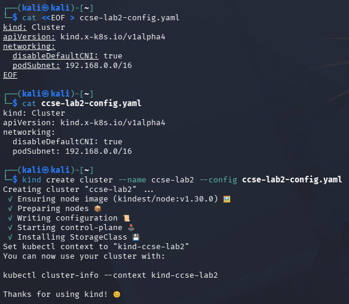

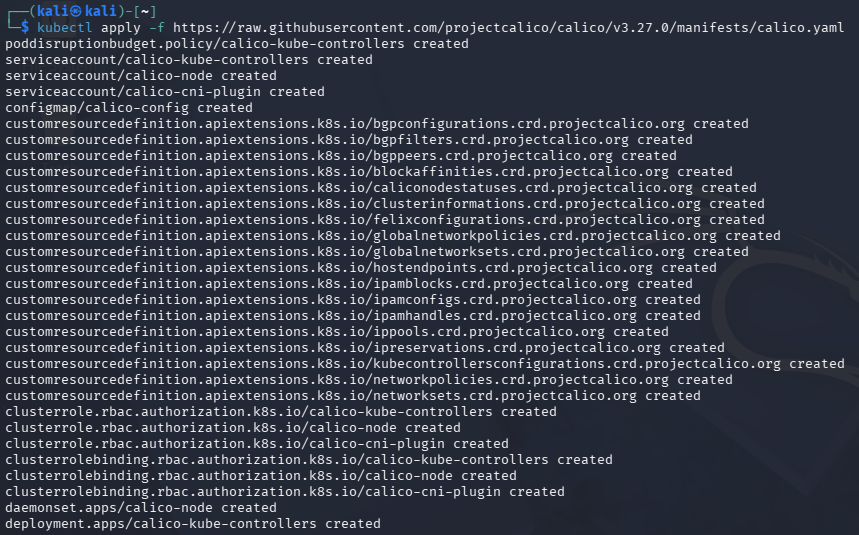

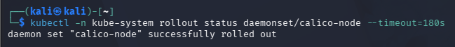

### Task 1 — Two Tenants on One Cluster

Two Kubernetes namespaces were created to represent separate tenants:

```bash
kubectl create namespace tenant-a
kubectl create namespace tenant-b
```

An Nginx deployment was created in each namespace:

```bash
kubectl -n tenant-a create deployment web --image=nginx
kubectl -n tenant-b create deployment web --image=nginx
```

Both deployments were exposed as ClusterIP services:

```bash
kubectl -n tenant-a expose deployment web --port=80
kubectl -n tenant-b expose deployment web --port=80
```

The pods and services were checked using:

```bash
kubectl get pods,svc -n tenant-a
kubectl get pods,svc -n tenant-b
```

Both Nginx pods reached the `1/1 Running` state. This confirmed that both tenants had their own workloads and services while sharing the same Kubernetes cluster.

### Evidence

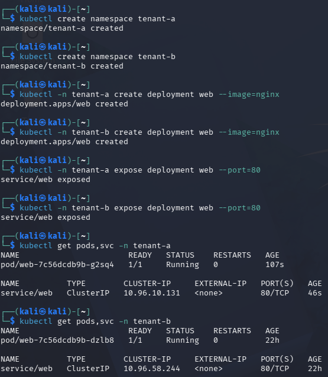

### Task 2 — Observe the Default-Open Risk

The ClusterIP address of the Tenant B web service was obtained using:

```bash
kubectl get svc web -n tenant-b -o jsonpath='{.spec.clusterIP}'; echo
```

The IP address assigned to the Tenant B service was:

```text
10.96.58.244
```

A temporary curl pod was launched from `tenant-a` to access the web service in `tenant-b`:

```bash
kubectl -n tenant-a run probe --rm -it \
  --image=curlimages/curl \
  --restart=Never \
  -- curl -s -m 5 http://10.96.58.244 \
  -o /dev/null -w 'HTTP %{http_code}\n'
```

The test produced:

```text
HTTP 200
```

The `HTTP 200` response confirmed that Tenant A could communicate with Tenant B. This shows that Kubernetes namespaces only provide logical separation and do not automatically block network traffic between namespaces.

### Evidence

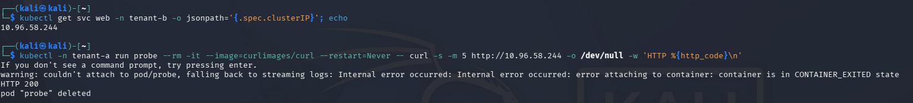

### Task 3 — Contain the Noisy Neighbour (Resource Quotas)

A ResourceQuota was created in `tenant-a` to limit the amount of cluster resources that the tenant could request.

```bash
cat <<EOF | kubectl apply -f -
apiVersion: v1
kind: ResourceQuota
metadata:
  name: tenant-a-quota
  namespace: tenant-a
spec:
  hard:
    requests.cpu: "1"
    requests.memory: 512Mi
    pods: "5"
EOF
```

The ResourceQuota was checked using:

```bash
kubectl describe resourcequota tenant-a-quota -n tenant-a
```

The result showed:

```text
Name:            tenant-a-quota
Namespace:       tenant-a
Resource         Used   Hard
pods             1      5
requests.cpu     0      1
requests.memory  0      512Mi
```

The quota limits Tenant A to a maximum of five pods, one CPU request and 512 MiB of memory requests. This prevents one tenant from consuming too many shared resources and affecting other tenants.

### Evidence

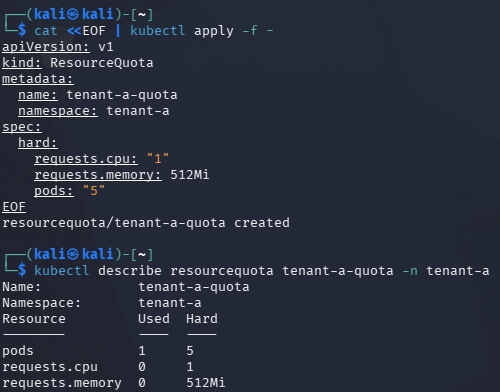

### Task 4 — Default-Deny Network Isolation

A default-deny ingress NetworkPolicy was applied to `tenant-b`.

```bash
cat <<EOF | kubectl apply -f -
apiVersion: networking.k8s.io/v1
kind: NetworkPolicy
metadata:
  name: default-deny-ingress
  namespace: tenant-b
spec:
  podSelector: {}
  policyTypes:
    - Ingress
EOF
```

The policy was verified using:

```bash
kubectl get networkpolicy -n tenant-b
```

The output showed:

```text
NAME                   POD-SELECTOR   AGE
default-deny-ingress   <none>         57s
```

The empty pod selector means that the policy applies to every pod in `tenant-b`. Since no ingress traffic is allowed by the policy, incoming connections to the pods are denied.

The first connection test could not create the probe pod because the ResourceQuota required CPU and memory requests:

```text
Error from server (Forbidden): pods "probe" is forbidden: failed quota:
tenant-a-quota: must specify requests.cpu for: probe;
requests.memory for: probe
```

Therefore, the probe was repeated with CPU and memory requests:

```bash
kubectl -n tenant-a run probe --rm -it \
  --image=curlimages/curl \
  --restart=Never \
  --overrides='{"spec":{"containers":[{"name":"probe","image":"curlimages/curl","resources":{"requests":{"cpu":"10m","memory":"16Mi"}}}]}}' \
  -- curl -s -m 5 http://10.96.58.244 \
  -o /dev/null -w 'HTTP %{http_code}\n'
```

The observed result was:

```text
pod "probe" deleted
error: timed out waiting for the condition
```

The timeout confirmed that Tenant A could no longer connect to the web service in Tenant B. Therefore, the default-deny NetworkPolicy successfully provided network isolation.

### Evidence

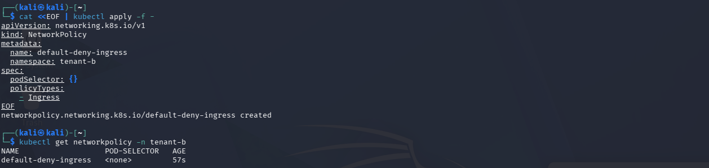

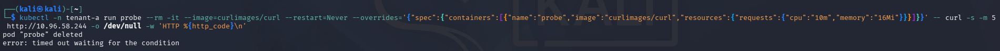

### Task 5 — Storage & Secret Isolation

A different Kubernetes Secret was created in each tenant:

```bash
kubectl -n tenant-a create secret generic data \
  --from-literal=value=SECRET_A

kubectl -n tenant-b create secret generic data \
  --from-literal=value=SECRET_B
```

A ServiceAccount named `app-a` was created in `tenant-a`:

```bash
kubectl -n tenant-a create serviceaccount app-a
```

A Role named `reader` was created to allow access to Secrets inside `tenant-a`:

```bash
kubectl -n tenant-a create role reader \
  --verb=get \
  --resource=secrets
```

The Role was assigned to the ServiceAccount using a RoleBinding:

```bash
kubectl -n tenant-a create rolebinding rb \
  --role=reader \
  --serviceaccount=tenant-a:app-a
```

The ServiceAccount identity was stored in a variable:

```bash
SA=system:serviceaccount:tenant-a:app-a
```

Its permission in Tenant A was checked using:

```bash
kubectl auth can-i get secrets -n tenant-a --as=$SA
```

Result:

```text
yes
```

Its permission in Tenant B was checked using:

```bash
kubectl auth can-i get secrets -n tenant-b --as=$SA
```

Result:

```text
no
```

The results showed that the ServiceAccount could access Secrets in its own namespace but could not access Secrets belonging to Tenant B. This demonstrates secret isolation using namespace-scoped RBAC.

### Evidence

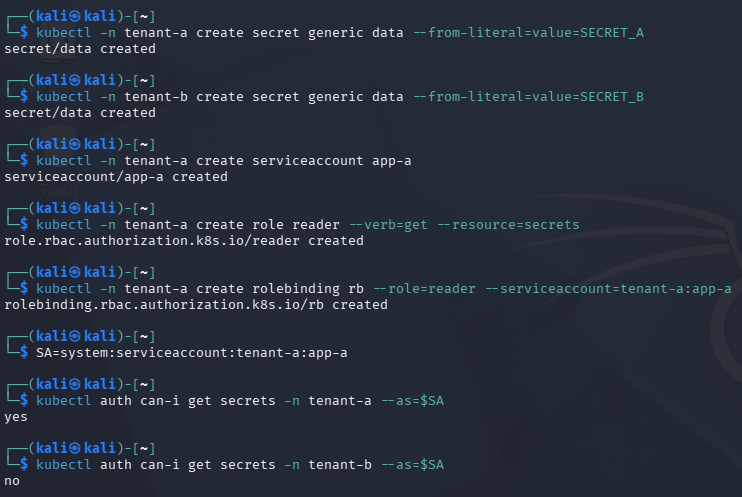

### Task 6 — Data Remanence and Secure Deletion

This task demonstrated the difference between normal file deletion and overwriting a file before deletion inside a Docker volume.

### Normal Deletion

Sensitive information was written to a file and then deleted normally:

```bash
docker run --rm -v ccse-vol:/data alpine sh -c \
  'echo SENSITIVE-PATIENT-RECORD > /data/phi.txt; \
  sync; \
  rm /data/phi.txt; \
  grep -a SENSITIVE /data/* 2>/dev/null; \
  echo scan-done'
```

The observed result was:

```text
scan-done
```

The file was no longer visible after deletion. However, the `rm` command only removes the file reference and does not intentionally overwrite its underlying data. Therefore, some data may remain recoverable on the storage medium.

### Secure Wipe

A second file was created and overwritten with zero bytes before deletion:

```bash
docker run --rm -v ccse-vol:/data alpine sh -c \
  'echo SENSITIVE > /data/phi2.txt; \
  sync; \
  dd if=/dev/zero of=/data/phi2.txt bs=1k count=1 conv=notrunc; \
  rm /data/phi2.txt; \
  echo wiped'
```

The observed result was:

```text
1+0 records in
1+0 records out
1024 bytes (1.0KB) copied
wiped
```

The Docker volume was checked using:

```bash
docker run --rm -v ccse-vol:/data alpine ls -la /data
```

The final output only showed the `.` and `..` directory entries. This confirmed that `phi.txt` and `phi2.txt` were no longer visible.

Overwriting the file before deletion reduces the possibility of recovering its original contents. However, cryptographic erasure is more practical in cloud storage because customers normally cannot control the physical storage blocks directly.

### Evidence

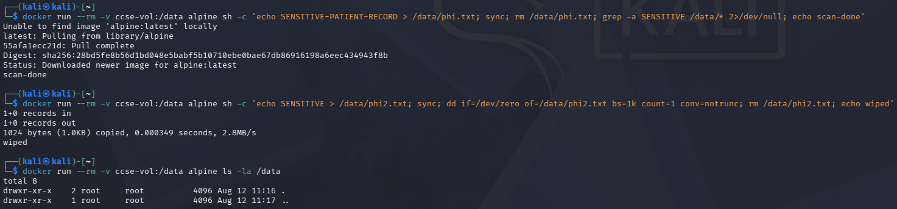

### Verification Commands

The NetworkPolicy can be verified using:

```bash
kubectl get networkpolicy -A
```

The ResourceQuota can be verified using:

```bash
kubectl describe resourcequota tenant-a-quota -n tenant-a
```
### Evidence

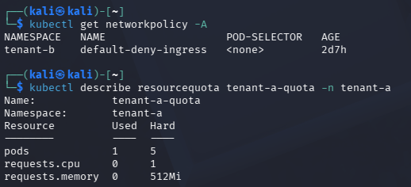

## Evidence

All screenshots used as evidence are stored in the `Evidence` folder.

| Screenshot | Description |
|---|---|
| `0-Create-Cluster.png` | Creation of the kind cluster |
| `0.1-Install-Calico.png` | Installation of Calico |
| `0.2-Calico-Rollout-Success.png` | Successful Calico rollout |
| `1-Tenant-Setup-and-Deployment.png` | Tenant namespaces, deployments and services |
| `2-Default-Network-Access.png` | Successful connection before NetworkPolicy |
| `3-ResourceQuota-and-Verification.png` | ResourceQuota configuration and verification |
| `4-Default-Deny-NetworkPolicy.png` | Default-deny NetworkPolicy configuration |
| `4.1-NetworkPolicy-Timeout.png` | Connection blocked by NetworkPolicy |
| `5-Secret-Isolation-and-RBAC.png` | Secret isolation and RBAC results |
| `6-Data-Remanence-and-Secure-Wipe.png` | Normal deletion and secure wipe |
| `7-Security-Control-Verification.png` | Final NetworkPolicy and ResourceQuota verification |

## Commands Used

| Purpose | Command |
|---|---|
| Create a namespace | `kubectl create namespace tenant-a` |
| Create a deployment | `kubectl -n tenant-a create deployment web --image=nginx` |
| Expose a deployment | `kubectl -n tenant-a expose deployment web --port=80` |
| Check pods and services | `kubectl get pods,svc -n tenant-a` |
| Retrieve a service IP | `kubectl get svc web -n tenant-b -o jsonpath='{.spec.clusterIP}'` |
| Inspect ResourceQuota | `kubectl describe resourcequota tenant-a-quota -n tenant-a` |
| Verify NetworkPolicy | `kubectl get networkpolicy -A` |
| Test RBAC access | `kubectl auth can-i get secrets -n tenant-a --as=$SA` |
| Inspect the Docker volume | `docker run --rm -v ccse-vol:/data alpine ls -la /data` |

## Challenges Encountered

The main challenge occurred during the Calico installation. Some Kubernetes components failed to start because the system reached its open-file and `inotify` limits. The issue was resolved by increasing the `inotify` limits and restarting the kind control-plane container.

Another challenge occurred when the probe pod was rejected after ResourceQuota was applied. The quota required the pod to specify CPU and memory requests. The command was corrected by adding resource requests through the `--overrides` option. After this correction, the connection timed out and confirmed that NetworkPolicy was working.

## Short-Answer Questions

### Q1. Why can containers in different namespaces communicate by default?

Kubernetes namespaces separate resources logically, but they are not network firewalls. Without a NetworkPolicy, pods in one namespace can communicate with services in another namespace. This is dangerous in a multi-tenant environment because a compromised tenant may attempt to scan or access another tenant's workloads.

### Q2. How does the default-deny principle improve security?

The default-deny principle blocks traffic unless it is specifically allowed. The NetworkPolicy used in this lab selected every pod in `tenant-b` and did not include any ingress allow rules. Therefore, incoming connections were automatically blocked.

### Q3. How are virtual machines and containers different in isolation?

Virtual machines provide stronger isolation because each VM has its own guest operating system and kernel boundary. Containers are more lightweight, but they share the host kernel. A VM boundary is more suitable when tenants are untrusted, workloads contain highly sensitive information or compliance requires stronger separation.

### Q4. What is data remanence?

Data remanence occurs when information remains on a storage device after a file is deleted. Cloud users usually cannot overwrite all physical copies, replicas or snapshots. Cryptographic erasure is preferred because destroying the encryption key makes the remaining encrypted data unreadable.

### Q5. Which isolation area was demonstrated by each task?

| Task | Isolation Area | Explanation |
|---|---|---|
| Task 1 | Compute isolation | Workloads were placed in separate Kubernetes namespaces. |
| Task 2 | Network isolation risk | The initial test showed that cross-namespace traffic was allowed. |
| Task 3 | Resource isolation | CPU, memory and pod usage were limited using ResourceQuota. |
| Task 4 | Network isolation | Incoming traffic to Tenant B was blocked using NetworkPolicy. |
| Task 5 | Secret isolation | RBAC prevented access to another tenant’s Secret. |
| Task 6 | Storage security | Normal deletion was compared with overwrite-before-delete. |

## Security Best-Practices Checklist

- [x] Tenants are separated into distinct namespaces.
- [x] A default-deny NetworkPolicy blocks cross-tenant traffic (verified before/after).
- [x] Resource quotas prevent a noisy-neighbour from exhausting shared capacity.
- [x] Per-tenant secrets are unreadable by other tenants (RBAC enforced).
- [x] Secure deletion / cryptographic erasure is understood for data remanence.

## Lessons Learned

This lab showed that namespaces alone do not provide complete tenant isolation because pods in different namespaces can communicate by default. NetworkPolicy is required to control network traffic, while ResourceQuota prevents a tenant from using excessive shared resources.

I also learned that RBAC can restrict access to sensitive resources such as Secrets. The storage test demonstrated that normal deletion may leave recoverable data, while overwriting data before deletion can make recovery more difficult. In cloud storage, cryptographic erasure is generally more practical.

## Cleanup

```bash
kind delete cluster --name ccse-lab2
docker volume rm ccse-vol
```

## Conclusion

This lab demonstrated that secure multi-tenancy requires several security controls. Kubernetes namespaces provided logical separation, but they did not automatically block network communication. ResourceQuota controlled shared resource usage, NetworkPolicy enforced network isolation and RBAC protected sensitive information. The storage test also showed why secure deletion is important when handling data in cloud environments.

## References

1. UniKL MIIT. *IKB42603 Cloud Computing Security Essentials: Lab 2 Manual*.
2. Kubernetes Documentation. [Namespaces](https://kubernetes.io/docs/concepts/overview/working-with-objects/namespaces/).
3. Kubernetes Documentation. [Resource Quotas](https://kubernetes.io/docs/concepts/policy/resource-quotas/).
4. Kubernetes Documentation. [Network Policies](https://kubernetes.io/docs/concepts/services-networking/network-policies/).
5. Kubernetes Documentation. [Using RBAC Authorization](https://kubernetes.io/docs/reference/access-authn-authz/rbac/).
6. Calico Documentation. [Getting Started with Calico](https://docs.tigera.io/calico/latest/getting-started/).