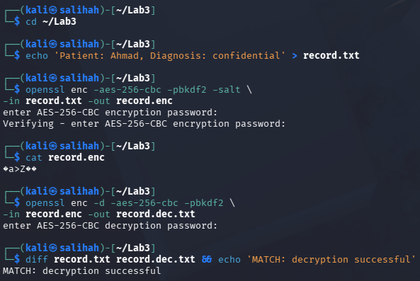
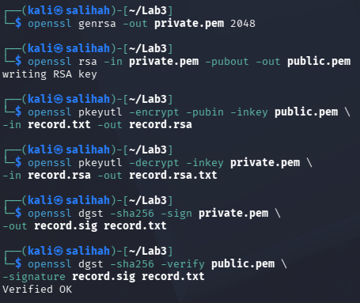
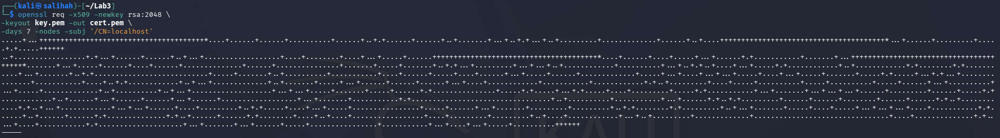
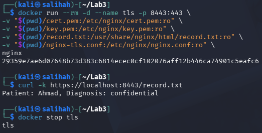

# Lab 3: Data Protection — Encryption & Key Management

## Course Information

- **Course Name:** IKB42603 Cloud Computing Security Essentials
- **Instructor:** Madam Adani
- **Student Name:** SITI NUR SALIHAH BINTI AHMAD BALKIS
- **Topic:** Data protection using encryption, TLS, key management, cryptographic erasure and hashing
- **Environment:** Kali Linux, OpenSSL, Docker, Nginx, AWS CLI and LocalStack KMS
- **Date:** 18 August 2026

## Lab Objectives

The objectives of this lab are:

- To encrypt and decrypt data using symmetric and asymmetric encryption.
- To protect data in transit using TLS.
- To manage encryption keys using LocalStack KMS.
- To implement envelope encryption and per-tenant keys.
- To demonstrate cryptographic erasure.
- To verify data integrity using SHA-256 hashing and a hash chain.

## Learning Outcomes

After completing this lab, I was able to:

- Encrypt and decrypt data using AES symmetric encryption.
- Generate and use RSA public and private keys.
- Create and verify a digital signature.
- Protect data in transit using TLS.
- Create and manage encryption keys using LocalStack KMS.
- Apply envelope encryption using a KMS master key and a data key.
- Use separate encryption keys for different tenants.
- Demonstrate cryptographic erasure by disabling an encryption key.
- Verify file integrity using SHA-256 hashing.
- Create a simple hash chain for tamper-evident records.

## Environment

| Component | Details |
|---|---|
| Operating System | Kali Linux |
| Cryptographic Tool | OpenSSL 3.5.5 |
| Container Platform | Docker |
| Web Server | Nginx |
| TLS Port | `8443` |
| Command-Line Tool | curl |
| Cloud Service Emulator | LocalStack |
| Key Management Service | LocalStack KMS |
| Cloud Command-Line Tool | AWS CLI v2 |
| Symmetric Encryption | AES-256-CBC |
| Asymmetric Encryption | RSA 2048-bit |
| Hashing Algorithm | SHA-256 |
| Working Directory | `~/Lab3` |

## Lab Summary

In this lab, a sensitive file was encrypted and decrypted using AES and RSA encryption. A digital signature was created and verified, while TLS was used to protect the file during transmission. LocalStack KMS was used to create and manage keys and perform envelope encryption. Separate keys were also created for different tenants, and cryptographic erasure was demonstrated by disabling a key. Lastly, SHA-256 hashing and a hash chain were used to check data integrity and detect changes. Overall, this lab demonstrated how encryption, key management and hashing can protect cloud data.

## Step-by-Step Implementation

### Task 1: Symmetric Encryption (Data at Rest)

A sensitive patient record was created and encrypted using AES-256-CBC. The same passphrase was used to encrypt and decrypt the file.

#### 1. Create a Sensitive Record

The following command was used to create a sample sensitive file:

```bash
echo 'Patient: Ahmad, Diagnosis: confidential' > record.txt
```

#### 2. Encrypt the Record

The file was encrypted using AES-256-CBC with PBKDF2 and salt:

```bash
openssl enc -aes-256-cbc -pbkdf2 -salt \
-in record.txt -out record.enc
```

The encrypted file was displayed using:

```bash
cat record.enc
```

The output appeared unreadable, showing that the original content was protected.

#### 3. Decrypt and Verify the Record

The encrypted file was decrypted using the same passphrase:

```bash
openssl enc -d -aes-256-cbc -pbkdf2 \
-in record.enc -out record.dec.txt
```

The original and decrypted files were then compared:

```bash
diff record.txt record.dec.txt && echo 'MATCH: decryption successful'
```

The `MATCH: decryption successful` message confirmed that the decrypted content was the same as the original record.


**Figure 1:** AES-256 encryption and decryption showing that the decrypted file matched the original file.

#### Result

The sensitive record was successfully encrypted and decrypted using AES-256-CBC. The encrypted content could not be read normally, while the decrypted file matched the original record.

---

### Task 2: Asymmetric Encryption and Digital Signatures

In this task, an RSA public and private key pair was generated. The public key was used for encryption, while the private key was used for decryption. A digital signature was also created and verified.

#### Generate the RSA Key Pair

A 2048-bit RSA private key was generated:

```bash
openssl genrsa -out private.pem 2048
```

The public key was generated from the private key:

```bash
openssl rsa -in private.pem -pubout -out public.pem
```

#### Encrypt and Decrypt the Record

The record was encrypted using the public key:

```bash
openssl pkeyutl -encrypt -pubin -inkey public.pem \
-in record.txt -out record.rsa
```

The encrypted record was decrypted using the private key:

```bash
openssl pkeyutl -decrypt -inkey private.pem \
-in record.rsa -out record.rsa.txt
```

#### Create and Verify the Digital Signature

A digital signature was created using the private key:

```bash
openssl dgst -sha256 -sign private.pem \
-out record.sig record.txt
```

The signature was verified using the public key:

```bash
openssl dgst -sha256 -verify public.pem \
-signature record.sig record.txt
```

The `Verified OK` output confirmed that the digital signature was valid and that the record had not been modified.



**Figure 2:** RSA encryption, decryption and digital-signature verification showing the `Verified OK` result.

#### Task 2 Result

The record was successfully protected using RSA encryption. The digital signature was also verified successfully, confirming the origin and integrity of the record.

---

### Task 3: Encryption in Transit (TLS)

In this task, TLS was used to protect the sensitive record while it was transmitted through an HTTPS connection. A self-signed certificate and an RSA private key were generated using OpenSSL.

#### Generate a Self-Signed Certificate

```bash
openssl req -x509 -newkey rsa:2048 \
-keyout key.pem -out cert.pem \
-days 7 -nodes -subj '/CN=localhost'
```

This command created a certificate named `cert.pem` and a private key named `key.pem`.



**Figure 3.1:** Generation of a self-signed certificate and RSA private key using OpenSSL.

#### Configure Nginx for TLS

The default Nginx container did not automatically enable TLS after the certificate and private key were mounted. Therefore, an additional Nginx configuration file named `nginx-tls.conf` was created.

```nginx
events {}

http {
    server {
        listen 443 ssl;
        server_name localhost;

        ssl_certificate /etc/nginx/cert.pem;
        ssl_certificate_key /etc/nginx/key.pem;

        location / {
            root /usr/share/nginx/html;
        }
    }
}
```

#### Run the HTTPS Container

The Nginx container was started on port `8443`. The certificate, private key, sensitive record and TLS configuration were mounted into the container.

```bash
docker run --rm -d --name tls -p 8443:443 \
-v "$(pwd)/cert.pem:/etc/nginx/cert.pem:ro" \
-v "$(pwd)/key.pem:/etc/nginx/key.pem:ro" \
-v "$(pwd)/record.txt:/usr/share/nginx/html/record.txt:ro" \
-v "$(pwd)/nginx-tls.conf:/etc/nginx/nginx.conf:ro" \
nginx
```

The sensitive record was accessed through HTTPS:

```bash
curl -k https://localhost:8443/record.txt
```

The command returned:

```text
Patient: Ahmad, Diagnosis: confidential
```

After the HTTPS connection was tested successfully, the TLS container was stopped:

```bash
docker stop tls
```

The output `tls` confirmed that the container was stopped successfully.



**Figure 3.2:** The sensitive record was successfully accessed through HTTPS, and the TLS container was stopped after the test.

#### Task 3 Result

The sensitive record was successfully transmitted through an HTTPS connection. TLS encrypted the communication channel and protected the data from being read if the network traffic was intercepted. The TLS container was then stopped successfully after the test was completed.