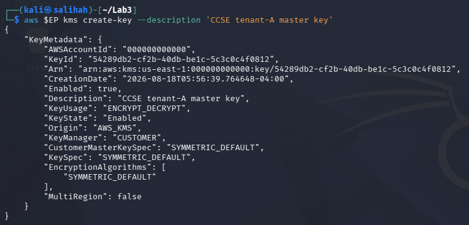
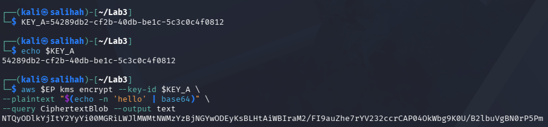
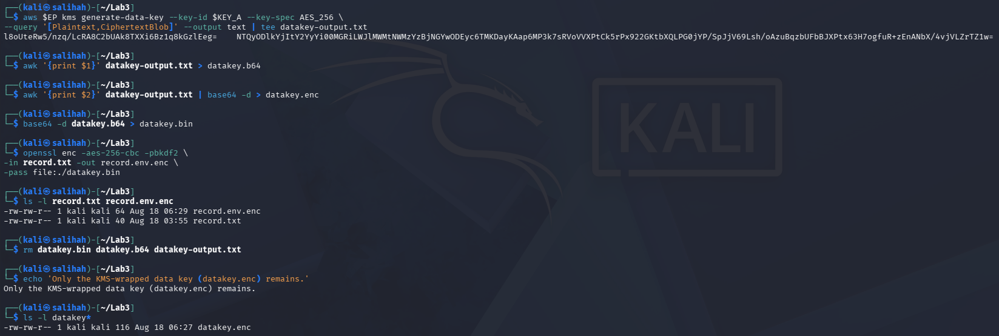
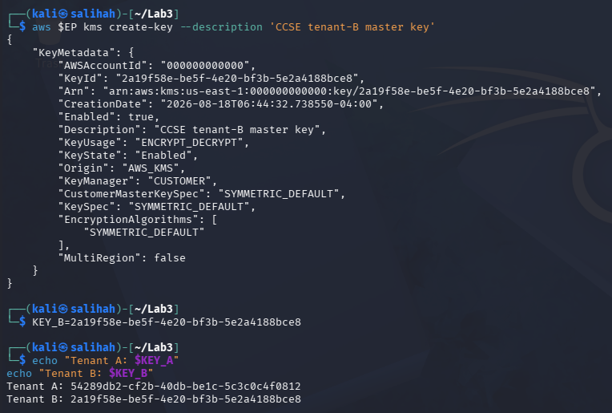
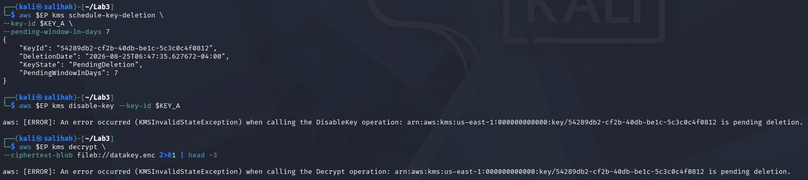
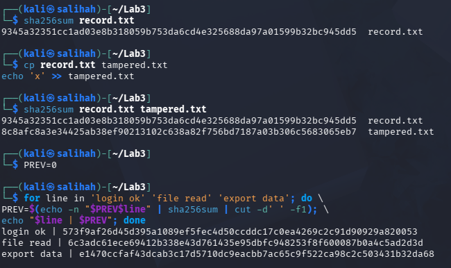
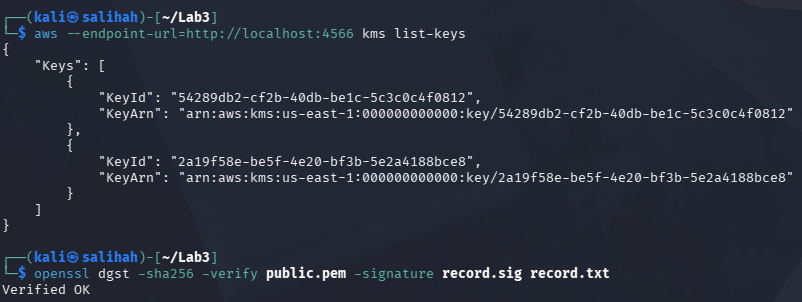
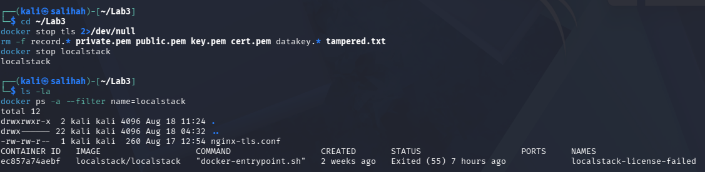

# Lab 3: Data Protection — Encryption & Key Management

## Course Information

- **Course Name:** IKB42603 Cloud Computing Security Essentials
- **Instructor:** Madam Adani
- **Student Name:** SITI NUR SALIHAH BINTI AHMAD BALKIS
- **Topic:** Data protection using encryption, TLS, key management, cryptographic erasure and hashing
- **Environment:** Kali Linux, OpenSSL, Docker, Nginx, AWS CLI and LocalStack KMS
- **Date:** 18 August 2026

## Lab Objectives

The objectives of this lab are:

- To encrypt and decrypt data using symmetric and asymmetric encryption.
- To protect data in transit using TLS.
- To manage encryption keys using LocalStack KMS.
- To implement envelope encryption and per-tenant keys.
- To demonstrate cryptographic erasure.
- To verify data integrity using SHA-256 hashing and a hash chain.

## Learning Outcomes

After completing this lab, I was able to:

- Encrypt and decrypt data using AES symmetric encryption.
- Generate and use RSA public and private keys.
- Create and verify a digital signature.
- Protect data in transit using TLS.
- Create and manage encryption keys using LocalStack KMS.
- Apply envelope encryption using a KMS master key and a data key.
- Use separate encryption keys for different tenants.
- Demonstrate cryptographic erasure by scheduling an encryption key for deletion.
- Verify file integrity using SHA-256 hashing.
- Create a simple hash chain for tamper-evident records.

## Environment

| Component | Details |
|---|---|
| Operating System | Kali Linux |
| Cryptographic Tool | OpenSSL 3.5.5 |
| Container Platform | Docker |
| Web Server | Nginx |
| TLS Port | `8443` |
| Command-Line Tool | curl |
| Cloud Service Emulator | LocalStack |
| Key Management Service | LocalStack KMS |
| Cloud Command-Line Tool | AWS CLI v2 |
| Symmetric Encryption | AES-256-CBC |
| Asymmetric Encryption | RSA 2048-bit |
| Hashing Algorithm | SHA-256 |
| Working Directory | `~/Lab3` |

## Lab Summary

In this lab, a sensitive file was encrypted and decrypted using AES and RSA encryption. A digital signature was created and verified, while TLS was used to protect the file during transmission. LocalStack KMS was used to create and manage keys and perform envelope encryption. Separate keys were also created for different tenants, and cryptographic erasure was demonstrated by scheduling a key for deletion. Lastly, SHA-256 hashing and a hash chain were used to check data integrity and detect changes. Overall, this lab demonstrated how encryption, key management and hashing can protect cloud data.

## Step-by-Step Implementation

### Task 1: Symmetric Encryption (Data at Rest)

A sensitive patient record was created and encrypted using AES-256-CBC. The same passphrase was used to encrypt and decrypt the file.

#### 1. Create a Sensitive Record

The following command was used to create a sample sensitive file:

```bash
echo 'Patient: Ahmad, Diagnosis: confidential' > record.txt
```

#### 2. Encrypt the Record

The file was encrypted using AES-256-CBC with PBKDF2 and salt:

```bash
openssl enc -aes-256-cbc -pbkdf2 -salt \
-in record.txt -out record.enc
```

The encrypted file was displayed using:

```bash
cat record.enc
```

The output appeared unreadable, showing that the original content was protected.

#### 3. Decrypt and Verify the Record

The encrypted file was decrypted using the same passphrase:

```bash
openssl enc -d -aes-256-cbc -pbkdf2 \
-in record.enc -out record.dec.txt
```

The original and decrypted files were then compared:

```bash
diff record.txt record.dec.txt && echo 'MATCH: decryption successful'
```

The `MATCH: decryption successful` message confirmed that the decrypted content was the same as the original record.


**Figure 1:** AES-256 encryption and decryption showing that the decrypted file matched the original file.

#### Result

The sensitive record was successfully encrypted and decrypted using AES-256-CBC. The encrypted content could not be read normally, while the decrypted file matched the original record.

---

### Task 2: Asymmetric Encryption and Digital Signatures

In this task, an RSA public and private key pair was generated. The public key was used for encryption, while the private key was used for decryption. A digital signature was also created and verified.

#### Generate the RSA Key Pair

A 2048-bit RSA private key was generated:

```bash
openssl genrsa -out private.pem 2048
```

The public key was generated from the private key:

```bash
openssl rsa -in private.pem -pubout -out public.pem
```

#### Encrypt and Decrypt the Record

The record was encrypted using the public key:

```bash
openssl pkeyutl -encrypt -pubin -inkey public.pem \
-in record.txt -out record.rsa
```

The encrypted record was decrypted using the private key:

```bash
openssl pkeyutl -decrypt -inkey private.pem \
-in record.rsa -out record.rsa.txt
```

#### Create and Verify the Digital Signature

A digital signature was created using the private key:

```bash
openssl dgst -sha256 -sign private.pem \
-out record.sig record.txt
```

The signature was verified using the public key:

```bash
openssl dgst -sha256 -verify public.pem \
-signature record.sig record.txt
```

The `Verified OK` output confirmed that the digital signature was valid and that the record had not been modified.


**Figure 2:** RSA encryption, decryption and digital-signature verification showing the `Verified OK` result.

#### Task 2 Result

The record was successfully protected using RSA encryption. The digital signature was also verified successfully, confirming the origin and integrity of the record.

---

### Task 3: Encryption in Transit (TLS)

In this task, TLS was used to protect the sensitive record while it was transmitted through an HTTPS connection. A self-signed certificate and an RSA private key were generated using OpenSSL.

#### Generate a Self-Signed Certificate

```bash
openssl req -x509 -newkey rsa:2048 \
-keyout key.pem -out cert.pem \
-days 7 -nodes -subj '/CN=localhost'
```

This command created a certificate named `cert.pem` and a private key named `key.pem`.


**Figure 3.1:** Generation of a self-signed certificate and RSA private key using OpenSSL.

#### Configure Nginx for TLS

The default Nginx container did not automatically enable TLS after the certificate and private key were mounted. Therefore, an additional Nginx configuration file named `nginx-tls.conf` was created.

```nginx
events {}

http {
    server {
        listen 443 ssl;
        server_name localhost;

        ssl_certificate /etc/nginx/cert.pem;
        ssl_certificate_key /etc/nginx/key.pem;

        location / {
            root /usr/share/nginx/html;
        }
    }
}
```

#### Run the HTTPS Container

The Nginx container was started on port `8443`. The certificate, private key, sensitive record and TLS configuration were mounted into the container.

```bash
docker run --rm -d --name tls -p 8443:443 \
-v "$(pwd)/cert.pem:/etc/nginx/cert.pem:ro" \
-v "$(pwd)/key.pem:/etc/nginx/key.pem:ro" \
-v "$(pwd)/record.txt:/usr/share/nginx/html/record.txt:ro" \
-v "$(pwd)/nginx-tls.conf:/etc/nginx/nginx.conf:ro" \
nginx
```

The sensitive record was accessed through HTTPS:

```bash
curl -k https://localhost:8443/record.txt
```

The command returned:

```text
Patient: Ahmad, Diagnosis: confidential
```

After the HTTPS connection was tested successfully, the TLS container was stopped:

```bash
docker stop tls
```

The output `tls` confirmed that the container was stopped successfully.


**Figure 3.2:** The sensitive record was successfully accessed through HTTPS, and the TLS container was stopped after the test.

#### Task 3 Result

The sensitive record was successfully transmitted through an HTTPS connection. TLS encrypted the communication channel and protected the data from being read if the network traffic was intercepted. The TLS container was then stopped successfully after the test was completed.

### Task 4: Create and Use a KMS Master Key

In this task, LocalStack KMS was used to create a customer master key for Tenant A. The key was then used to encrypt a small secret directly.

#### Start LocalStack KMS

LocalStack Community version 3.0 was started with the KMS service enabled:

```bash
docker run --rm -d --name localstack \
-p 4566:4566 \
-e SERVICES=kms \
localstack/localstack:3.0
```

The LocalStack endpoint was stored in the `EP` variable:

```bash
EP='--endpoint-url=http://localhost:4566'
```

#### Create a Master Key for Tenant A

The following command was used to create a customer master key for Tenant A:

```bash
aws $EP kms create-key \
--description 'CCSE tenant-A master key'
```

The command returned the KMS key information, including the KeyId, description and key status. The output showed that the key was enabled and could be used for encryption and decryption.



**Figure 4.1:** Creation of a KMS master key for Tenant A using LocalStack.

#### Store the KMS KeyId

The KeyId returned by KMS was stored in the `KEY_A` variable:

```bash
KEY_A=54289db2-cf2b-40db-be1c-5c3c0c4f0812
```

The variable was verified using:

```bash
echo $KEY_A
```

#### Encrypt a Small Secret

The word `hello` was converted to Base64 and encrypted directly using the Tenant A master key:

```bash
aws $EP kms encrypt \
--key-id $KEY_A \
--plaintext "$(echo -n 'hello' | base64)" \
--query CiphertextBlob \
--output text
```

The command returned a long Base64 ciphertext, showing that the secret was successfully encrypted.



**Figure 4.2:** The `hello` secret was successfully encrypted using the Tenant A KMS master key.

#### Task 4 Result

A KMS master key was successfully created for Tenant A using LocalStack. The key was enabled and used to encrypt a small secret directly. This demonstrated how a Key Management Service can centrally create and manage encryption keys.

### Task 5: Envelope Encryption

In this task, envelope encryption was used to protect the sensitive record. KMS generated a plaintext data key and a wrapped copy of the same key. The plaintext key was used to encrypt the record locally, while the wrapped key was kept for future decryption.

#### Generate the Data Key

The following command generated an AES-256 data key using the Tenant A master key:

```bash
aws $EP kms generate-data-key \
--key-id $KEY_A \
--key-spec AES_256 \
--query '[Plaintext,CiphertextBlob]' \
--output text | tee datakey-output.txt
```

The first column contained the plaintext data key, while the second column contained the wrapped data key.

The two keys were saved separately:

```bash
awk '{print $1}' datakey-output.txt > datakey.b64
awk '{print $2}' datakey-output.txt | base64 -d > datakey.enc
```

#### Encrypt the Sensitive Record

The plaintext data key was decoded:

```bash
base64 -d datakey.b64 > datakey.bin
```

It was then used to encrypt the sensitive record locally:

```bash
openssl enc -aes-256-cbc -pbkdf2 \
-in record.txt -out record.env.enc \
-pass file:./datakey.bin
```

The creation of `record.env.enc` confirmed that the record was successfully encrypted.

#### Remove the Plaintext Data Key

After the encryption was completed, the plaintext key files and temporary output were removed:

```bash
rm datakey.bin datakey.b64 datakey-output.txt
```

A confirmation message was displayed:

```bash
echo 'Only the KMS-wrapped data key (datakey.enc) remains.'
```

The remaining data-key file was checked using:

```bash
ls -l datakey*
```

Only `datakey.enc`, which contained the KMS-wrapped data key, remained.



**Figure 5:** Envelope encryption of the sensitive record and removal of the plaintext data key, leaving only the KMS-wrapped key.

#### Task 5 Result

The sensitive record was successfully encrypted using a data key generated by KMS. The plaintext data key was removed after use, while only the wrapped data key remained. This reduced the risk of exposing the plaintext key and demonstrated the envelope-encryption process.

### Task 6: Per-Tenant Keys and Cryptographic Erasure

In this task, a separate KMS master key was created for Tenant B. The Tenant A key was then scheduled for deletion to demonstrate cryptographic erasure.

#### Create a Separate Key for Tenant B

The following command was used to create a master key for Tenant B:

```bash
aws $EP kms create-key \
--description 'CCSE tenant-B master key'
```

The KeyId returned by KMS was stored in the `KEY_B` variable:

```bash
KEY_B=2a19f58e-be5f-4e20-bf3b-5e2a4188bce8
```

The KeyIds for Tenant A and Tenant B were displayed:

```bash
echo "Tenant A: $KEY_A"
echo "Tenant B: $KEY_B"
```

The output confirmed that each tenant used a different KMS master key.



**Figure 6.1:** Separate KMS master keys were created for Tenant A and Tenant B, as shown by their different KeyIds.

#### Schedule the Tenant A Key for Deletion

The Tenant A key was scheduled for deletion using the minimum seven-day waiting period:

```bash
aws $EP kms schedule-key-deletion \
--key-id $KEY_A \
--pending-window-in-days 7
```

The output showed that the Tenant A key had entered the `PendingDeletion` state.

#### Attempt to Disable the Tenant A Key

The following command attempted to disable the Tenant A key immediately:

```bash
aws $EP kms disable-key --key-id $KEY_A
```

KMS returned a `KMSInvalidStateException` because the key was already pending deletion. A key in this state cannot be disabled or used for cryptographic operations.

#### Test Cryptographic Erasure

An attempt was made to decrypt and unwrap the Tenant A data key:

```bash
aws $EP kms decrypt \
--ciphertext-blob fileb://datakey.enc 2>&1 | head -3
```

The decrypt operation failed with a `KMSInvalidStateException` because the Tenant A master key was pending deletion.



**Figure 6.2:** The Tenant A key entered the `PendingDeletion` state, causing the disable and decrypt operations to fail.

#### Task 6 Result

Separate KMS master keys were successfully created for Tenant A and Tenant B. After the Tenant A key was scheduled for deletion, its wrapped data key could no longer be decrypted. Therefore, the encrypted Tenant A record became unrecoverable even though the encrypted file still existed. This demonstrated cryptographic erasure and the benefit of using separate encryption keys for each tenant.

### Task 7: Integrity and Tamper-Evidence

In this task, SHA-256 hashing was used to verify file integrity and detect changes. A simple hash chain was also created to demonstrate a tamper-evident log.

#### Generate the Original File Hash

The SHA-256 fingerprint of the original sensitive record was generated:

```bash
sha256sum record.txt
```

The command produced a unique hash representing the current content of `record.txt`.

#### Tamper with a Copy of the Record

A copy of the original record was created:

```bash
cp record.txt tampered.txt
```

The copy was modified by adding `x`:

```bash
echo 'x' >> tampered.txt
```

The hashes of both files were then compared:

```bash
sha256sum record.txt tampered.txt
```

The output showed different SHA-256 hashes for `record.txt` and `tampered.txt`. This confirmed that even a small change to the file could be detected using hashing.

#### Create a Hash Chain

The initial previous-hash value was set to zero:

```bash
PREV=0
```

A simple hash chain containing three log entries was then created:

```bash
for line in 'login ok' 'file read' 'export data'; do \
PREV=$(echo -n "$PREV$line" | sha256sum | cut -d' ' -f1); \
echo "$line | $PREV"; done
```

Each new hash was calculated using the previous hash together with the current log entry. This linked the records together in sequence.



**Figure 7:** SHA-256 detected the modification to the copied record, while the hash chain created linked and tamper-evident log entries.

#### Task 7 Result

The SHA-256 hashes of the original and modified files were different, showing that hashing can detect unauthorized changes. The hash chain also linked each log entry to the previous hash. If an earlier entry were modified, its hash and all following hashes would change, making the tampering detectable.

### Verification Commands

The LocalStack KMS keys can be verified using:

```bash
aws --endpoint-url=http://localhost:4566 kms list-keys
```

The RSA digital signature can be verified using:

```bash
openssl dgst -sha256 -verify public.pem -signature record.sig record.txt
```

### Evidence



**Figure 8:** Verification of the LocalStack KMS keys and RSA digital signature.

## Evidence

All screenshots used as evidence are stored in the `Evidence` folder.

| Screenshot | Description |
|---|---|
| `1-AES-Encryption-Decryption.png` | AES-256 encryption and successful decryption verification |
| `2-RSA-Digital-Signature.png` | RSA encryption, decryption and digital-signature verification |
| `3.1-Generate-Self-Signed-Certificate.png` | Generation of a self-signed TLS certificate and RSA private key |
| `3.2-TLS-HTTPS-Connection.png` | Successful HTTPS connection and TLS container cleanup |
| `4.1-Create-KMS-Master-Key.png` | Creation of the Tenant A KMS master key |
| `4.2-KMS-Direct-Encryption.png` | Direct encryption of a small secret using KMS |
| `5-Envelope-Encryption-and-Key-Removal.png` | Envelope encryption and removal of the plaintext data key |
| `6.1-Per-Tenant-KMS-Keys.png` | Separate KMS master keys for Tenant A and Tenant B |
| `6.2-Cryptographic-Erasure.png` | Failed decryption after the Tenant A key entered the `PendingDeletion` state |
| `7-Integrity-and-Tamper-Evidence.png` | SHA-256 tamper detection and tamper-evident hash chain |
| `8-Verification-Command.png` | Verification of the LocalStack KMS keys and RSA digital signature |
| `9-Cleanup-and-Teardown.png` | Removal of temporary cryptographic files, keys and the LocalStack container |

## Commands Used

| Purpose | Command |
|---|---|
| Encrypt a file using AES-256 | `openssl enc -aes-256-cbc -pbkdf2 -salt -in record.txt -out record.enc` |
| Decrypt the AES-encrypted file | `openssl enc -d -aes-256-cbc -pbkdf2 -in record.enc -out record.dec.txt` |
| Generate an RSA private key | `openssl genrsa -out private.pem 2048` |
| Verify a digital signature | `openssl dgst -sha256 -verify public.pem -signature record.sig record.txt` |
| Generate a self-signed TLS certificate | `openssl req -x509 -newkey rsa:2048 -keyout key.pem -out cert.pem -days 7 -nodes -subj '/CN=localhost'` |
| Access the record through HTTPS | `curl -k https://localhost:8443/record.txt` |
| Create a KMS master key | `aws $EP kms create-key --description 'CCSE tenant-A master key'` |
| Generate an AES-256 data key | `aws $EP kms generate-data-key --key-id $KEY_A --key-spec AES_256` |
| Encrypt the record using the data key | `openssl enc -aes-256-cbc -pbkdf2 -in record.txt -out record.env.enc -pass file:./datakey.bin` |
| Schedule cryptographic erasure | `aws $EP kms schedule-key-deletion --key-id $KEY_A --pending-window-in-days 7` |
| Test data-key decryption after erasure | `aws $EP kms decrypt --ciphertext-blob fileb://datakey.enc` |
| Compare file hashes | `sha256sum record.txt tampered.txt` |

## Challenges Encountered

- The Nginx container returned a `Broken pipe` error because TLS was not enabled by default. This was solved by adding an SSL configuration file.
- The existing LocalStack container required a license token. LocalStack Community version 3.0 was used instead.
- The Tenant A key could not be disabled because it was already pending deletion. However, the decryption attempt still failed as expected.

## Short-Answer Questions

### Q1. Compare symmetric and asymmetric encryption: speed, key distribution and typical use.

Symmetric encryption is faster and uses the same key for encryption and decryption. However, the shared key must be distributed securely. It is normally used to encrypt large files and stored data. Asymmetric encryption is slower and uses a public and private key pair. It is commonly used for secure key exchange, digital signatures and authentication.

### Q2. Why is key management described as the weakest link, not the algorithm?

Modern encryption algorithms are difficult to break when used correctly. However, encrypted data can still be exposed if a key is stolen, shared insecurely, stored improperly or not rotated. Therefore, protecting and managing the keys is often more difficult and important than selecting the encryption algorithm.

### Q3. Explain envelope encryption and why only the master key needs hardware-grade protection.

Envelope encryption uses a data key to encrypt the actual data. The data key is then encrypted, or wrapped, using a master key. Only the master key requires hardware-grade protection because it protects the data keys and remains inside the KMS. The plaintext data key is used temporarily and removed after the data is encrypted.

### Q4. How does cryptographic erasure achieve provable deletion where overwriting cannot in the cloud?

Cloud data may have multiple copies in backups, replicas and physical storage, making it difficult to overwrite every copy. Cryptographic erasure destroys or disables the encryption key instead. Without the key, all remaining encrypted copies become unreadable and cannot be recovered, even if the ciphertext still exists.

### Q5. How does a hash chain make a log tamper-evident?

In a hash chain, each log entry includes the hash of the previous entry. If an earlier entry is modified or removed, its hash changes and causes all following hashes to become invalid. This makes unauthorized changes detectable and supports the creation of tamper-evident logs.

## Security Best-Practices Checklist

- [x] Data encrypted at rest using AES and decryption verified.
- [x] Asymmetric keys used correctly by encrypting with the public key and signing with the private key.
- [x] Data protected in transit using TLS.
- [x] Envelope encryption used, and the plaintext data key was removed from disk.
- [x] Per-tenant keys used, and cryptographic erasure demonstrated.
- [x] Data integrity verified using SHA-256 hashing and a hash chain.

## Cleanup and Teardown

After completing the lab and saving all evidence, the temporary cryptographic files, keys and containers were removed.

```bash
docker stop tls 2>/dev/null
rm -f record.* private.pem public.pem key.pem cert.pem datakey.* tampered.txt
docker stop localstack
```

The directory and Docker containers were checked after the cleanup:

```bash
ls -la
docker ps -a --filter name=localstack
```

The output confirmed that the sensitive records, cryptographic keys and temporary data-key files had been removed. The LocalStack container used for the KMS tasks was also stopped and removed.



**Figure 9:** Verification of the cleanup process after removing the temporary cryptographic files and stopping the LocalStack container.

## Conclusion

In this lab, data was protected using AES and RSA encryption, digital signatures and TLS. LocalStack KMS was used to manage separate keys, perform envelope encryption and demonstrate cryptographic erasure. SHA-256 hashing and a hash chain were also used to detect changes and protect data integrity. Overall, this lab demonstrated how encryption, key management and integrity controls can protect cloud data at rest and in transit.

## References

1. UniKL MIIT. (2026). *IKB42603 Cloud Computing Security Essentials: Lab 3 - Data Protection, Encryption and Key Management*.

2. OpenSSL Project. (n.d.). *OpenSSL encryption documentation*. [https://docs.openssl.org/3.3/man1/openssl-enc/](https://docs.openssl.org/3.3/man1/openssl-enc/)

3. Amazon Web Services. (n.d.). *AWS Key Management Service*. [https://docs.aws.amazon.com/kms/latest/developerguide/overview.html](https://docs.aws.amazon.com/kms/latest/developerguide/overview.html)

4. Amazon Web Services. (n.d.). *AWS KMS cryptography essentials and envelope encryption*. [https://docs.aws.amazon.com/kms/latest/developerguide/kms-cryptography.html](https://docs.aws.amazon.com/kms/latest/developerguide/kms-cryptography.html)