# Lab 4: Access Control & Network Security

## Course Information

- **Course Name:** IKB42603 Cloud Computing Security Essentials
- **Instructor:** Madam Adani
- **Student Name:** SITI NUR SALIHAH BINTI AHMAD BALKIS
- **Topic:** Authentication, authorization, MFA, network segmentation, firewall rules and container hardening
- **Environment:** Kali Linux, Docker, Nginx, Kubernetes, Kind, kubectl, oathtool, iptables and Trivy
- **Date:** 27 August 2026

## Lab Objectives

The objectives of this lab are:

- To distinguish between authentication and authorization.
- To protect a web service using HTTP Basic Authentication.
- To generate and validate a TOTP code as a second authentication factor.
- To enforce least-privilege access using Kubernetes RBAC.
- To implement network segmentation between the web, application and database tiers.
- To configure default-deny firewall rules with explicit allowed traffic.
- To harden a container using non-root access, a read-only filesystem and restricted Linux capabilities.
- To scan a container image for known vulnerabilities using Trivy.

## Learning Outcomes

After completing this lab, I was able to:

- Configure a password-protected Nginx web service.
- Test unauthenticated and authenticated access using HTTP status codes.
- Generate and validate a six-digit TOTP code.
- Create a Kubernetes service account, role and role binding.
- Test allowed and denied actions using Kubernetes RBAC.
- Separate containers using frontend and backend Docker networks.
- Verify that the web tier could not directly reach the database tier.
- Configure a default-deny firewall policy using iptables.
- Run a hardened container as a non-root user with a read-only filesystem.
- Drop unnecessary Linux capabilities and prevent privilege escalation.
- Scan a container image for high and critical vulnerabilities using Trivy.

## Environment

| Component | Details |
|---|---|
| Operating System | Kali Linux |
| Container Platform | Docker |
| Web Server | Nginx |
| Authentication Method | HTTP Basic Authentication |
| MFA Tool | oathtool |
| MFA Method | TOTP |
| Kubernetes Cluster Tool | Kind |
| Kubernetes Version | v1.30.0 |
| Kubernetes Command-Line Tool | kubectl |
| Access Control | Kubernetes RBAC |
| Network Segmentation | Docker networks |
| Database Service | Redis |
| Firewall Tool | iptables |
| Hardened Image | nginxinc/nginx-unprivileged |
| Vulnerability Scanner | Trivy |
| Working Directory | `~/Lab4` |

## Lab Summary

In this lab, an Nginx web service was protected using HTTP Basic Authentication, and a TOTP code was generated and validated as a second authentication factor. Kubernetes RBAC was configured to allow a developer service account to list pods while denying permission to create deployments and delete pods. Docker networks were used to separate the web, application and database tiers, preventing the web container from directly reaching the database. A default-deny firewall was also configured to allow only required traffic. Finally, a container was hardened using a non-root user, a read-only filesystem, dropped capabilities and the no-new-privileges option. The `nginx:alpine` image was then scanned using Trivy to identify known high and critical vulnerabilities.

## Step-by-Step Implementation

### Task 1: Authentication - Password-Protected Service

A password-protected Nginx web service was created to demonstrate HTTP Basic Authentication. First, a password file was generated for the user `student`.

```bash
docker run --rm httpd:alpine htpasswd -nbB student 'P@ssw0rd!' > htpasswd.txt
```

A simple webpage was created to display a successful authentication message.

```bash
mkdir -p html
echo 'Authenticated OK' > html/index.html
```

The following authentication configuration was saved in `default.conf`.

```nginx
server {
    listen 80;

    location / {
        auth_basic "Restricted";
        auth_basic_user_file /etc/nginx/.htpasswd;

        root /usr/share/nginx/html;
        index index.html;
    }
}
```

The Nginx container was started on port `8080` with the configuration, password file and webpage mounted into the container.

```bash
docker run --rm -d --name authsvc -p 8080:80 \
  -v "$(pwd)/default.conf:/etc/nginx/conf.d/default.conf:ro" \
  -v "$(pwd)/htpasswd.txt:/etc/nginx/.htpasswd:ro" \
  -v "$(pwd)/html:/usr/share/nginx/html:ro" \
  nginx
```

Access without credentials was tested.

```bash
curl -s -o /dev/null -w 'no-creds: %{http_code}\n' http://localhost:8080
```

The request returned:

```text
no-creds: 401
```

Access using the correct username and password was then tested.

```bash
curl -s -u student:'P@ssw0rd!' \
  -w '\nvalid-creds: %{http_code}\n' http://localhost:8080
```

The authenticated request returned:

```text
Authenticated OK
valid-creds: 200
```

The `401` response confirmed that access without credentials was rejected. The `200` response confirmed that the correct username and password successfully authenticated the user.

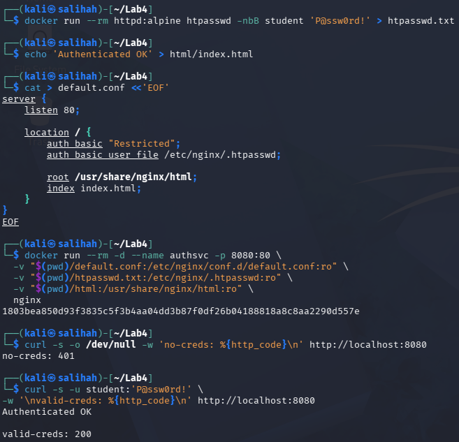

**Figure 1: HTTP Basic Authentication Test.** The request without credentials returned HTTP status code `401`. After the correct credentials were provided, the service displayed `Authenticated OK` and returned HTTP status code `200`.

---

### Task 2: Multi-Factor Authentication Using TOTP

A time-based one-time password was generated and validated to demonstrate a second authentication factor. First, a random Base32 shared secret was generated.

```bash
SECRET=$(head -c20 /dev/urandom | base32)
echo "Enrol this secret in an authenticator app: $SECRET"
```

The shared secret was used to generate and store the current six-digit TOTP code.

```bash
CURRENT_CODE=$(oathtool --totp -b "$SECRET")
echo "Current TOTP code: $CURRENT_CODE"
```

Since Kali Linux uses Zsh as its default shell, the Zsh-compatible `read` command was used to request the code.

```bash
read "CODE?Enter the 6-digit code: "
```

The entered code was compared with the generated TOTP code.

```bash
[ "$CODE" = "$CURRENT_CODE" ] && echo 'MFA OK' || echo 'MFA FAILED'
```

The system returned:

```text
MFA OK
```

This confirmed that the correct TOTP code was entered and successfully validated as a second authentication factor.

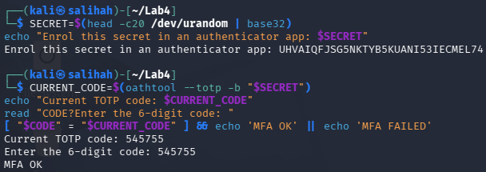

**Figure 2: TOTP Multi-Factor Authentication Validation.** A shared secret and six-digit TOTP code were generated. The correct code was entered, and the `MFA OK` result confirmed successful validation.

---

### Task 3: Authorization Using Kubernetes RBAC

A Kubernetes cluster named `ccse-lab4` was created using Kind.

```bash
kind create cluster --name ccse-lab4
```

A namespace named `app` and a service account named `dev` were then created.

```bash
kubectl create namespace app
kubectl create serviceaccount dev -n app
```

A role named `dev-role` was created. This role only allowed the `get` and `list` actions on pods.

```bash
kubectl create role dev-role -n app \
  --verb=get,list \
  --resource=pods
```

The role was assigned to the `dev` service account using a role binding.

```bash
kubectl create rolebinding dev-rb -n app \
  --role=dev-role \
  --serviceaccount=app:dev
```

The service account identity was stored in a variable.

```bash
SA=system:serviceaccount:app:dev
```

The service account permissions were tested using three authorization checks.

```bash
kubectl auth can-i list pods -n app --as=$SA
kubectl auth can-i create deploy -n app --as=$SA
kubectl auth can-i delete pods -n app --as=$SA
```

The results were:

```text
yes
no
no
```

The `dev` service account was allowed to list pods but was not allowed to create deployments or delete pods. This demonstrated that Kubernetes RBAC successfully enforced least-privilege access.

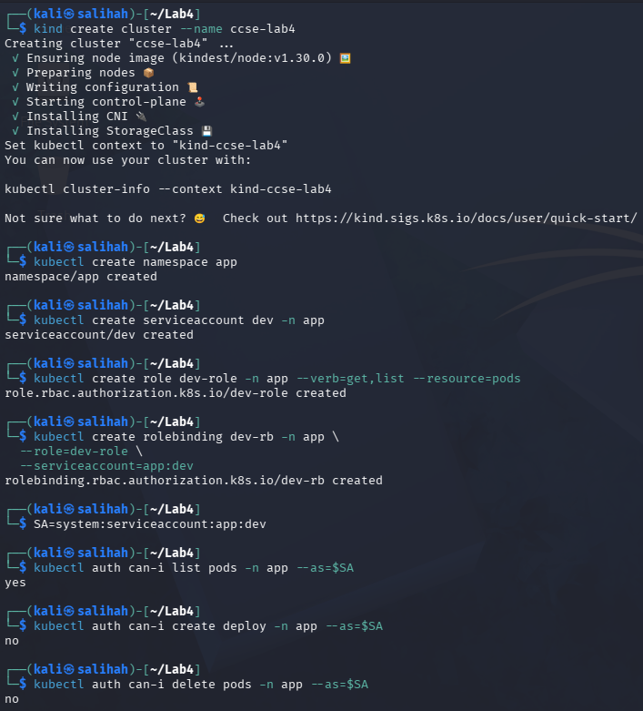

**Figure 3: Kubernetes RBAC Authorization Enforcement.** The `dev` service account was permitted to list pods but denied permission to create deployments and delete pods.

---

### Task 4: Three-Tier Network Segmentation

Two Docker networks were created to separate the frontend and backend tiers.

```bash
docker network create frontend-net
docker network create backend-net
```

A Redis database container was placed only in `backend-net`.

```bash
docker run -d --name db --network backend-net redis:alpine
```

The application container was initially placed in `backend-net`.

```bash
docker run -d --name app --network backend-net nginx
```

The application container was also connected to `frontend-net`, allowing it to communicate with both tiers.

```bash
docker network connect frontend-net app
```

The web container was placed only in `frontend-net`.

```bash
docker run -d --name web --network frontend-net nginx
```

The resulting network arrangement was:

* `web` connected to `frontend-net`
* `app` connected to `frontend-net` and `backend-net`
* `db` connected to `backend-net`

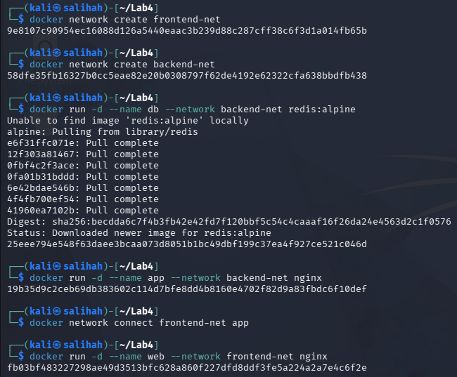

**Figure 4.1: Three-Tier Network and Container Setup.** The web and database containers were placed on separate networks, while the application container was connected to both networks.

The connectivity from the web container to the database port was tested.

```bash
docker exec web bash -c \
  'timeout 3 bash -c "</dev/tcp/db/6379" 2>/dev/null && echo REACHABLE || echo BLOCKED'
```

The result was:

```text
BLOCKED
```

Connectivity from the application container to the database was then tested.

```bash
docker exec app bash -c \
  'timeout 3 bash -c "</dev/tcp/db/6379" 2>/dev/null && echo REACHABLE || echo BLOCKED'
```

The result was:

```text
REACHABLE
```

The web container could not reach the database directly because they did not share a Docker network. However, the application container could reach the database through `backend-net`.

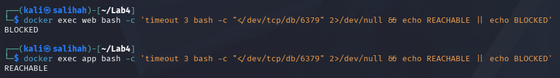

**Figure 4.2: Network Segmentation Connectivity Test.** Direct communication from the web tier to the database was blocked, while the application tier successfully reached the database.

---

### Task 5: Default-Deny Firewall Rules

A temporary Alpine container with the `NET_ADMIN` capability was used to demonstrate a default-deny firewall.

```bash
docker run --rm --cap-add=NET_ADMIN alpine sh -c '\
  apk add -q iptables; \
  iptables -P INPUT DROP; \
  iptables -A INPUT -p tcp --dport 443 -j ACCEPT; \
  iptables -A INPUT -i lo -j ACCEPT; \
  iptables -L INPUT -n'
```

The firewall used `DROP` as the default policy for incoming traffic. It then included explicit rules to allow HTTPS traffic on TCP port `443` and internal loopback communication.

The output showed:

```text
Chain INPUT (policy DROP)
ACCEPT tcp -- 0.0.0.0/0 0.0.0.0/0 tcp dpt:443
ACCEPT all -- 0.0.0.0/0 0.0.0.0/0
```

This demonstrated the default-deny principle because traffic was rejected unless an explicit rule allowed it.

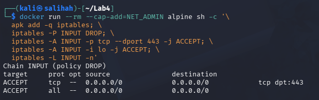

**Figure 5: Default-Deny Firewall Configuration.** The firewall rejected incoming traffic by default while explicitly allowing TCP port `443` and loopback communication.

---

### Task 6: Container Hardening and Vulnerability Scanning

A hardened Nginx container was started using several security controls.

```bash
docker run -d --name hardened \
  --user 1000:1000 \
  --read-only \
  --cap-drop=ALL \
  --security-opt no-new-privileges \
  --tmpfs /tmp \
  nginxinc/nginx-unprivileged
```

The container included the following hardening measures:

* `--user 1000:1000` ran the service as a non-root user.
* `--read-only` prevented modification of the root filesystem.
* `--cap-drop=ALL` removed unnecessary Linux capabilities.
* `--security-opt no-new-privileges` prevented the process from gaining additional privileges.
* `--tmpfs /tmp` provided a temporary writable location without making the root filesystem writable.

The container status was checked.

```bash
docker ps --filter name=hardened
```

The container remained operational with a status of `Up`.

The non-root user and read-only filesystem were verified.

```bash
docker inspect hardened --format 'User={{.Config.User}}
ReadOnly={{.HostConfig.ReadonlyRootfs}}'
```

The output was:

```text
User=1000:1000
ReadOnly=true
```

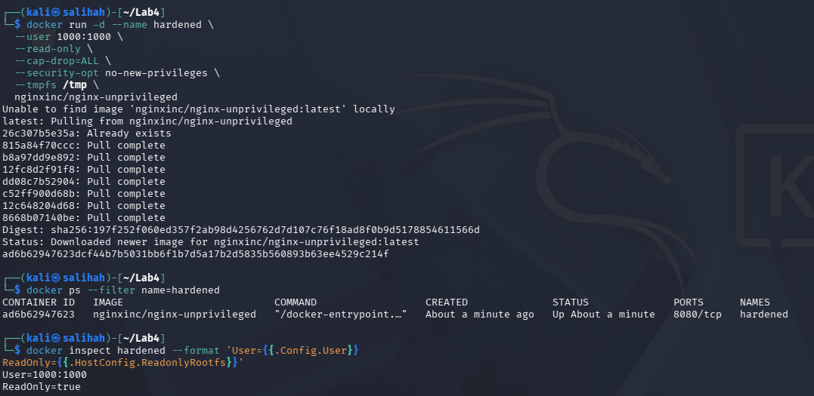

**Figure 6.1: Hardened Container Configuration.** The Nginx container remained operational while running as user `1000:1000` with a read-only root filesystem.

The `nginx:alpine` image was scanned for high and critical vulnerabilities using Trivy.

```bash
docker run --rm aquasec/trivy image \
  --severity HIGH,CRITICAL \
  nginx:alpine | head -20
```

During the first scan, Trivy downloaded and updated its vulnerability database.

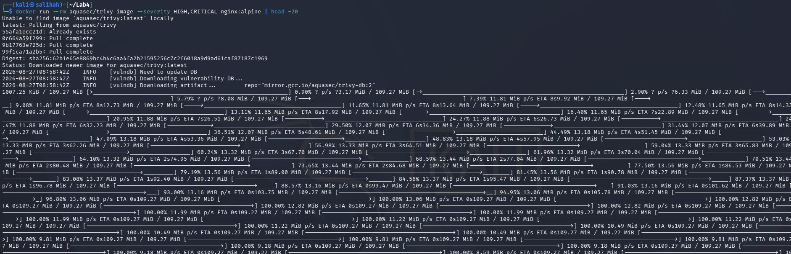

**Figure 6.2: Trivy Vulnerability Database Download.** Trivy downloaded the latest vulnerability database before scanning the container image.

The scan produced the following summary:

```text
Total: 2 (HIGH: 2, CRITICAL: 0)
```

This indicated that two high-severity vulnerabilities and no critical vulnerabilities were detected in the scanned `nginx:alpine` image.

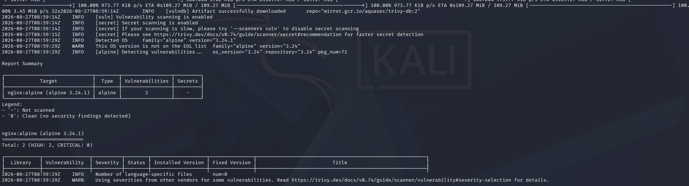

**Figure 6.3: Trivy Vulnerability Scan Result.** The scan detected two high-severity vulnerabilities and no critical vulnerabilities in the `nginx:alpine` image.

#### Hardening Measures and Reduced Attack Surfaces

| Hardening measure     | Attack or risk reduced                                                                                      |
| --------------------- | ----------------------------------------------------------------------------------------------------------- |
| Non-root user         | Reduces the impact of a container compromise because the service does not have root privileges.             |
| Read-only filesystem  | Prevents attackers from modifying system files or installing malicious files in the container filesystem.   |
| Drop all capabilities | Removes unnecessary Linux privileges that could be abused for privilege escalation or system-level actions. |

### Verification Commands

The Kubernetes RoleBinding was verified using:

```bash
kubectl get rolebinding dev-rb -n app -o yaml
```

The output showed that the `dev` service account was connected to the `dev-role` in the `app` namespace.

The dropped Linux capabilities of the hardened container were verified using:

```bash
docker inspect hardened --format '{{json .HostConfig.CapDrop}}'
```

The command returned:

```text
["ALL"]
```

This confirmed that all unnecessary Linux capabilities were removed from the hardened container.

### Verification Evidence

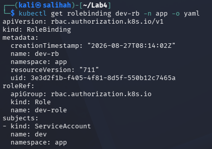

**Figure 7.1: Kubernetes RoleBinding Verification.** The output confirmed that the `dev` service account was assigned to the `dev-role` within the `app` namespace.

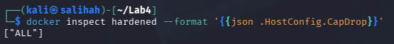

**Figure 7.2: Hardened Container Capabilities Verification.** The `["ALL"]` output confirmed that all Linux capabilities were dropped from the hardened container.

## Evidence

All screenshots used as evidence are stored in the `Evidence` folder.

| Screenshot                                | Description                                                                                                  |
| ----------------------------------------- | ------------------------------------------------------------------------------------------------------------ |
| `1-Basic-Authentication.png`              | HTTP Basic Authentication test showing `401` without credentials and `200` with valid credentials            |
| `2-MFA-TOTP-Validation.png`               | Generation and successful validation of a six-digit TOTP code                                                |
| `3-Kubernetes-RBAC-Authorization.png`     | Kubernetes cluster, RBAC configuration and authorization results showing `yes`, `no` and `no`                |
| `4.1-Three-Tier-Network-Setup.png`        | Creation of the frontend and backend networks and deployment of the web, application and database containers |
| `4.2-Network-Segmentation-Test.png`       | Connectivity test showing `web` to `db` as `BLOCKED` and `app` to `db` as `REACHABLE`                        |
| `5-Default-Deny-Firewall-Rules.png`       | iptables default `DROP` policy with explicit rules allowing TCP port 443 and loopback traffic                |
| `6.1-Hardened-Container-Verification.png` | Hardened Nginx container running as a non-root user with a read-only root filesystem                         |
| `6.2-Trivy-Database-Download.png`         | Download and update of the Trivy vulnerability database                                                      |
| `6.3-Trivy-Vulnerability-Scan-Result.png` | Trivy result showing two high-severity and zero critical vulnerabilities                                     |
| `RBAC-RoleBinding-Verification.png`       | Verification that the `dev` service account was assigned to the `dev-role`                                   |
| `Container-Capabilities-Verification.png` | Verification that all Linux capabilities were dropped from the hardened container                            |
| `Cleanup-and-Teardown.png` | Removal of the Docker containers, frontend and backend networks, and the `ccse-lab4` Kubernetes cluster |

## Commands Used

| Purpose                                         | Command                                                                                                                                                                                                    |
| ----------------------------------------------- | ---------------------------------------------------------------------------------------------------------------------------------------------------------------------------------------------------------- |
| Generate the Basic Authentication password file | `docker run --rm httpd:alpine htpasswd -nbB student 'P@ssw0rd!' > htpasswd.txt`                                                                                                                            |
| Start the password-protected Nginx service      | `docker run --rm -d --name authsvc -p 8080:80 -v "$(pwd)/default.conf:/etc/nginx/conf.d/default.conf:ro" -v "$(pwd)/htpasswd.txt:/etc/nginx/.htpasswd:ro" -v "$(pwd)/html:/usr/share/nginx/html:ro" nginx` |
| Test access without credentials                 | `curl -s -o /dev/null -w 'no-creds: %{http_code}\n' http://localhost:8080`                                                                                                                                 |
| Test access with valid credentials              | `curl -s -u student:'P@ssw0rd!' -w '\nvalid-creds: %{http_code}\n' http://localhost:8080`                                                                                                                  |
| Generate a Base32 shared secret                 | `SECRET=$(head -c20 /dev/urandom \| base32)`                                                                                                                                                               |
| Generate a TOTP code                            | `CURRENT_CODE=$(oathtool --totp -b "$SECRET")`                                                                                                                                                             |
| Validate the TOTP code                          | `[ "$CODE" = "$CURRENT_CODE" ] && echo 'MFA OK' \|\| echo 'MFA FAILED'`                                                                                                                                    |
| Create the Kubernetes cluster                   | `kind create cluster --name ccse-lab4`                                                                                                                                                                     |
| Create the application namespace                | `kubectl create namespace app`                                                                                                                                                                             |
| Create the developer service account            | `kubectl create serviceaccount dev -n app`                                                                                                                                                                 |
| Create the developer role                       | `kubectl create role dev-role -n app --verb=get,list --resource=pods`                                                                                                                                      |
| Bind the role to the service account            | `kubectl create rolebinding dev-rb -n app --role=dev-role --serviceaccount=app:dev`                                                                                                                        |
| Test the service account permissions            | `kubectl auth can-i list pods -n app --as=$SA`                                                                                                                                                             |
| Create the frontend network                     | `docker network create frontend-net`                                                                                                                                                                       |
| Create the backend network                      | `docker network create backend-net`                                                                                                                                                                        |
| Test web-to-database connectivity               | `docker exec web bash -c 'timeout 3 bash -c "</dev/tcp/db/6379" 2>/dev/null && echo REACHABLE \|\| echo BLOCKED'`                                                                                          |
| Test application-to-database connectivity       | `docker exec app bash -c 'timeout 3 bash -c "</dev/tcp/db/6379" 2>/dev/null && echo REACHABLE \|\| echo BLOCKED'`                                                                                          |
| Apply the default-deny firewall policy          | `iptables -P INPUT DROP`                                                                                                                                                                                   |
| Allow HTTPS traffic                             | `iptables -A INPUT -p tcp --dport 443 -j ACCEPT`                                                                                                                                                           |
| Run the hardened container                      | `docker run -d --name hardened --user 1000:1000 --read-only --cap-drop=ALL --security-opt no-new-privileges --tmpfs /tmp nginxinc/nginx-unprivileged`                                                      |
| Verify the hardened container                   | `docker inspect hardened --format 'User={{.Config.User}} ReadOnly={{.HostConfig.ReadonlyRootfs}}'`                                                                                                         |
| Scan the Nginx image for vulnerabilities        | `docker run --rm aquasec/trivy image --severity HIGH,CRITICAL nginx:alpine`                                                                                                                                |
| Verify the Kubernetes RoleBinding               | `kubectl get rolebinding dev-rb -n app -o yaml`                                                                                                                                                            |
| Verify dropped Linux capabilities               | `docker inspect hardened --format '{{json .HostConfig.CapDrop}}'`                                                                

## Challenges Encountered

* The original Nginx configuration used `return 200`, which caused requests without credentials to return HTTP status code `200` instead of `401`. This was solved by creating a static `index.html` page and allowing Nginx to perform the authentication check before displaying the page.

* The `read -p` command provided in the lab manual returned the `read: -p: no coprocess` error because Kali Linux was using Zsh instead of Bash. This was solved by using the Zsh-compatible command `read "CODE?Enter the 6-digit code: "`.

* The first attempt to create the `ccse-lab4` cluster failed during node preparation. Docker also displayed the `Too many open files` error when it was restarted. The inotify limits were temporarily increased, Docker was restarted, and the Kind cluster was then created successfully.

* The network connectivity commands in the lab manual used `apk` and `nc`. However, the standard Nginx image was Debian-based and did not include these commands. The connectivity tests were completed using Bash TCP connections through `/dev/tcp/db/6379`.

* During the first Trivy scan, the vulnerability database needed to be downloaded and updated. After the download completed, the scan successfully reported two high-severity vulnerabilities and no critical vulnerabilities.

## Short-Answer Questions

### Q1. Explain the difference between authentication and authorization using Tasks 1 and 3.

Authentication is used to confirm who the user is, while authorization decides what the user is allowed to do. In Task 1, the user needed the correct username and password to access the Nginx service. In Task 3, Kubernetes RBAC allowed the `dev` service account to list pods but denied permission to create deployments and delete pods.

### Q2. Why is MFA so effective, and which attacks does it defeat?

MFA is effective because it requires more than one authentication factor. Even if an attacker obtains the password, they still need the valid TOTP code. MFA can reduce password guessing, brute-force, credential-stuffing and phishing attacks. However, it may not stop an attacker who has already stolen a valid session token.

### Q3. How does network segmentation limit the damage of a compromised web server?

Network segmentation separates the web, application and database tiers. In this lab, the web container could not directly reach the database because they were connected to different networks. If the web server is compromised, the attacker cannot easily access the database or move to other systems. This helps limit lateral movement and reduces the damage.

### Q4. What does a default-deny firewall policy achieve, and how does it relate to cloud security groups?

A default-deny firewall blocks all traffic unless it is specifically allowed. In this lab, incoming traffic was dropped by default, while TCP port `443` and loopback traffic were allowed. Cloud security groups work in a similar way by allowing only the required ports, protocols and sources.

### Q5. List the hardening measures you applied and the attack surface each one removes.

* **Non-root user:** Reduces the damage if the container is compromised because the process does not have root privileges.
* **Read-only filesystem:** Prevents attackers from changing system files or saving malicious files.
* **Drop all capabilities:** Removes unnecessary Linux privileges that may be used for privilege escalation.
* **No new privileges:** Prevents processes from gaining additional privileges.
* **Temporary `/tmp` filesystem:** Provides temporary writable storage without making the root filesystem writable.
* **Trivy scanning:** Identifies known vulnerabilities in the container image before deployment.


## Security Best-Practices Checklist

- [x] Service requires authentication and unauthenticated requests are rejected.
- [x] MFA or a second authentication factor was implemented and validated.
- [x] Authorization was enforced using RBAC and least-privilege permissions.
- [x] The network was segmented so the frontend tier could not directly reach the data tier.
- [x] A default-deny firewall with explicit allow rules was configured.
- [x] The container was hardened using non-root access, a minimal image, dropped capabilities and a read-only filesystem.
- [x] The container image was scanned for known vulnerabilities.

## Cleanup and Teardown

After completing all tasks, verification commands and evidence screenshots, the temporary Docker containers, networks and Kubernetes cluster created during the lab were removed.

```bash
docker rm -f authsvc db app web hardened 2>/dev/null
docker network rm frontend-net backend-net 2>/dev/null
kind delete cluster --name ccse-lab4
```

The cleanup command successfully removed the `db`, `app`, `web` and `hardened` containers. The `authsvc` container had already been removed after it was stopped because it was started using the `--rm` option. The `frontend-net` and `backend-net` networks were also removed, followed by the `ccse-lab4` Kubernetes cluster and its control-plane node.

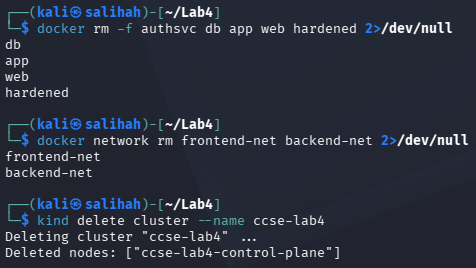

**Figure 8: Cleanup and Teardown.** The Docker containers, segmented networks and `ccse-lab4` Kubernetes cluster created during the lab were successfully removed.

## Conclusion

In conclusion, this lab demonstrated authentication, authorization, network security and container hardening. Basic Authentication and TOTP protected user access, while Kubernetes RBAC enforced least-privilege permissions. Network segmentation and default-deny firewall rules restricted unnecessary communication. The container was also hardened and scanned using Trivy. Overall, these controls helped reduce security risks in a cloud environment.

## References

* Docker. (n.d.). *Docker Engine security*. https://docs.docker.com/engine/security/
* Kubernetes. (n.d.). *Using RBAC authorization*. https://kubernetes.io/docs/reference/access-authn-authz/rbac/
* Aqua Security. (n.d.). *Trivy container image scanning*. https://trivy.dev/docs/latest/guide/target/container_image/
* UniKL MIIT. (2026). *IKB42603 Lab 4: Access Control and Network Security*.