# Lab 5: Monitoring, Logging & Incident Detection

## Course Information

- **Course Name:** IKB42603 Cloud Computing Security Essentials
- **Instructor:** Madam Adani
- **Student Name:** SITI NUR SALIHAH BINTI AHMAD BALKIS
- **Topic:** Centralised logging, tamper-evident logs, incident detection and response
- **Environment:** Kali Linux, Docker, LocalStack 3.0, AWS CLI, SHA-256 and iptables
- **Date:** 5 September 2026

## Lab Objectives

The objectives of this lab are:

- To generate, centralise and query authentication logs.
- To protect logs and detect changes using a SHA-256 hash chain.
- To detect an incident by correlating related log events.
- To contain a suspicious IP address and preserve log evidence.

## Learning Outcomes

After completing this lab, I was able to:

- Centralise and query logs using CloudWatch Logs through LocalStack.
- Identify repeated failed login attempts from a suspicious IP address.
- Create a hash chain and detect changes made to a log.
- Correlate events to detect a possible brute-force attack and data exfiltration.
- Block the suspicious IP and verify the integrity of collected evidence.

## Environment

| Component | Details |
|---|---|
| Operating System | Kali Linux |
| Container Platform | Docker |
| Cloud Service Emulator | LocalStack 3.0 |
| Logging Service | CloudWatch Logs |
| Command-Line Tool | AWS CLI |
| Log Query Tools | grep and awk |
| Integrity Algorithm | SHA-256 |
| Firewall Tool | iptables |
| Working Directory | `~/Lab5` |

## Lab Summary

In this lab, authentication logs were generated and centralised using CloudWatch Logs through LocalStack. The logs were queried to identify repeated failed logins and protected using a SHA-256 hash chain. Event correlation detected a possible brute-force attack followed by data exfiltration. The suspicious IP address was blocked, while a hashed evidence copy was created and verified to preserve its integrity.

## Step-by-Step Implementation

### Setup - Start LocalStack

LocalStack was used to provide a local CloudWatch Logs service. LocalStack 3.0 was selected because the latest image required licence activation.

```bash
docker run -d --name localstack -p 4566:4566 localstack/localstack:3.0
```

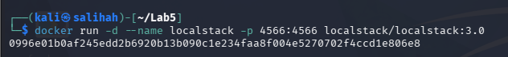

*Figure 1: Starting the LocalStack 3.0 container using Docker.*

The LocalStack endpoint was configured before creating the CloudWatch log group and log stream.

```bash
EP='--endpoint-url=http://localhost:4566'

aws $EP logs create-log-group \
  --log-group-name /ccse/app

aws $EP logs create-log-stream \
  --log-group-name /ccse/app \
  --log-stream-name auth
```

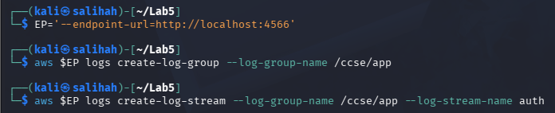

*Figure 2: Configuring the LocalStack endpoint and creating the CloudWatch log group and log stream.*

### Task 1 - Generate Application Logs

An authentication log was created with successful logins, failed login attempts and data export activity.

```bash
cat > auth.log <<'EOF'
2025-03-01T09:00:01 LOGIN_OK    user=ahmad         ip=10.0.0.5
2025-03-01T09:01:10 LOGIN_FAIL user=admin          ip=203.0.113.9
2025-03-01T09:01:12 LOGIN_FAIL user=admin          ip=203.0.113.9
2025-03-01T09:01:15 LOGIN_FAIL user=admin          ip=203.0.113.9
2025-03-01T09:01:18 LOGIN_FAIL user=admin          ip=203.0.113.9
2025-03-01T09:01:22 LOGIN_OK    user=admin         ip=203.0.113.9
2025-03-01T09:01:40 EXPORT_DATA user=admin         ip=203.0.113.9 size=500MB
EOF

cat auth.log
```

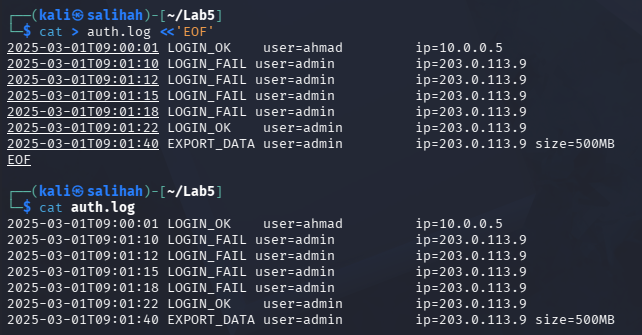

*Figure 3: Authentication events generated and stored in `auth.log`.*

The output contained seven events. These included four failed login attempts from `203.0.113.9`, followed by a successful login and a 500 MB data export.

### Task 2 - Centralise Logs

Each line from `auth.log` was sent to the `auth` log stream in CloudWatch Logs.

```bash
TS=$(date +%s000)

while IFS= read -r line; do
  aws $EP logs put-log-events \
    --log-group-name /ccse/app \
    --log-stream-name auth \
    --log-events timestamp=$TS,message="$line" >/dev/null
  TS=$((TS+1000))
done < auth.log
```

The logs were then retrieved from the centralised log service.

```bash
aws $EP logs get-log-events \
  --log-group-name /ccse/app \
  --log-stream-name auth \
  --query 'events[].message' \
  --output text
```

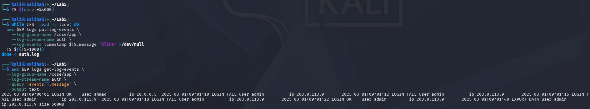

*Figure 4: Authentication logs retrieved from the centralised CloudWatch log stream.*

The successful read-back confirmed that all authentication events were stored centrally instead of remaining only on the local system.

### Task 3 - Query for Security-Relevant Activity

The authentication log was queried to count failed login attempts and identify their source IP address.

```bash
grep LOGIN_FAIL auth.log | awk '{print $4, $5}' | sort | uniq -c
```

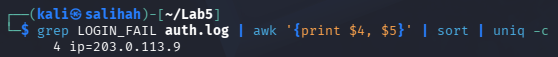

*Figure 5: Failed login attempts grouped by source IP address.*

The result showed four failed login attempts from `203.0.113.9`. This indicated suspicious authentication activity from the same source.

### Task 4 - Tamper-Proof Hash-Chained Logs

A SHA-256 hash chain was created by combining each log entry with the hash of the previous entry.

```bash
PREV=0

while IFS= read -r line; do
  PREV=$(printf '%s%s' "$PREV" "$line" | sha256sum | cut -d' ' -f1)
  printf '%s | %s\n' "$line" "$PREV"
done < auth.log > auth.chain

cat auth.chain
```

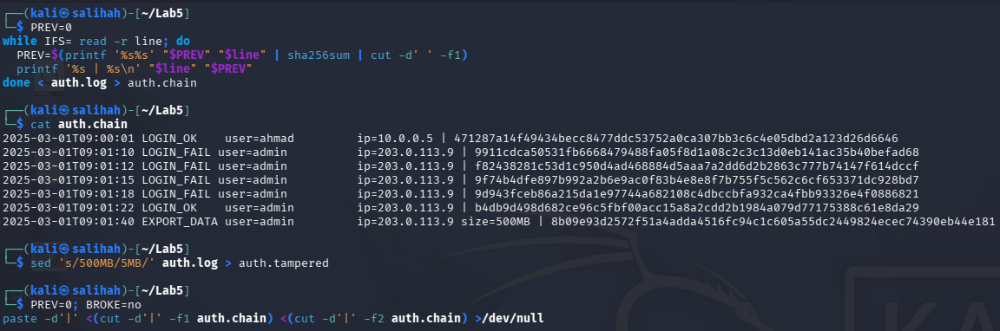

*Figure 6: Authentication log protected using a SHA-256 hash chain.*

A tampered copy was created by changing the export size from 500 MB to 5 MB.

```bash
sed 's/500MB/5MB/' auth.log > auth.tampered
```

The final hash of the tampered log was recomputed and compared with the original final hash.

```bash
ORIGINAL_FINAL=$(tail -1 auth.chain | awk -F'|' \
  '{gsub(/[[:space:]]/,"",$2); print $2}')

PREV=0

while IFS= read -r line; do
  PREV=$(printf '%s%s' "$PREV" "$line" | sha256sum | cut -d' ' -f1)
done < auth.tampered

TAMPERED_FINAL=$PREV

echo "Original final hash: $ORIGINAL_FINAL"
echo "Tampered final hash: $TAMPERED_FINAL"

if [ "$ORIGINAL_FINAL" != "$TAMPERED_FINAL" ]; then
  echo "TAMPERING DETECTED: Final hashes do not match"
else
  echo "No tampering detected"
fi
```

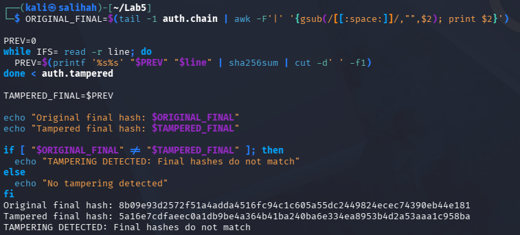

*Figure 7: Log tampering detected through final hash comparison.*

The original and tampered final hashes were different. This proved that the modification made to the log was successfully detected.

### Task 5 - Detect the Incident

The activities associated with `203.0.113.9` were correlated to identify the complete pattern of the incident.

```bash
IP=203.0.113.9
FAILS=$(grep -c "LOGIN_FAIL.*$IP" auth.log)
SUCCESS=$(grep -c "LOGIN_OK.*$IP" auth.log)
EXPORT=$(grep -c "EXPORT_DATA.*$IP" auth.log)

echo "IP=$IP fails=$FAILS success=$SUCCESS export=$EXPORT"

if [ "$FAILS" -ge 3 ] && [ "$SUCCESS" -ge 1 ] && [ "$EXPORT" -ge 1 ]; then
  echo 'ALERT: probable brute-force -> compromise -> data exfiltration'
fi
```

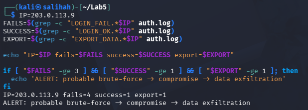

*Figure 8: Security incident detected by correlating authentication and data export events.*

The correlation found four failed logins, one successful login and one data export from the same IP address. This triggered an alert for a probable brute-force attack followed by account compromise and data exfiltration.

### Task 6 - Incident Response

The suspicious IP address was contained using an iptables DROP rule inside an Alpine container.

```bash
docker run --rm --cap-add=NET_ADMIN alpine sh -c \
'apk add -q iptables; iptables -A INPUT -s 203.0.113.9 -j DROP; iptables -L INPUT -n | tail -2'
```

A timestamped evidence copy of the authentication log was then created and hashed.

```bash
cp auth.log evidence_$(date +%Y%m%d).log
sha256sum evidence_*.log > evidence.sha256
cat evidence.sha256
```

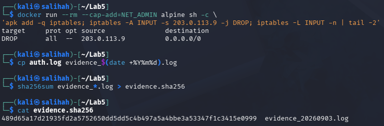

*Figure 9: Blocking the suspicious IP address and preserving a hashed copy of the log evidence.*

The DROP rule demonstrated that the suspicious IP address was contained. The SHA-256 hash provided a reference that could be used to detect any later changes to the evidence.

## Incident Report

### Detection

Four failed logins, one successful login and one data export were detected from `203.0.113.9`.

### Analysis

The events indicated a possible brute-force attack followed by account compromise and data exfiltration.

### Containment

The suspicious IP address was blocked using an iptables DROP rule.

### Evidence and Integrity

A copy of `auth.log` was collected and hashed using SHA-256. The `OK` result confirmed that the evidence remained unchanged.

### Lesson Learned

Centralised and tamper-evident logs are important for detecting incidents and preserving reliable evidence.

### Verification Commands

The CloudWatch log group was verified using:

```bash
aws --endpoint-url=http://localhost:4566 logs describe-log-groups
```

The output showed that the `/ccse/app` log group existed in CloudWatch Logs through LocalStack.

The integrity of the collected evidence was verified using:

```bash
sha256sum -c evidence.sha256
```

The command returned:

```text
evidence_20260903.log: OK
```

This confirmed that the evidence file matched its recorded SHA-256 hash and had not been modified.

### Verification Evidence

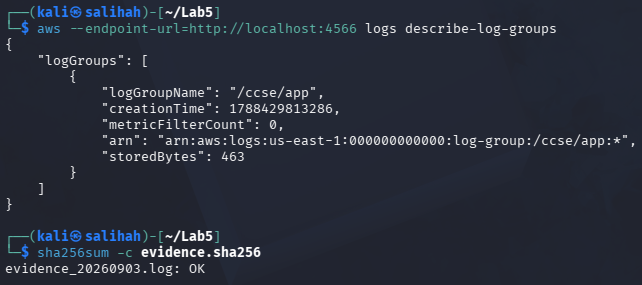

*Figure 10: CloudWatch log group and evidence integrity verification.*

The output confirmed that the `/ccse/app` log group was available and the collected evidence passed the SHA-256 integrity check.

## Evidence

All screenshots used as evidence are stored in the `Evidence` folder.

| Screenshot | Description |
|---|---|
| `0.1-Start-LocalStack.png` | Starting the LocalStack 3.0 container using Docker |
| `0.2-CloudWatch-Logs-Setup.png` | Configuration of the LocalStack endpoint, CloudWatch log group and log stream |
| `1-Generate-Application-Logs.png` | Authentication events generated and stored in `auth.log` |
| `2-Centralised-CloudWatch-Logs.png` | Authentication logs retrieved from the centralised CloudWatch log stream |
| `3-Failed-Login-Query.png` | Query result showing four failed login attempts from `203.0.113.9` |
| `4.1-Hash-Chained-Log.png` | Authentication log protected using a SHA-256 hash chain |
| `4.2-Tampering-Detection.png` | Detection of log tampering through final hash comparison |
| `5-Incident-Correlation-Alert.png` | Alert showing probable brute-force, account compromise and data exfiltration |
| `6-Incident-Response-and-Evidence.png` | Blocking the suspicious IP and creating a SHA-256 hash of the evidence |
| `Security-Control-Verification.png` | Verification of the CloudWatch log group and evidence integrity |
| `Cleanup-and-Teardown.png` | Removal of temporary Lab 5 files and the LocalStack container |

## Commands Used

| Purpose | Command |
|---|---|
| Start LocalStack 3.0 | `docker run -d --name localstack -p 4566:4566 localstack/localstack:3.0` |
| Set the LocalStack endpoint | `EP='--endpoint-url=http://localhost:4566'` |
| Create the CloudWatch log group | `aws $EP logs create-log-group --log-group-name /ccse/app` |
| Create the CloudWatch log stream | `aws $EP logs create-log-stream --log-group-name /ccse/app --log-stream-name auth` |
| Display the authentication log | `cat auth.log` |
| Generate a timestamp | `TS=$(date +%s000)` |
| Send logs to CloudWatch | `aws $EP logs put-log-events --log-group-name /ccse/app --log-stream-name auth --log-events timestamp=$TS,message="$line"` |
| Retrieve centralised logs | `aws $EP logs get-log-events --log-group-name /ccse/app --log-stream-name auth --query 'events[].message' --output text` |
| Count failed logins by IP | `grep LOGIN_FAIL auth.log \| awk '{print $4, $5}' \| sort \| uniq -c` |
| Create the SHA-256 hash chain | `printf '%s%s' "$PREV" "$line" \| sha256sum \| cut -d' ' -f1` |
| Create a tampered log | `sed 's/500MB/5MB/' auth.log > auth.tampered` |
| Count failed logins from the suspicious IP | `grep -c "LOGIN_FAIL.*$IP" auth.log` |
| Count successful logins from the suspicious IP | `grep -c "LOGIN_OK.*$IP" auth.log` |
| Count data exports from the suspicious IP | `grep -c "EXPORT_DATA.*$IP" auth.log` |
| Block the suspicious IP | `iptables -A INPUT -s 203.0.113.9 -j DROP` |
| Create a timestamped evidence copy | `cp auth.log evidence_$(date +%Y%m%d).log` |
| Generate the evidence hash | `sha256sum evidence_*.log > evidence.sha256` |
| Verify the CloudWatch log group | `aws --endpoint-url=http://localhost:4566 logs describe-log-groups` |
| Verify evidence integrity | `sha256sum -c evidence.sha256` |
| Remove temporary Lab 5 files | `rm -f auth.log auth.chain auth.tampered evidence_*.log evidence.sha256` |
| Stop and remove LocalStack | `docker stop localstack && docker rm localstack` |

## Challenges Encountered

- The latest `localstack/localstack` image stopped with exit code `55` because it required licence activation and no LocalStack authentication token was available. This was solved by removing the failed container and using the `localstack/localstack:3.0` image.

- The LocalStack container initially displayed the `health: starting` status. After waiting for the startup process to finish, its status changed to `healthy`, allowing the CloudWatch commands to run successfully.

- The Task 4 instructions required the final hash of the tampered log to be compared with the original hash, but the PDF did not provide the complete comparison command. The original final hash was extracted from `auth.chain`, while the hash chain for `auth.tampered` was recomputed. The different final hashes confirmed that tampering had occurred.

- The CloudWatch read-back appeared on a long wrapped line because the command used the `--output text` option. However, all seven authentication events were successfully retrieved from the centralised log stream.

## Short-Answer Questions

### Q1. What is the difference between a log and an event?

A log is a stored record of an activity, such as `LOGIN_FAIL` from `203.0.113.9`. An event is an activity that may trigger an alert, such as four failed login attempts from the same IP.

### Q2. Why must audit logs be tamper-proof, and how does a hash chain achieve this?

Audit logs must be tamper-proof to prevent attackers from hiding their activities. A hash chain links each log entry to the previous hash. If one entry is changed, the final hash will also change.

### Q3. How did correlation detect the incident?

Correlation connected four failed logins, one successful login and one data export from the same IP. Together, these activities indicated a possible brute-force attack, account compromise and data exfiltration.

### Q4. What incident-response steps were performed?

- **Detect:** Identify suspicious activity from the logs.
- **Analyse:** Review the login and data export events.
- **Contain:** Block the suspicious IP using iptables.
- **Collect:** Create a copy of the log as evidence.
- **Verify:** Use SHA-256 to check the evidence integrity.
- **Document:** Record the incident and actions taken.

### Q5. How do logs support security monitoring and compliance?

Logs help detect suspicious activities during security monitoring. They also provide records for investigations and audits, which can be used as compliance evidence.

## Security Best-Practices Checklist

- [x] Logs were centralised instead of being left on the local host.
- [x] Failed login activity was successfully queried.
- [x] Logs were made tamper-evident using a SHA-256 hash chain.
- [x] An incident was detected by correlating multiple events.
- [x] Incident response was performed by containing the IP, collecting evidence and documenting the incident.

## Cleanup and Teardown

After completing the lab and saving all required evidence, the temporary log files, evidence copies and hash file were removed.

```bash
rm -f auth.log auth.chain auth.tampered evidence_*.log evidence.sha256
```

The LocalStack container was then stopped and removed.

```bash
docker stop localstack && docker rm localstack
```

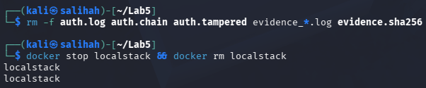

*Figure 11: Cleanup and teardown of the temporary Lab 5 files and LocalStack container.*

## Conclusion

This lab was successfully completed by centralising and querying authentication logs using CloudWatch Logs. A SHA-256 hash chain detected log changes, while event correlation identified a possible security incident. The suspicious IP was blocked, and the evidence integrity was verified. Overall, this lab demonstrated the importance of logging, monitoring and incident response in cloud security.

## References

- Amazon Web Services. (n.d.). *Amazon CloudWatch Logs concepts*. https://docs.aws.amazon.com/AmazonCloudWatch/latest/logs/CloudWatchLogsConcepts.html
- LocalStack. (n.d.). *CloudWatch Logs*. https://docs.localstack.cloud/aws/services/logs/
- IKB42603 Cloud Computing Security Essentials. (2026). *Week 6: Monitoring, Auditing and Management* [Course lecture notes].