# Lab 6: Object Storage Security & the Data Security Lifecycle

## Course Information

- **Course Name:** IKB42603 Cloud Computing Security Essentials
- **Instructor:** Madam Adani
- **Student Name:** SITI NUR SALIHAH BINTI AHMAD BALKIS
- **Topic:** Bucket Exposure, Resource Policies, SSE-KMS, Versioning, Lifecycle Management, and Cryptographic Erasure
- **Environment:** Kali Linux, Docker, LocalStack Pro 2026.8.1, AWS CLI, Amazon S3, AWS KMS, and curl
- **Date:** 7 September 2026
- **Bucket Name:** `miit-patient-records-1343`

## Lab Objectives

The objectives of this lab are:

- To provision object storage and classify stored data according to its sensitivity.
- To reproduce and remediate a publicly readable S3 bucket exposure.
- To compare identity-based IAM policies with resource-based bucket policies.
- To configure default SSE-KMS encryption and time-limited delegated access.
- To demonstrate versioning, data remanence, lifecycle retention and cryptographic erasure.

## Learning Outcomes

After completing this lab, I was able to:

- Create and classify objects in an S3 bucket using classification tags.
- Identify how a wildcard principal can expose confidential information publicly.
- Configure Block Public Access and least-privilege access policies.
- Explain how an explicit deny overrides an allow during policy evaluation.
- Apply default SSE-KMS encryption and generate a presigned URL.
- Demonstrate that a delete marker does not permanently destroy previous object versions.
- Configure lifecycle rules and verify cryptographic erasure using a disabled KMS key.
- Identify and accurately document LocalStack enforcement limitations.

## Environment

| Component | Details |
|---|---|
| Operating System | Kali Linux |
| Container Platform | Docker |
| Cloud Service Emulator | LocalStack Pro 2026.8.1 |
| Object Storage Service | Amazon S3 through LocalStack |
| Key Management Service | AWS KMS through LocalStack |
| Command-Line Tool | AWS CLI |
| Anonymous Request Tool | curl |
| Data Protection Controls | SSE-KMS, versioning and lifecycle rules |
| LocalStack Endpoint | `http://localhost:4566` |
| S3 Bucket | `miit-patient-records-1343` |

## Lab Summary

In this lab, objects with public, internal and confidential classifications were stored in an S3 bucket through LocalStack. A public bucket policy was used to reproduce a confidential-data exposure before Block Public Access and least-privilege policies were applied. IAM and bucket-policy evaluation was tested using a `DataAnalyst` user. Default SSE-KMS encryption, presigned access, versioning, lifecycle retention and cryptographic erasure were then configured. Several LocalStack enforcement limitations were also identified and documented.

## Step-by-Step Implementation

### Introduction

This lab examined the security of Amazon S3 object storage using LocalStack. The activities covered data classification, public bucket exposure, Block Public Access, identity-based and resource-based policies, SSE-KMS encryption, presigned URLs, versioning, lifecycle rules, data remanence, and cryptographic erasure. The lab also demonstrated that secure cloud storage depends on correctly configured access policies, encryption, retention, and deletion controls throughout the data security lifecycle.

### Setup - Start LocalStack

A clean LocalStack Pro container was started with IAM policy enforcement enabled. The `LOCALSTACK_AUTH_TOKEN` was passed to the container to activate the required LocalStack Pro features.

```bash
docker rm -f localstack 2>/dev/null

docker run -d --name localstack -p 4566:4566 \
  -e LOCALSTACK_AUTH_TOKEN=$LOCALSTACK_AUTH_TOKEN \
  -e ENFORCE_IAM=1 \
  localstack/localstack-pro:latest
```

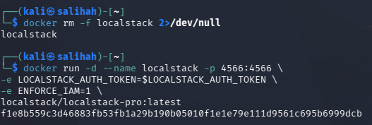

*Figure 1: Starting the LocalStack Pro container with IAM policy enforcement enabled.*

The AWS CLI was then configured to communicate with the LocalStack endpoint. Test credentials and the `us-east-1` region were configured before verifying the caller identity.

```bash
export EP='--endpoint-url=http://localhost:4566'

aws configure set aws_access_key_id test
aws configure set aws_secret_access_key test
aws configure set region us-east-1

aws $EP sts get-caller-identity
```

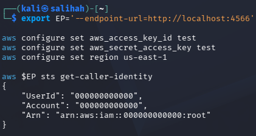

*Figure 2: Verifying the LocalStack caller identity and account number.*

The command returned account number `000000000000`, confirming that the AWS CLI was successfully connected to LocalStack. This account number was later used in the IAM and S3 resource ARNs.

### Task 1 - Classify the Data Before Storage

A unique S3 bucket was created for the hospital patient records system. The bucket name was stored in the `$BUCKET` variable so that it could be reused throughout the lab.

Three files containing different types of information were then created. These files represented public, internal and confidential data.

```bash
export BUCKET=miit-patient-records-$RANDOM
echo "Bucket name: $BUCKET"

aws $EP s3api create-bucket --bucket "$BUCKET"

echo 'Ward visiting hours 10am-8pm' > public-notice.txt
echo 'Staff duty schedule, week 12' > internal-roster.txt
echo 'Patient: Ahmad bin Ali, Diagnosis: confidential' > confidential-record.txt
```

Each object was uploaded using a different key prefix and assigned an appropriate classification tag.

```bash
aws $EP s3api put-object \
  --bucket "$BUCKET" \
  --key public/notice.txt \
  --body public-notice.txt \
  --tagging 'classification=public'

aws $EP s3api put-object \
  --bucket "$BUCKET" \
  --key internal/roster.txt \
  --body internal-roster.txt \
  --tagging 'classification=internal'

aws $EP s3api put-object \
  --bucket "$BUCKET" \
  --key confidential/record.txt \
  --body confidential-record.txt \
  --tagging 'classification=confidential'
```

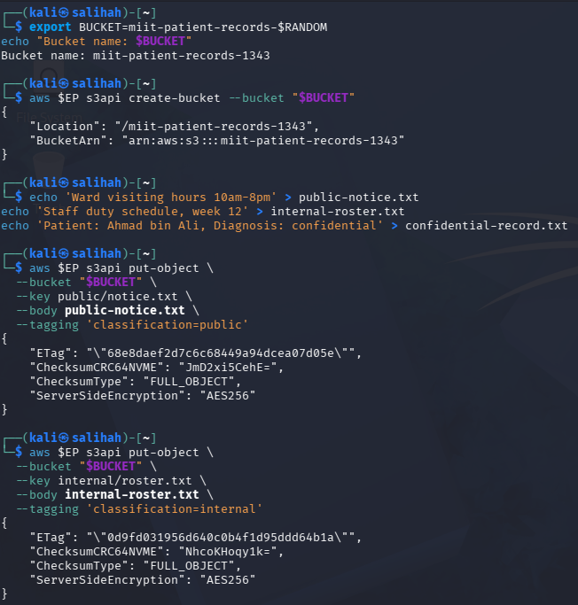

*Figure 3: Creating the S3 bucket and uploading objects with public, internal and confidential classifications.*

The stored objects were listed, and the classification tag assigned to the confidential patient record was verified.

```bash
aws $EP s3api list-objects-v2 \
  --bucket "$BUCKET" \
  --query 'Contents[].[Key,Size]' \
  --output table

aws $EP s3api get-object-tagging \
  --bucket "$BUCKET" \
  --key confidential/record.txt
```

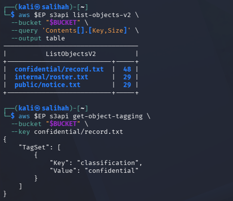

*Figure 4: Listing the stored objects and verifying the confidential classification tag.*

The output showed three objects stored under the `public/`, `internal/` and `confidential/` prefixes. The confidential patient record was successfully tagged with `classification=confidential`.

#### Data Classification Table

| Classification | Who may read it | Impact if leaked | Control applied |
|---|---|---|---|
| Public | General public | Low impact because the information is intended for public distribution | Public classification tag and controlled object prefix |
| Internal | Authorised hospital employees | Exposure of staff schedules and internal operational information | Least-privilege policy scoped to `internal/*` and time-limited presigned access |
| Confidential | Authorised clinical personnel and approved systems | Patient privacy violation, regulatory consequences and loss of trust | Confidential tag, explicit deny, SSE-KMS encryption, version control, lifecycle retention and cryptographic erasure |

The slash in an S3 object key represents a prefix rather than an actual folder. Therefore, access policies must scope prefixes carefully to avoid exposing unrelated objects.

### Task 2 - Reproduce the Public-Bucket Exposure

A public-read bucket policy was deliberately created to demonstrate how a configuration mistake can expose confidential information. The policy allowed any principal to retrieve every object stored in the bucket.

```bash
cat > public-policy.json <<JSON
{
  "Version": "2012-10-17",
  "Statement": [{
    "Sid": "PublicReadEverything",
    "Effect": "Allow",
    "Principal": "*",
    "Action": "s3:GetObject",
    "Resource": "arn:aws:s3:::$BUCKET/*"
  }]
}
JSON
```

The policy was applied to the bucket and retrieved to verify its configuration.

```bash
aws $EP s3api put-bucket-policy \
  --bucket "$BUCKET" \
  --policy file://public-policy.json

aws $EP s3api get-bucket-policy \
  --bucket "$BUCKET" \
  --query Policy \
  --output text
```

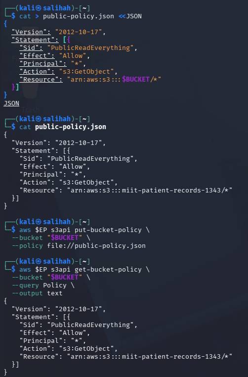

*Figure 5: Applying and verifying a public-read bucket policy containing a wildcard principal.*

An anonymous request was then made using `curl`. This request did not use an AWS CLI profile or AWS identity.

```bash
curl -s -o leaked.txt -w 'HTTP %{http_code}\n' \
  "http://localhost:4566/$BUCKET/confidential/record.txt"

cat leaked.txt
```

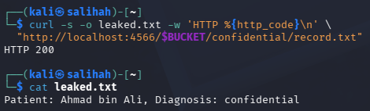

*Figure 6: Anonymous access returning HTTP 200 and exposing the confidential patient record.*

The request returned `HTTP 200` and displayed the confidential patient record. The exposure was caused by `"Principal": "*"`, meaning that the policy allowed every principal, including anonymous users, to read the bucket objects. No malware or software exploit was required because the bucket policy itself authorised the access.

### Task 3 - Remediate with Block Public Access

The public-read policy was first removed from the bucket. All four Block Public Access settings were then enabled to prevent public access through bucket policies and access control lists.

```bash
aws $EP s3api delete-bucket-policy \
  --bucket "$BUCKET"

aws $EP s3api put-public-access-block \
  --bucket "$BUCKET" \
  --public-access-block-configuration \
  'BlockPublicAcls=true,IgnorePublicAcls=true,BlockPublicPolicy=true,RestrictPublicBuckets=true'

aws $EP s3api get-public-access-block \
  --bucket "$BUCKET"
```

The output confirmed that `BlockPublicAcls`, `IgnorePublicAcls`, `BlockPublicPolicy` and `RestrictPublicBuckets` were all set to `true`.

The dangerous public policy was then reapplied to test whether the guardrail would reject it. Anonymous access was also tested again.

```bash
aws $EP s3api put-bucket-policy \
  --bucket "$BUCKET" \
  --policy file://public-policy.json

curl -s -o /dev/null \
  -w 'Anonymous read now: HTTP %{http_code}\n' \
  "http://localhost:4566/$BUCKET/confidential/record.txt"
```

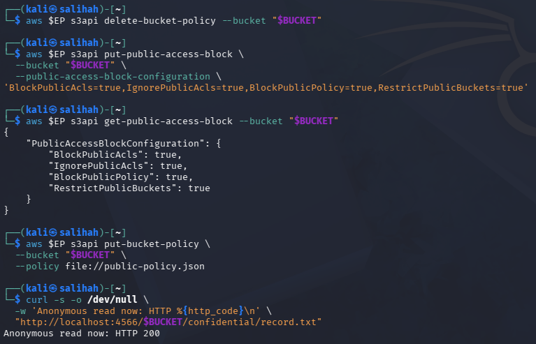

*Figure 7: Enabling all four Block Public Access settings and repeating the anonymous access test.*

LocalStack stored all four Block Public Access settings but still accepted the public policy. The anonymous request also continued to return `HTTP 200`. This was an expected LocalStack enforcement limitation stated in the lab manual. On real AWS, `BlockPublicPolicy=true` would reject a bucket policy that provides public access.

A least-privilege bucket policy was then created. The policy allowed the local account to read objects only under the `internal/*` prefix.

```bash
cat > least-privilege-policy.json <<JSON
{
  "Version": "2012-10-17",
  "Statement": [{
    "Sid": "AccountReadInternalOnly",
    "Effect": "Allow",
    "Principal": {
      "AWS": "arn:aws:iam::000000000000:root"
    },
    "Action": "s3:GetObject",
    "Resource": "arn:aws:s3:::$BUCKET/internal/*"
  }]
}
JSON

aws $EP s3api put-bucket-policy \
  --bucket "$BUCKET" \
  --policy file://least-privilege-policy.json

aws $EP s3api get-bucket-policy \
  --bucket "$BUCKET" \
  --query Policy \
  --output text
```

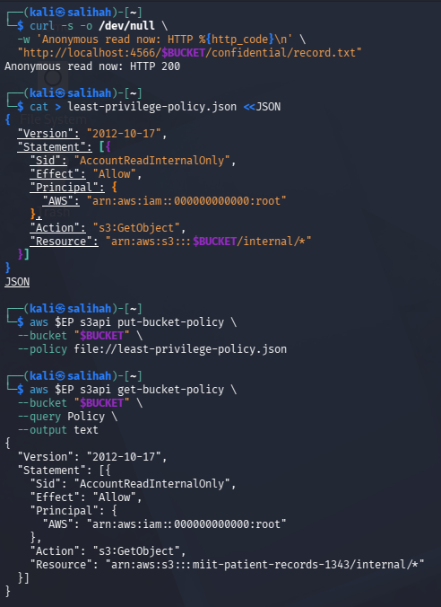

*Figure 8: Replacing public access with a least-privilege bucket policy scoped to the internal prefix.*

Block Public Access is a preventative guardrail because it is designed to stop an unsafe public configuration before exposure occurs. This is stronger than a detective control that only reports the exposure after the bucket has already become public.

### Task 4 - Identity Policy vs Resource Policy

An IAM user named `DataAnalyst` was created to demonstrate the interaction between an identity-based IAM policy and a resource-based bucket policy.

The identity-based policy allowed the analyst to retrieve objects and list S3 buckets. An access key was also created and configured under a separate AWS CLI profile named `analyst`. The access key values were hidden from the screenshot to prevent credential exposure.

```bash
aws $EP iam create-user \
  --user-name DataAnalyst

cat > analyst-iam.json <<'JSON'
{
  "Version": "2012-10-17",
  "Statement": [{
    "Effect": "Allow",
    "Action": [
      "s3:GetObject",
      "s3:ListBucket"
    ],
    "Resource": "*"
  }]
}
JSON

aws $EP iam put-user-policy \
  --user-name DataAnalyst \
  --policy-name S3ReadAll \
  --policy-document file://analyst-iam.json

aws $EP iam create-access-key \
  --user-name DataAnalyst \
  --query 'AccessKey.[AccessKeyId,SecretAccessKey]' \
  --output text

aws configure --profile analyst set aws_access_key_id "$ANALYST_KEY_ID"
aws configure --profile analyst set aws_secret_access_key "$ANALYST_SECRET"
aws configure --profile analyst set region us-east-1
```

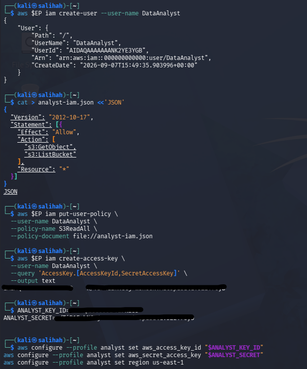

*Figure 9: Creating the DataAnalyst user, attaching an identity-based policy and configuring the analyst profile.*

A resource-based bucket policy was then created. It allowed the analyst to retrieve objects under the `internal/*` prefix but explicitly denied all S3 actions against `confidential/*`.

```bash
cat > deny-confidential.json <<JSON
{
  "Version": "2012-10-17",
  "Statement": [
    {
      "Sid": "AllowAnalystInternal",
      "Effect": "Allow",
      "Principal": {
        "AWS": "arn:aws:iam::000000000000:user/DataAnalyst"
      },
      "Action": "s3:GetObject",
      "Resource": "arn:aws:s3:::$BUCKET/internal/*"
    },
    {
      "Sid": "DenyAnalystConfidential",
      "Effect": "Deny",
      "Principal": {
        "AWS": "arn:aws:iam::000000000000:user/DataAnalyst"
      },
      "Action": "s3:*",
      "Resource": "arn:aws:s3:::$BUCKET/confidential/*"
    }
  ]
}
JSON

aws $EP s3api put-bucket-policy \
  --bucket "$BUCKET" \
  --policy file://deny-confidential.json
```

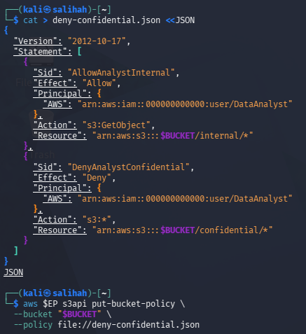

*Figure 10: Applying the bucket policy that explicitly denied analyst access to the confidential prefix.*

The analyst profile was used to retrieve both the internal roster and the confidential patient record.

```bash
AWS_PROFILE=analyst aws $EP s3api get-object \
  --bucket "$BUCKET" \
  --key internal/roster.txt \
  analyst-internal.txt && echo "Internal: ALLOWED"

AWS_PROFILE=analyst aws $EP s3api get-object \
  --bucket "$BUCKET" \
  --key confidential/record.txt \
  analyst-conf.txt || echo "Confidential: DENIED"
```

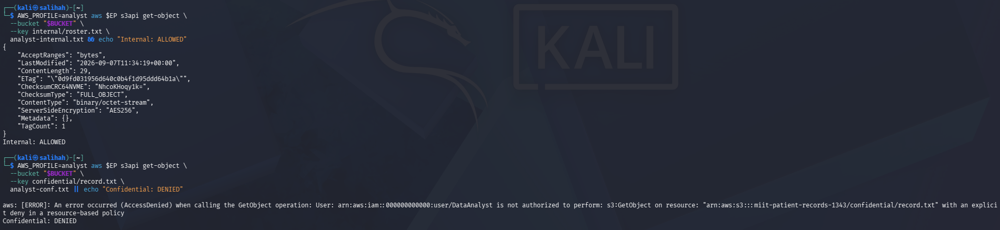

*Figure 11: Allowing access to the internal object while denying access to the confidential object.*

The internal request succeeded because an applicable allow was present. The confidential request failed with `AccessDenied` because the bucket policy contained an explicit deny. This demonstrated that an explicit deny in a resource-based policy overrides an allow in an identity-based policy.

### Task 5 - Default Encryption at Rest with SSE-KMS

Before starting Session B, the Task 4 bucket policy was removed to prevent it from interfering with the remaining activities.

```bash
aws $EP s3api delete-bucket-policy \
  --bucket "$BUCKET"
```

A dedicated customer-managed KMS key was created for the patient-records bucket. The returned key ID was stored in the `$KEY_ID` variable for use throughout the remaining tasks.

```bash
export KEY_ID=$(aws $EP kms create-key \
  --description 'IKB42603 Lab6 patient records bucket key' \
  --query 'KeyMetadata.KeyId' \
  --output text)

echo "$KEY_ID"
```

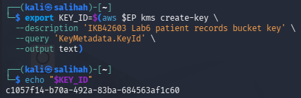

*Figure 12: Creating a dedicated KMS key for the patient-records bucket.*

A bucket encryption configuration was then created. The configuration selected `aws:kms` as the encryption algorithm and used the newly created KMS key. `BucketKeyEnabled` was set to `true` to reduce the number of direct KMS requests required for object encryption.

```bash
cat > encryption.json <<JSON
{
  "Rules": [{
    "ApplyServerSideEncryptionByDefault": {
      "SSEAlgorithm": "aws:kms",
      "KMSMasterKeyID": "$KEY_ID"
    },
    "BucketKeyEnabled": true
  }]
}
JSON

aws $EP s3api put-bucket-encryption \
  --bucket "$BUCKET" \
  --server-side-encryption-configuration file://encryption.json

aws $EP s3api get-bucket-encryption \
  --bucket "$BUCKET"
```

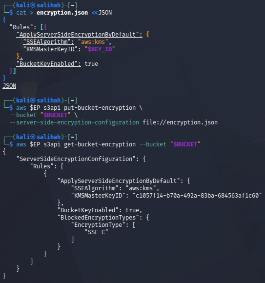

*Figure 13: Configuring default SSE-KMS encryption and enabling the S3 bucket key.*

A new copy of the confidential patient record was uploaded without including any encryption option in the upload command. The bucket's default encryption configuration automatically protected the object.

```bash
aws $EP s3api put-object \
  --bucket "$BUCKET" \
  --key confidential/record-v2.txt \
  --body confidential-record.txt
```

The object metadata was inspected using `head-object`.

```bash
aws $EP s3api head-object \
  --bucket "$BUCKET" \
  --key confidential/record-v2.txt \
  --query '[ServerSideEncryption,SSEKMSKeyId,BucketKeyEnabled]' \
  --output text
```

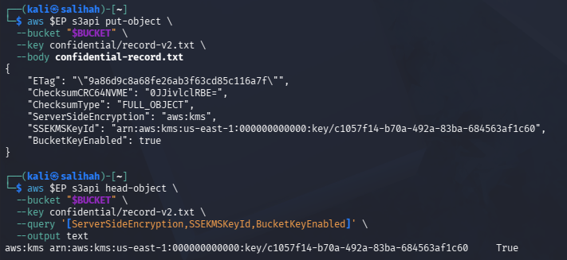

*Figure 14: Verifying that the confidential object was automatically encrypted using SSE-KMS.*

The output displayed `aws:kms`, the configured KMS key ID and `True` for `BucketKeyEnabled`. This confirmed that default encryption protected the object even though the uploader did not manually request encryption.

### Task 6 - Delegated Access and the Condition-Key Trap

A presigned URL was generated for `internal/roster.txt` with a validity period of 60 seconds. This URL allowed someone without an AWS identity to perform a specific action on one object for a limited time.

```bash
aws $EP s3 presign \
  s3://$BUCKET/internal/roster.txt \
  --expires-in 60

URL='PASTE_PRESIGNED_URL_HERE'

curl -s -w ' <-- HTTP %{http_code}\n' "$URL"
```

The first request returned the staff duty schedule with `HTTP 200`, confirming that the presigned URL provided delegated access to the object.

The same URL was tested again after waiting for 65 seconds.

```bash
sleep 65

curl -s -o /dev/null \
  -w 'After expiry: HTTP %{http_code}\n' \
  "$URL"
```

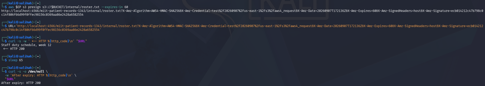

*Figure 15: Testing the presigned URL before and after its configured 60-second expiry period.*

The second request still returned `HTTP 200`. LocalStack did not enforce the expiry period, which was an expected limitation stated in the lab manual. On real AWS, the same URL should be rejected after expiry. Anyone who possesses a valid presigned URL can access the authorised object until the URL expires, so the URL must be protected from unauthorised disclosure.

A bucket policy was then created to deny requests that did not use secure transport.

```bash
cat > secure-transport.json <<JSON
{
  "Version": "2012-10-17",
  "Statement": [{
    "Sid": "DenyUnencryptedTransport",
    "Effect": "Deny",
    "Principal": "*",
    "Action": "s3:*",
    "Resource": [
      "arn:aws:s3:::$BUCKET",
      "arn:aws:s3:::$BUCKET/*"
    ],
    "Condition": {
      "Bool": {
        "aws:SecureTransport": "false"
      }
    }
  }]
}
JSON

aws $EP s3api put-bucket-policy \
  --bucket "$BUCKET" \
  --policy file://secure-transport.json
```

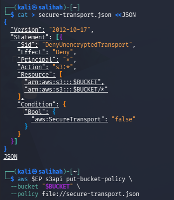

*Figure 16: Applying a bucket policy that denies requests made without secure transport.*

An ordinary bucket request was performed after the policy was applied.

```bash
aws $EP s3api list-objects-v2 \
  --bucket "$BUCKET"
```

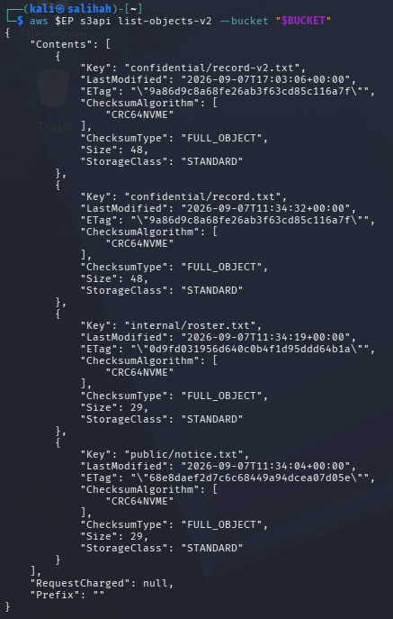

*Figure 17: LocalStack continuing to list the bucket objects despite the secure-transport deny condition.*

The LocalStack endpoint used plain HTTP, so `aws:SecureTransport` should have evaluated to `false` and caused the explicit deny to apply. However, LocalStack stored the policy without enforcing the condition. On real AWS, an insecure request matching this condition would be denied.

The stored bucket policy was verified and then removed before continuing to the next task.

```bash
AWS_PAGER="" aws $EP s3api get-bucket-policy \
  --bucket "$BUCKET" \
  --query Policy \
  --output text

aws $EP s3api delete-bucket-policy \
  --bucket "$BUCKET"
```

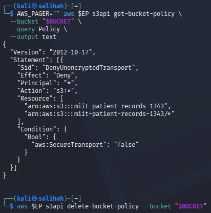

*Figure 18: Verifying the secure-transport policy and removing it before continuing.*

This task demonstrated that condition keys must be evaluated according to the environment in which the policy operates. A policy that is suitable for the HTTPS endpoints used by real AWS can cause unintended access problems when tested through a plain HTTP local endpoint.

### Task 7 - Versioning, Delete Markers and Data Remanence

Bucket versioning was enabled to preserve multiple versions of the same object.

```bash
aws $EP s3api put-bucket-versioning \
  --bucket "$BUCKET" \
  --versioning-configuration Status=Enabled

aws $EP s3api get-bucket-versioning \
  --bucket "$BUCKET"
```

Two additional revisions of the confidential patient record were created. The second version contained an updated diagnosis, while the third version contained redacted information.

```bash
echo 'Patient: Ahmad bin Ali, Diagnosis: hypertension' > rec-v2.txt
echo 'Patient: [REDACTED], Diagnosis: [REDACTED]' > rec-v3.txt

aws $EP s3api put-object \
  --bucket "$BUCKET" \
  --key confidential/record.txt \
  --body rec-v2.txt \
  --query VersionId \
  --output text

aws $EP s3api put-object \
  --bucket "$BUCKET" \
  --key confidential/record.txt \
  --body rec-v3.txt \
  --query VersionId \
  --output text
```

All versions of the confidential record were then listed.

```bash
aws $EP s3api list-object-versions \
  --bucket "$BUCKET" \
  --prefix confidential/record.txt \
  --query 'Versions[].[VersionId,IsLatest,Size]' \
  --output table
```

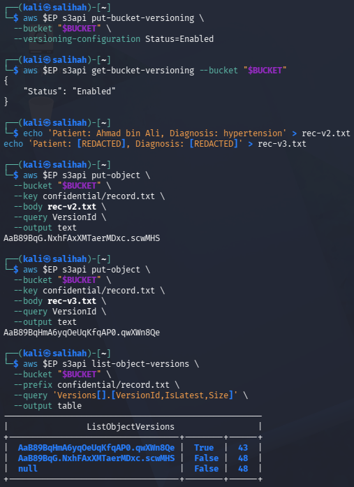

*Figure 19: Enabling bucket versioning and listing three versions of the confidential patient record.*

The output showed three versions. The newest redacted version was marked as the latest version. The oldest object had the version ID `null` because it was uploaded before versioning was enabled.

The confidential record was then deleted without specifying a version ID.

```bash
aws $EP s3api delete-object \
  --bucket "$BUCKET" \
  --key confidential/record.txt
```

Instead of permanently deleting the stored data, S3 created a delete marker. The delete marker became the latest version.

```bash
aws $EP s3api list-object-versions \
  --bucket "$BUCKET" \
  --prefix confidential/record.txt \
  --query 'DeleteMarkers[].[VersionId,IsLatest]' \
  --output table
```

A normal retrieval request returned `NoSuchKey`, which made the object appear to be deleted.

```bash
aws $EP s3api get-object \
  --bucket "$BUCKET" \
  --key confidential/record.txt \
  gone.txt
```

However, the original version was still stored and could be recovered by requesting version ID `null`.

```bash
aws $EP s3api get-object \
  --bucket "$BUCKET" \
  --key confidential/record.txt \
  --version-id null \
  recovered.txt

cat recovered.txt
```

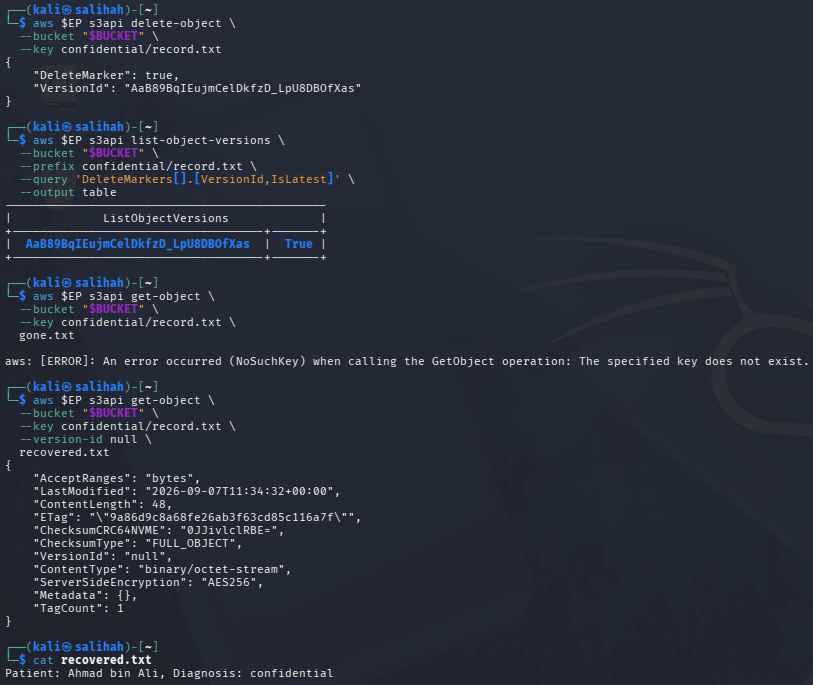

*Figure 20: Creating a delete marker and recovering the original confidential record using its version ID.*

The recovered file still contained the original patient's name and diagnosis. This demonstrated object-level data remanence because an ordinary delete operation only hid the object without destroying its previous versions.

The original pre-versioning copy was permanently removed by specifying its version ID.

```bash
aws $EP s3api delete-object \
  --bucket "$BUCKET" \
  --key confidential/record.txt \
  --version-id null

aws $EP s3api list-object-versions \
  --bucket "$BUCKET" \
  --prefix confidential/record.txt \
  --query 'Versions[].[VersionId,Size]' \
  --output table
```

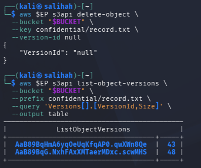

*Figure 21: Permanently deleting the original version and verifying that the `null` version was no longer listed.*

This result showed that `delete-object` alone is not sufficient for a data-erasure request when versioning is enabled. Every stored version must be removed by its version ID, or the data must be made unreadable through cryptographic erasure.

### Task 8 - Lifecycle, Retention and Cryptographic Erasure

A lifecycle configuration was created to automate the retention and deletion of stored objects. The first rule applied to the `confidential/` prefix. It expired current objects after 365 days and non-current versions after 30 days. The second rule removed incomplete multipart uploads after seven days.

```bash
cat > lifecycle.json <<'JSON'
{
  "Rules": [
    {
      "ID": "RetireConfidentialRecords",
      "Filter": {
        "Prefix": "confidential/"
      },
      "Status": "Enabled",
      "Expiration": {
        "Days": 365
      },
      "NoncurrentVersionExpiration": {
        "NoncurrentDays": 30
      }
    },
    {
      "ID": "AbortIncompleteUploads",
      "Filter": {
        "Prefix": ""
      },
      "Status": "Enabled",
      "AbortIncompleteMultipartUpload": {
        "DaysAfterInitiation": 7
      }
    }
  ]
}
JSON

aws $EP s3api put-bucket-lifecycle-configuration \
  --bucket "$BUCKET" \
  --lifecycle-configuration file://lifecycle.json

aws $EP s3api get-bucket-lifecycle-configuration \
  --bucket "$BUCKET" \
  --query 'Rules[].[ID,Status]' \
  --output table
```

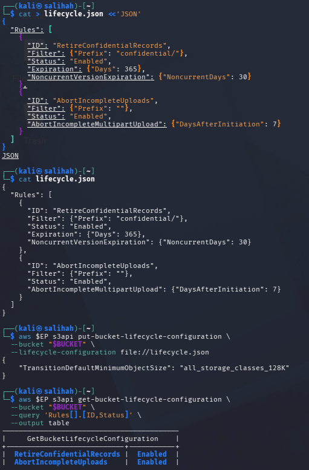

*Figure 22: Applying and verifying the lifecycle rules for confidential records and incomplete uploads.*

The output confirmed that both `RetireConfidentialRecords` and `AbortIncompleteUploads` were enabled. These rules provide an automated and auditable method of enforcing the organisation's retention policy.

The KMS key used for the bucket was inspected before being disabled. It initially showed the `Enabled` state.

```bash
aws $EP kms describe-key \
  --key-id "$KEY_ID" \
  --query 'KeyMetadata.[KeyId,KeyState,Enabled]' \
  --output text
```

The key was then disabled and scheduled for deletion using a seven-day pending window.

```bash
aws $EP kms disable-key \
  --key-id "$KEY_ID"

aws $EP kms schedule-key-deletion \
  --key-id "$KEY_ID" \
  --pending-window-in-days 7

aws $EP kms describe-key \
  --key-id "$KEY_ID" \
  --query 'KeyMetadata.[KeyState,DeletionDate]' \
  --output text
```

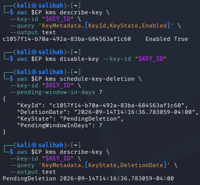

*Figure 23: Disabling the bucket KMS key and scheduling its deletion after a seven-day pending period.*

The key state changed from `Enabled` to `PendingDeletion`. Deleting an encryption key is a form of cryptographic erasure because ciphertext protected by that key becomes unreadable when the key is no longer available.

An attempt was made to retrieve the object that had been encrypted using the disabled KMS key.

```bash
aws $EP s3api get-object \
  --bucket "$BUCKET" \
  --key confidential/record-v2.txt \
  after-erasure.txt
```

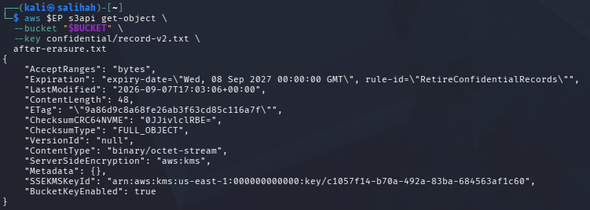

*Figure 24: LocalStack returning the SSE-KMS object even though its KMS key had been disabled.*

LocalStack still returned the object successfully. This showed that its S3 implementation did not re-check the KMS key state during object retrieval. On real AWS, an object encrypted under an unavailable KMS key should not be decrypted and returned.

Because S3 did not enforce the disabled key state, cryptographic erasure was demonstrated directly at the KMS layer. A separate test key was created and used to encrypt a test file.

```bash
export ERASURE_KEY_ID=$(aws $EP kms create-key \
  --description 'Lab6 cryptographic erasure verification key' \
  --query 'KeyMetadata.KeyId' \
  --output text)

echo 'Cryptographic erasure verification' > erasure-test.txt

aws $EP kms encrypt \
  --key-id "$ERASURE_KEY_ID" \
  --plaintext fileb://erasure-test.txt \
  --query CiphertextBlob \
  --output text | base64 -d > erasure-test.cipher

ls -l erasure-test.cipher
```

The test key was disabled before attempting to decrypt the ciphertext.

```bash
aws $EP kms disable-key \
  --key-id "$ERASURE_KEY_ID"

aws $EP kms decrypt \
  --ciphertext-blob fileb://erasure-test.cipher \
  --query Plaintext \
  --output text
```

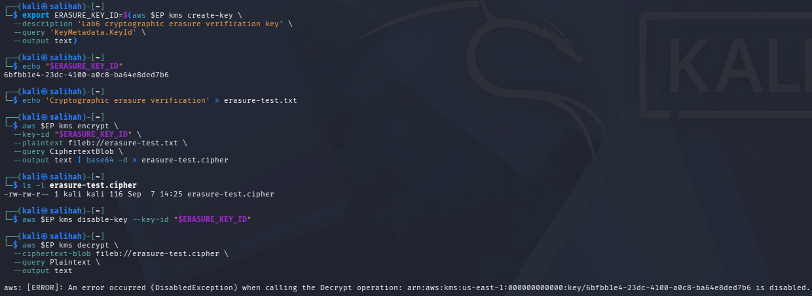

*Figure 25: Direct KMS decryption failing with `DisabledException` after the test key was disabled.*

The decrypt operation failed with `DisabledException`. This result confirmed that ciphertext becomes inaccessible when the required encryption key is disabled. Cryptographic erasure provides stronger assurance than overwriting because the data cannot be recovered without the encryption key, even if copies remain on storage media or backups.

### Verification Commands

The final security posture of the S3 bucket was verified by checking its Block Public Access settings, versioning status, default encryption configuration, lifecycle rules and KMS key state.

```bash
echo "=== IKB42603 Lab 6 verification: $BUCKET ==="

aws $EP s3api get-public-access-block \
  --bucket "$BUCKET" \
  --query 'PublicAccessBlockConfiguration' \
  --output text

aws $EP s3api get-bucket-versioning \
  --bucket "$BUCKET" \
  --output text

aws $EP s3api get-bucket-encryption \
  --bucket "$BUCKET" \
  --query 'ServerSideEncryptionConfiguration.Rules[0].ApplyServerSideEncryptionByDefault.[SSEAlgorithm,KMSMasterKeyID]' \
  --output text

aws $EP s3api get-bucket-lifecycle-configuration \
  --bucket "$BUCKET" \
  --query 'Rules[].[ID,Status]' \
  --output text

aws $EP kms describe-key \
  --key-id "$KEY_ID" \
  --query 'KeyMetadata.KeyState' \
  --output text
```

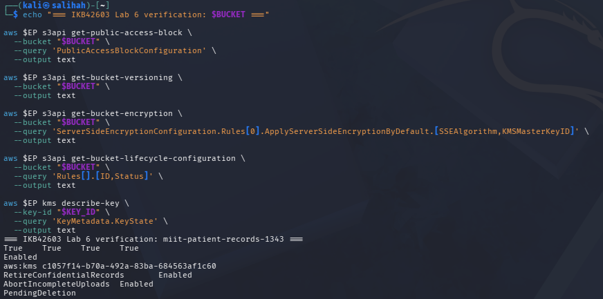

*Figure 26: Verifying the final security posture of the patient-records bucket.*

The verification output confirmed that:

- All four Block Public Access settings were set to `True`.
- Bucket versioning was `Enabled`.
- Default bucket encryption used `aws:kms`.
- `RetireConfidentialRecords` was `Enabled`.
- `AbortIncompleteUploads` was `Enabled`.
- The original bucket KMS key was in the `PendingDeletion` state.

These results confirmed that the required access protection, encryption, versioning, lifecycle and cryptographic-erasure configurations were present at the end of the lab.

## Evidence

All screenshots used as evidence are stored in the `Evidence` folder.

| Screenshot | Description |
|---|---|
| `T0.1-LocalStack-Pro-Container-Started.png` | Starting LocalStack Pro with IAM policy enforcement enabled |
| `T0.2-LocalStack-Caller-Identity-Verified.png` | Verifying the LocalStack caller identity and account number |
| `T1.1-S3-Bucket-Created-and-Objects-Uploaded.png` | Creating the S3 bucket and uploading the classified objects |
| `T1.2-Object-List-and-Confidential-Classification-Tag.png` | Listing the stored objects and verifying the confidential classification tag |
| `T2.1-Public-Read-Bucket-Policy-Applied.png` | Applying and verifying the public-read bucket policy |
| `T2.2-Anonymous-Access-and-Confidential-Record-Leak.png` | Anonymous HTTP 200 response exposing the confidential patient record |
| `T3.1-Block-Public-Access-and-Anonymous-Retest.png` | Enabling all four Block Public Access settings and repeating the anonymous request |
| `T3.2-Least-Privilege-Bucket-Policy.png` | Applying a least-privilege policy scoped to the internal prefix |
| `T4.1-DataAnalyst-IAM-Policy-and-Profile-Configuration.png` | Creating the DataAnalyst user and configuring its IAM policy and AWS CLI profile |
| `T4.2-Deny-Confidential-Bucket-Policy.png` | Applying the bucket policy that explicitly denied confidential access |
| `T4.3-Internal-Allowed-and-Confidential-Denied.png` | Allowing internal access while denying confidential access |
| `T5.1-KMS-Key-Creation.png` | Creating the dedicated bucket encryption key |
| `T5.2-Default-SSE-KMS-Bucket-Configuration.png` | Configuring default SSE-KMS encryption |
| `T5.3-SSE-KMS-Encrypted-Object-Verification.png` | Verifying automatic SSE-KMS object encryption |
| `T6.1-Presigned-URL-Before-and-After-Expiry.png` | Testing delegated access before and after the URL expiry period |
| `T6.2-Secure-Transport-Policy-Applied.png` | Applying the secure-transport bucket policy |
| `T6.3-Secure-Transport-LocalStack-Enforcement-Limitation.png` | Recording the LocalStack secure-transport enforcement limitation |
| `T6.4-Secure-Transport-Policy-Verified-and-Removed.png` | Verifying and removing the secure-transport policy |
| `T7.1-Versioning-Enabled-and-Object-Version-List.png` | Enabling versioning and listing the object versions |
| `T7.2-Delete-Marker-and-Original-Record-Recovery.png` | Creating a delete marker and recovering the original record |
| `T7.3-Permanent-Deletion-of-Original-Version.png` | Permanently deleting the original pre-versioning copy |
| `T8.1-Lifecycle-Retention-Rules-Enabled.png` | Applying and verifying both lifecycle rules |
| `T8.2-KMS-Key-State-and-Scheduled-Deletion.png` | Disabling the bucket KMS key and scheduling its deletion |
| `T8.3-S3-KMS-Key-State-Enforcement-Limitation.png` | Recording S3 retrieval after the KMS key was disabled |
| `T8.4-KMS-Layer-Cryptographic-Erasure-Verification.png` | Verifying failed direct KMS decryption using a disabled key |
| `T9-Final-Security-Posture-Verification.png` | Verifying the final bucket security posture |
| `Cleanup-and-Teardown.png` | Removing the Lab 6 resources and temporary files |

## Commands Used

| Purpose | Command |
|---|---|
| Start LocalStack Pro | `docker run -d --name localstack -p 4566:4566 -e LOCALSTACK_AUTH_TOKEN=$LOCALSTACK_AUTH_TOKEN -e ENFORCE_IAM=1 localstack/localstack-pro:latest` |
| Set the LocalStack endpoint | `export EP='--endpoint-url=http://localhost:4566'` |
| Verify the caller identity | `aws $EP sts get-caller-identity` |
| Create the S3 bucket | `aws $EP s3api create-bucket --bucket $BUCKET` |
| Upload a classified object | `aws $EP s3api put-object --bucket $BUCKET --key KEY --body FILE --tagging 'classification=VALUE'` |
| List the bucket objects | `aws $EP s3api list-objects-v2 --bucket $BUCKET` |
| Retrieve an object tag | `aws $EP s3api get-object-tagging --bucket $BUCKET --key confidential/record.txt` |
| Apply a bucket policy | `aws $EP s3api put-bucket-policy --bucket $BUCKET --policy file://POLICY.json` |
| Remove a bucket policy | `aws $EP s3api delete-bucket-policy --bucket $BUCKET` |
| Enable Block Public Access | `aws $EP s3api put-public-access-block --bucket $BUCKET --public-access-block-configuration CONFIGURATION` |
| Test anonymous access | `curl http://localhost:4566/$BUCKET/confidential/record.txt` |
| Create the DataAnalyst user | `aws $EP iam create-user --user-name DataAnalyst` |
| Attach the analyst IAM policy | `aws $EP iam put-user-policy --user-name DataAnalyst --policy-name S3ReadAll --policy-document file://analyst-iam.json` |
| Create an analyst access key | `aws $EP iam create-access-key --user-name DataAnalyst` |
| Use the analyst profile | `AWS_PROFILE=analyst aws $EP s3api get-object --bucket $BUCKET --key KEY OUTPUT_FILE` |
| Create a KMS key | `aws $EP kms create-key --description DESCRIPTION` |
| Configure default SSE-KMS | `aws $EP s3api put-bucket-encryption --bucket $BUCKET --server-side-encryption-configuration file://encryption.json` |
| Verify object encryption | `aws $EP s3api head-object --bucket $BUCKET --key confidential/record-v2.txt` |
| Generate a presigned URL | `aws $EP s3 presign s3://$BUCKET/internal/roster.txt --expires-in 60` |
| Enable bucket versioning | `aws $EP s3api put-bucket-versioning --bucket $BUCKET --versioning-configuration Status=Enabled` |
| List object versions | `aws $EP s3api list-object-versions --bucket $BUCKET --prefix confidential/record.txt` |
| Permanently delete a version | `aws $EP s3api delete-object --bucket $BUCKET --key confidential/record.txt --version-id null` |
| Apply lifecycle rules | `aws $EP s3api put-bucket-lifecycle-configuration --bucket $BUCKET --lifecycle-configuration file://lifecycle.json` |
| Disable a KMS key | `aws $EP kms disable-key --key-id $KEY_ID` |
| Schedule KMS key deletion | `aws $EP kms schedule-key-deletion --key-id $KEY_ID --pending-window-in-days 7` |
| Encrypt data directly with KMS | `aws $EP kms encrypt --key-id $ERASURE_KEY_ID --plaintext fileb://erasure-test.txt` |
| Attempt direct KMS decryption | `aws $EP kms decrypt --ciphertext-blob fileb://erasure-test.cipher` |
| Remove the LocalStack container | `docker rm -f localstack` |

## Challenges Encountered

- LocalStack Pro initially exited with code `55` because no authentication credential was available. This issue was resolved by configuring a valid `LOCALSTACK_AUTH_TOKEN` and recreating the container.
- Block Public Access stored all four protection settings as `true`. However, LocalStack still accepted the public bucket policy and returned `HTTP 200` for the anonymous request. This indicates a LocalStack enforcement limitation.
- The presigned URL continued to return `HTTP 200` after its 60-second expiry period because the expiry was not enforced by the LocalStack environment.
- The `aws:SecureTransport` deny condition was successfully stored in the bucket policy but was not enforced against requests made through the HTTP LocalStack endpoint.
- S3 continued to return the SSE-KMS-encrypted object after its KMS key was disabled. To verify the KMS security control independently, a direct encrypt-disable-decrypt test was performed using a separate KMS key. The decryption request correctly failed with `DisabledException`.
- Several commands in the lab document were split across lines or pages. Connected options such as `--output table` and complete JMESPath queries had to be reconstructed correctly before execution.

## Short-Answer Questions

### Q1. Which single element of the Task 2 policy caused the exposure, and why is `Principal: "*"` more dangerous on a bucket policy than an over-broad IAM policy attached to one user?

The element that caused the exposure was `"Principal": "*"`. This means that anyone, including anonymous users, can access the objects allowed by the bucket policy. It is more dangerous because a bucket policy is attached directly to the resource and can expose the data to the public. An over-broad IAM policy only affects the specific user who has that policy.

### Q2. Explain the difference between an identity-based policy and a resource-based policy. In Task 4, which one decided each of the analyst's two requests?

An identity-based policy is attached to an IAM user, group, or role. It defines what actions the identity is allowed to perform. A resource-based policy is attached directly to a resource, such as an S3 bucket, and defines who can access it.

In Task 4, the analyst was able to access `internal/roster.txt` because the IAM policy allowed `s3:GetObject` and the bucket policy also allowed access to the `internal/*` prefix. However, access to `confidential/record.txt` was denied by the bucket policy. The explicit deny in the bucket policy overrode the allow in the analyst's IAM policy.

### Q3. Block Public Access is described as a guardrail rather than a control. What is the difference, and why does the distinction matter for an organisation with many engineers?

A control manages access to a specific resource, while a guardrail creates a general safety boundary to prevent unsafe configurations. Block Public Access is a guardrail because it helps prevent public bucket policies and ACLs from exposing S3 data.

This is important for an organisation with many engineers because configuration mistakes can happen easily. A central guardrail reduces the risk of one engineer accidentally making a bucket public. In this lab, all four settings were enabled, but LocalStack did not fully enforce them.

### Q4. Your bucket has default SSE-KMS encryption. Does that protect the confidential record from the analyst in Task 4? Explain precisely what server-side encryption does and does not defend against.

No. SSE-KMS does not stop the analyst from reading the confidential record if the analyst already has permission to access it. SSE-KMS encrypts the object while it is stored and decrypts it when an authorised request is made.

It protects data at rest, such as data stored on physical disks, backups, or raw storage. However, it does not replace IAM policies or bucket policies. If a user is authorised, S3 can decrypt and return the object. In Task 4, the explicit deny in the bucket policy prevented the analyst from reading the confidential record.

### Q5. A patient invokes their right to erasure. Using your Task 7 evidence, explain why `delete-object` alone is not compliant, and describe two mechanisms that would make the deletion provable.

The `delete-object` command alone is not enough when versioning is enabled. It only creates a delete marker and hides the current object. The older versions are still stored and can be recovered using their version IDs. This was proven in Task 7 when the original confidential record was recovered after it had been deleted normally.

The first mechanism is to permanently delete all object versions and delete markers using their version IDs. After that, `list-object-versions` can be used to confirm that no versions remain.

The second mechanism is cryptographic erasure. The object can be encrypted using a dedicated KMS key, and the key can then be permanently deleted. Without the key, the encrypted data cannot be decrypted. The KMS key state can be collected as evidence.

### Q6. You are the auditor in Week 11. Name three commands from this lab whose output you would collect as compliance evidence, and state which control each one evidences.

1. `aws $EP s3api get-public-access-block --bucket "$BUCKET"`

   This command proves that all four Block Public Access settings are enabled. It provides evidence of the public-access protection guardrail.

2. `aws $EP s3api get-bucket-encryption --bucket "$BUCKET"`

   This command proves that default SSE-KMS encryption is enabled and shows the KMS key used. It provides evidence of the data-at-rest encryption control.

3. `aws $EP s3api get-bucket-lifecycle-configuration --bucket "$BUCKET"`

   This command proves that the lifecycle rules are enabled. It provides evidence of the data retention, old-version expiration, and incomplete-upload cleanup controls.

## LocalStack Limitations Observed

The following limitations were observed during the lab:

| Test | Expected AWS behaviour | Actual LocalStack result |
|---|---|---|
| Block Public Access | Reject the public policy and deny anonymous retrieval | Public policy was accepted and anonymous retrieval returned `HTTP 200` |
| Presigned URL expiry | Reject the same URL after 60 seconds | The URL still returned `HTTP 200` after 65 seconds |
| `aws:SecureTransport` condition | Deny requests made through the HTTP endpoint | The object-listing request remained successful |
| Disabled KMS key during S3 retrieval | Prevent decryption and retrieval | S3 still returned the encrypted object |
| Direct KMS decrypt after key disablement | Return `DisabledException` | Correctly returned `DisabledException` |

These results do not change the intended AWS security behaviour. They show the importance of documenting emulator limitations and avoiding unsupported conclusions when using a local testing environment.

## Security Best-Practices Checklist

- [x] Every object carries a classification tag before any access decision is made.
- [x] No bucket policy names `Principal: "*"`; anonymous access was tested and the public policy was removed.
- [x] Block Public Access is enabled on all four flags.
- [x] Access is granted by least privilege and scoped to a key prefix, never to `/*` by default.
- [x] Default encryption at rest is `aws:kms` with a customer-managed key.
- [x] Sharing uses time-bounded presigned URLs, not permanent public objects.
- [x] Versioning is enabled, and the team understands that delete markers do not destroy data.
- [x] A lifecycle configuration expresses the retention policy, and cryptographic erasure is available for provable deletion.

> **Note:** LocalStack did not fully enforce Block Public Access and presigned URL expiry during testing. These limitations were recorded in the evidence and Challenges Encountered section.

## Cleanup and Teardown

All object versions and delete markers were removed before the versioned bucket was deleted. The LocalStack container was then removed together with its remaining temporary resources. Finally, the JSON and text files created during the lab were deleted.

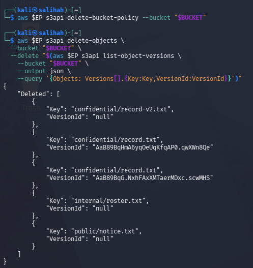

*Figure 27: Permanent removal of all stored object versions.*

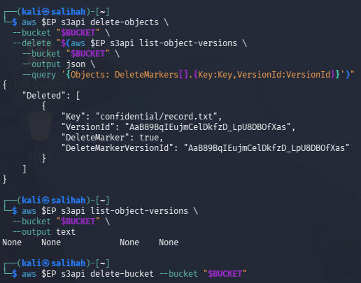

*Figure 28: Removal of the delete marker followed by successful bucket deletion.*

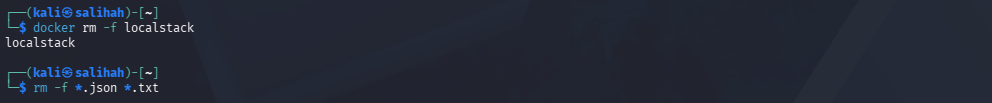

*Figure 29: Removal of the LocalStack container and temporary lab files.*

## Conclusion

This lab showed how object storage security protects data throughout its lifecycle. A wildcard principal exposed the confidential record, while least-privilege policies and an explicit deny restricted access. SSE-KMS protected data at rest, and presigned URLs provided temporary access without making objects public.

Versioning showed that a normal deletion only creates a delete marker and does not remove older versions. Lifecycle rules and cryptographic erasure can support proper data retention and provable deletion. Although several controls were not fully enforced by LocalStack, the limitations were recorded in the evidence. Overall, access control, encryption, versioning, and secure deletion must work together to protect sensitive data.

## References

Amazon Web Services. (n.d.). *Security best practices for Amazon S3*. https://docs.aws.amazon.com/AmazonS3/latest/userguide/security-best-practices.html

Amazon Web Services. (n.d.). *Retaining multiple versions of objects with S3 Versioning*. https://docs.aws.amazon.com/AmazonS3/latest/userguide/Versioning.html

Amazon Web Services. (n.d.). *Blocking public access to your Amazon S3 storage*. https://docs.aws.amazon.com/AmazonS3/latest/userguide/access-control-block-public-access.html

Amazon Web Services. (n.d.). *Using server-side encryption with AWS KMS keys (SSE-KMS)*. https://docs.aws.amazon.com/AmazonS3/latest/userguide/UsingKMSEncryption.html

LocalStack. (n.d.). *Local AWS services*. https://docs.localstack.cloud/aws/services/